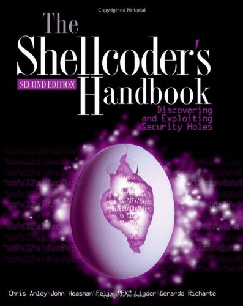

# Assembly Programming

This major covers assembly language in various flavors
and processor architectures.

## Table of Content

* [Beginning x64 Assembly Programming](#-beginning-x64-assembly-programming)

## ★★★★★ [Beginning x64 Assembly Programming](books/9781484250761.md)

> Reading this book is so fun to read, it's hard to believe you're actually
> learning Assembly programming.
> This is also technically the best book to learn about Assembly programming.

## ★★★★★ [The Shellcoder's Handbook](books/9780470080238.md)

> This book is a great help to uncover the underlying details of a computer system.
> It extremely improves understanding of C and C++ languages.
