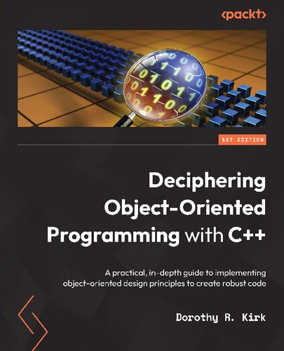

# C++ Programming

Covers the standard C++ programming language and its libraries.

## Table of Content

* [C++ Concurrency in Action](#-c++-concurrency-in-action)
* [Concurrency with Modern C++](#-concurrency-with-modern-c++)
* [The C++ Standard Library](#-the-c++-standard-library)
* [C++17: The Complete Guide](#-c++17-the-complete-guide)
* [C++20: The Complete Guide](#-c++20-the-complete-guide)
* [C++ Move Semantics: The Complete Guide](#-c++-move-semantics-the-complete-guide)
* [C++ Templates: The Complete Guide](#-c++-templates-the-complete-guide)
* [C++17 STL Cookbook](#-c++17-stl-cookbook)
* [Modern C++ Programming Cookbook](#-modern-c++-programming-cookbook)
* [Deciphering Object-Oriented Programming with C++](#-deciphering-object-oriented-programming-with-c++)
* [Hands-On Design Patterns with C++](#-hands-on-design-patterns-with-c)
* [Design Patterns in Modern C++20](#-design-patterns-in-modern-c++20)
* [Pro Tbb: C++ Parallel Programming with Threading Building Blocks](#-pro-tbb-c++-parallel-programming-with-threading-building-blocks)
* [Boost.Asio C++ Network Programming](#-boost.asio-c++-network-programming)
* [Boost.Asio C++ Network Programming Cookbook](#-boost.asio-c++-network-programming-cookbook)
* [Boost Libraries](#-boost-libraries)
* [Qt Manual](#-qt-manual)
* [OpenCV Manual](#-opencv-manual)
* [Learning OpenCV 3](#-learning-opencv-3)

---

## Standard C++

### ★★★★★ [C++ Concurrency in Action](resources/9781617294693.md)

### ★★★★★ [Concurrency with Modern C++](resources/concurrency-with-modern-cpp.md)

### ★★★★★ [The C++ Standard Library](resources/9780321623218.md)

### ★★★★★ [C++17: The Complete Guide](resources/9783967300178.md)

### ★★★★★ [C++20: The Complete Guide](resources/cxx20-the-complete-guide.md)

### ★★★★★ [C++ Move Semantics: The Complete Guide](resources/9783967309003.md)

### ★★★★★ [C++ Templates: The Complete Guide](resources/9780321714121.md)

### ★★★★★ [C++17 STL Cookbook](resources/9781787120495.md)

### ★★★★★ [Modern C++ Programming Cookbook](resources/9781800208988.md)

### ★★★ [Deciphering Object-Oriented Programming with C++](resources/9781804613900.md)

### ★★★★★ [Hands-On Design Patterns with C++](resources/9781804611555.md)

### ★★★ [Design Patterns in Modern C++20](resources/9781484272947.md)

### [Pro Tbb: C++ Parallel Programming with Threading Building Blocks](resources/9781484243978.md)

## Boost Libraries

### ★★★ [Boost.Asio C++ Network Programming](resources/9781782163268.md)

### ★★★★★ [Boost.Asio C++ Network Programming Cookbook](resources/9781783986545.md)

### ★★★★★ [Boost Libraries](https://www.boost.org/doc/libs/?view=condensed)

## Image Processing Libraries

### [OpenCV Manual](http://docs.opencv.org)

### ★★★★★ [Learning OpenCV 3](resources/9781491937990.md)

## User Interface Libraries

### [Qt Manual](https://doc.qt.io)

## Other Resources

### References

* http://en.cppreference.com/w/cpp
* http://isocpp.org
* http://learncpp.com

### Authors

* http://stroustrup.com
* http://josuttis.com
* http://simontoth.eu
