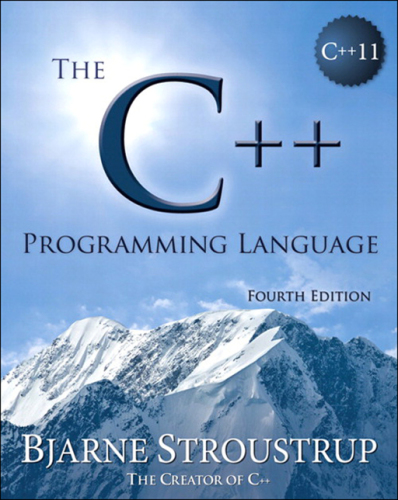

# C++

## References

* http://en.cppreference.com/w/cpp
* http://isocpp.org
* http://learncpp.com

## Authors

* http://stroustrup.com
* http://josuttis.com
* http://simontoth.eu

## ★★★ [C++ Concurrency in Action](resources/9781617294693.md)

## ★★★ [Concurrency with Modern C++](resources/concurrency-with-modern-cpp.md)

## ★★★ [The C++ Standard Library](resources/9780321623218.md)

## ★★★ [The C++ Programming Language](resources/9780275967307.md)

## ★★★ [Professional C++](resources/9781119695400.md)

## ★★★ [Teach Yourself C++ in One Hour a Day](resources/9780137334681.md)

## ★★★ [C++17: The Complete Guide](resources/9783967300178.md)

## ★★★ [C++17 STL Cookbook](resources/9781787120495.md)

## ★★★ [C++20: The Complete Guide](resources/cxx20-the-complete-guide.md)

## ★★★ [C++20 STL Cookbook](resources/9781803248714.md)

## ★★★ [C++20: Get the Details](resources/cxx20-get-the-details.md)

## ★★★ [Beginning C++20: From Novice to Professional](resources/9781484258842.md)

## ★★★ [Beginning C++23: From Novice to Professional](resources/9781484293423.md)

## ★★★ [C++ Move Semantics: The Complete Guide](resources/9783967309003.md)

## ★★★ [C++ Templates: The Complete Guide](resources/9780321714121.md)

## ★★★ [Modern C++ Programming Cookbook](resources/9781800208988.md)

## ★★ [Deciphering Object-Oriented Programming with C++](resources/9781804613900.md)

## ★★★ [Hands-On Design Patterns with C++](resources/9781804611555.md)

## ★★ [Design Patterns in Modern C++20](resources/9781484272947.md)

## [Pro Tbb: C++ Parallel Programming with Threading Building Blocks](resources/9781484243978.md)

