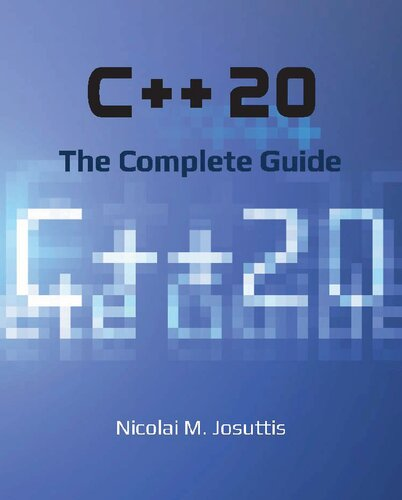

# C++ Programming

This subject covers the C++ programming language and its libraries.

## C++ Language

### ★★★★★ [C++ Concurrency in Action](../books/9781617294693.md)

### ★★★★★ [Concurrency with Modern C++](../books/concurrency-with-modern-cpp.md)

### ★★★★★ [The C++ Standard Library](../books/9780321623218.md)

### ★★★★★ [C++17: The Complete Guide](../books/9783967300178.md)

### ★★★★★ [C++20: The Complete Guide](../books/cxx20-the-complete-guide.md)

### ★★★★★ [C++ Move Semantics: The Complete Guide](../books/9783967309003.md)

### ★★★★★ [C++ Templates: The Complete Guide](../books/9780321714121.md)

### ★★★★★ [C++17 STL Cookbook](../books/9781787120495.md)

### ★★★★★ [Modern C++ Programming Cookbook](../books/9781800208988.md)

### ★★★ [Deciphering Object-Oriented Programming with C++](../books/9781804613900.md)

### ★★★ [Design Patterns in Modern C++20](../books/9781484272947.md)

### [Pro Tbb: C++ Parallel Programming with Threading Building Blocks](../books/9781484243978.md)

## Boost Libraries

### ★ [Boost.Asio C++ Network Programming](../books/9781782163268.md)

### [Boost Libraries](https://www.boost.org/doc/libs/?view=condensed)

## User Interface

### [Qt Manual](https://doc.qt.io)

## Image Processing

### [OpenCV Manual](http://docs.opencv.org)

### ★★★★★ [Learning OpenCV 3](../books/9781491937990.md)

## Other Resources

### References

* [cppreference.com](http://en.cppreference.com/w/cpp)
* [isocpp.org](http://isocpp.org)
* [learncpp.com](http://learncpp.com)

### Authors

* [stroustrup.com](http://stroustrup.com)
* [josuttis.com](http://josuttis.com)

