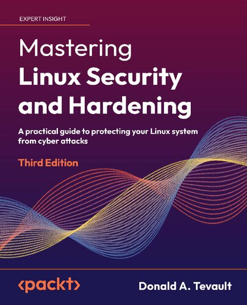

# Linux Administration

Covers Linux administration.

## Table of Content

* [Sudo Mastery](#-sudo-mastery)
* [Mastering Linux Security and Hardening](#-mastering-linux-security-and-hardening)
* [Mastering Kali Linux For Advanced Penetration Testing](#-mastering-kali-linux-for-advanced-penetration-testing)
* [Kali Linux Penetration Testing Bible](#-kali-linux-penetration-testing-bible)
* [Linux Security and Administration](#-linux-security-and-administration)
* [Linux Service Management Made Easy with systemd](#-linux-service-management-made-easy-with-systemd)

---

## Linux Security

### ★★★★★ [Sudo Mastery](resources/9781493626205.md)

### ★★★★★ [Mastering Linux Security and Hardening](resources/9781837630516.md)

### ★★★★★ [Mastering Kali Linux For Advanced Penetration Testing](resources/9781801819770.md)

### ★★★★★ [Kali Linux Penetration Testing Bible](resources/9781119719083.md)

### ★★★ [Linux Security and Administration](resources/linux-security-and-administration.md)

### ★★★★★ [Linux Service Management Made Easy with systemd](resources/9781801811644.md)

## References

* https://gnu.org/software/bash/manual/html_node/
* https://github.com/dylanaraps/pure-bash-bible
* https://explainshell.com
* bash-docs package
