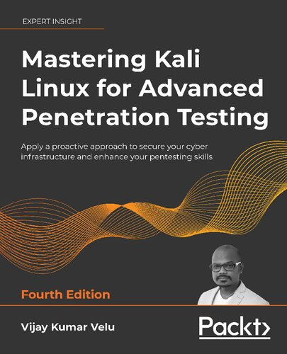
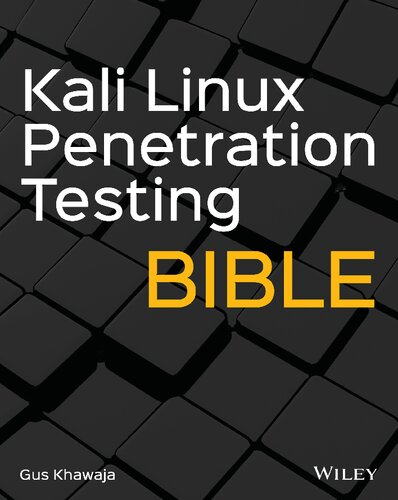

# Linux Administration

This section covers Linux administration.

## Shell

* [Bash Manual](https://gnu.org/software/bash/manual/html_node/)
* [Pure Bash Bible](https://github.com/dylanaraps/pure-bash-bible)
* [Explain Shell](https://explainshell.com)
* bash-docs package

## Linux Security

### ★★★★★ [Sudo Mastery](../resources/9781493626205.md)

### ★★★★★ [Mastering Linux Security and Hardening](../resources/9781837630516.md)

### ★★★★★ [Mastering Kali Linux For Advanced Penetration Testing](../resources/9781801819770.md)

### ★★★★★ [Kali Linux Penetration Testing Bible](../resources/9781119719083.md)

### ★★★☆☆ [Linux Security and Administration](../resources/linux-security-and-administration.md)

