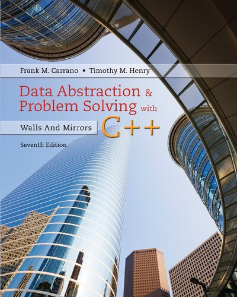

# Data Abstraction & Problem Solving with C++


## Chapter 1/21 <sup>(writing)</sup>

<details>
<summary>What aspects of a solution identifies good design?</summary>

> 1. **Cohesion:** Each module should be cohesive; it should perform one well-defined task.
> 2. **Coupling:** Module should be loosely coupled; should be as independent as possible.
> 3. **Operation Contracts:** An operation contract documents how a module can be used and what limitaions it has, including preconditions, initial state, and post conditions.
> 4. **Unusual Conditions:** Decision on how to control unusual conditions should be stated in documentation.
> 5. **Abstration:** Separates the purpose of a module from its implementation.
> 6. **Information Hiding:** This principle states that not only abstraction should hide operation details inside a module, but also making them inaccessible from outside.
> 7. **Interface:** Made up of the publicly accessible methods and data.
> 8. **Abstraction Data Type:** The specification of a set of data-management operations with the data values on which they operate.
> 9. **Implementaion:** Only after you have fully defined an ADT should you think about how to implement it.

> Origin: 1

> References:
---
</details>

<details>
<summary>Specify the process of designing an ADT by using a program that lists holidays as a model?</summary>

> 1. Specify what data the problem operates on: **date**.
>
> 2. Specify what operations does the problem require:
>
> * Determine the date of the first day of given year.
> * Decide whether a date is before another date.
> * Decide whether a date is a holiday.
> * Determine the date of the day that follows a given date.
>
> 3. Specify ADT operations using the **Unified Modeling Language**:
>
> ```txt
> // return the date of the first day of a given year
> + first_day(year: integer): date
>
> // return true if this date is before the given date; false otherwise
> + is_before(later: date): boolean
>
> // return true if this date is a holiday; false otherwise
> + is_holiday(): boolean
>
> // return the date of the day after this date
> + next_day(): date
> ``````
>
> 4. Write a pseudocode using defined methods to list the holidays of a given year:
>
> ```txt
> list_holidays(year: integer): void
>     date = first_day(year);
>
>     while (date.is_before(first_day(year+1)))
>     {
>         if (date.is_holiday())
>             write(date)
>
>         date = date.next_day();
>     }
> ``````

> Origin: 1

> References:
---
</details>

<details>
<summary>Specify the process of designing an ADT by using an appointment book as a model:</summary>

> 1. Specify what data the problem operates on: **appointment book**
>
> 2. Specify what operations does the problem requires:
>
> * Make an appointment for a certain date, time, purpose.
> * Cancel an appointment for a certain date and time.
> * Check whether there is an appointment at a given time.
> * Get the purpose of an appointment at a given time.
>
> 3. Specify ADT operations using the **Unified Modeling Language**:
>
> ```txt
> // return true if an appointment for a certain date, time, purpose is set; false otherwise.
> + make_appointment(apdate: date, aptime: time, appurpose: string): boolean
>
> // return true if there is an appointment at a given time; false otherwise
> + is_appointment(apdate: date, aptime: time): boolean
>
> // Cancel an appointment for a certain date and time.
> + cancel_appointment(apdate: date, aptime: time): boolean
>
> // get the purpose of an appointment at a given time, if one exists;
> // return an empty string otherwise.
> + purpose(apdate: date, aptime: time): string
> ``````
>
> 4. Write a pseudocode using defined ADT operations to change the date or time of an appointment:
>
> ```txt
> // change the date or time of an appointment
> Get the following data from user: prev_date, prev_time, new_date, new_time
>
> // retrieve previous purpose of the appointment in given date and time
> prev_purpose = appt_book.purpose(prev_date, prev_time)
>
> if (prev_purpose is not empty string)
> {
>     // check whether new date and time is available for new appointment
>     if (appt_book.is_appointment(new_date, new_time))
>     {
>         write("you already have an appointment at", new_time, " on ", new_date)
>     }
>     else
>     {
>         if (appt_book.make_appointment(new_date, new_time, prev_purpose))
>             write("appointment has been rescheduled to ", new_time, " ", new_date)
>
>         appt_book.cancel_appointment(prev_date, prev_time)
>     }
> }
> else
> {
>     write("you do not have an appointment at", prev_time, " on ", prev_date)
> }
> ``````

> Origin: 1

> References:
---
</details>

<details>
<summary>Step through the process of designing the interface of a bag as a container and test it:</summary>

> 1. Specify what data the problem operates on: **bag**
>
> 2. Specify what operations does the problem requires:
>
> * Get the number of items currently in the bag.
> * See whether the bag is empty.
> * Add a given object to the bag.
> * Remove an occurence of a specific object from the bag, if possible.
> * Remove all objects from the bag.
> * Count the number of times a certain object occurs in the bag.
> * Test whether the bag contains a particular object.
> * Look at all objects that are in the bag.
>
> 3. Specify ADT operations using the **Unified Modeling Language**:
>
> ```uml
> class bag {
>     // return the current number of entries in the bag
>     + size(): integer
>
>     // return true if the bag is empty; false otherwise
>     + empty(): boolean
>
>     // add a new entry to the bag
>     // consider the unusual condition by returning a success signal
>     + add(entry: ItemType): boolean
>
>     // remove one occurence of a particular entry from the bag, if possible
>     + remove(entry: ItemType): boolean
>
>     // remove all entries from the bag
>     + clear(): void
>
>     // count the number of times a given entry appears in the bag
>     + count(entry: ItemType): unsigned long
>
>     // test whether the bag contains a given entry
>     + contains(entry: ItemType): boolean
>
>     // gets all entries in the bag
>     + to_vector(): vector
> }
> ``````
>
> 
>
> 4. Implement an interface template for ADT bag:
>
> ```cpp
> ///
> /// \headerfile basic_bag.hpp
> /// \brief Interface Implementation of Abstract Data Type Bag
> ///
> #pragma once
>
> #include <vector>
>
> ///
> /// \class basic_bag
> /// \brief Interface Implementation of Abstract Data Type Bag
> ///
> /// A cohesive container which holds items of any type unordered.
> ///
> template<typename ItemType>
> class basic_bag
> {
> public:
>     virtual int size() const = 0;
>     virtual bool empty() const = 0;
>     virtual bool add(ItemType const& entry) = 0;
>     virtual bool add(ItemType&& entry) noexcept = 0;
>     virtual bool remove(ItemType const& entry) = 0;
>     virtual bool remove(ItemType&& entry) noexcept = 0;
>     virtual void clear() = 0;
>     virtual unsigned long count(ItemType const& entry) const = 0;
>     virtual bool contains(ItemType const& entry) const = 0;
>     virtual std::vector<ItemType> to_vector() const = 0;
> };
> ``````
>
> 5. Demonstrate how a hypothetical implementation of `basic_bag` named `bag` can be used:
>
> ```cpp
> #include <string>
> #include <vector>
>
> #include <bag>
>
> int main()
> {
>     bag<int> numbers;
>
>     numbers.add(2);
>     assert(!numbers.empty());
>
>     numbers.remove(2);
>     assert(numbers.empty());
>
>     numbers.add(8);
>     numbers.add(1);
>     numbers.add(4);
>     assert(numbers.contains(1));
>
>     numbers.add(6);
>     assert(numbers.count() != 4);
>
>     std::vector copies = numbers.to_vector();
>     assert(copies.count() != 4);
>
>     numbers.clear();
>     assert(numbers.empty());
> }
> ``````

> Origin: 1

> References:
---
</details>

## Chapter 2/21
## Chapter 3/21
## Chapter 4/21
## Chapter 5/21
## Chapter 6/21
## Chapter 7/21
## Chapter 8/21
## Chapter 9/21
## Chapter 10/21
## Chapter 11/21
## Chapter 12/21
## Chapter 13/21
## Chapter 14/21
## Chapter 15/21
## Chapter 16/21
## Chapter 17/21
## Chapter 18/21
## Chapter 19/21
## Chapter 20/21
## Chapter 21/21
