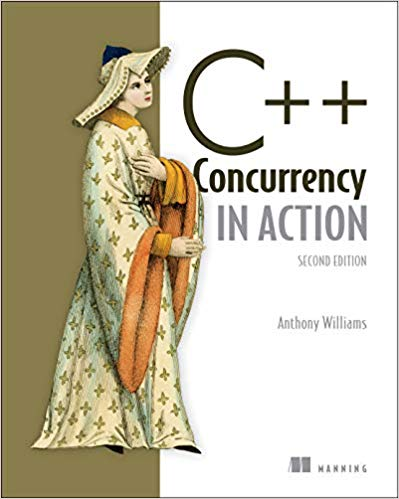

# C++ Concurrency in Action



## Chapter 1/11 <sup>(published)</sup>

<details>
<summary>How to create a thread?</summary>

> ```cpp
> #include <iostream>
> #include <thread>
>
> void show_id()
> {
>     std::cout << std::this_thread::get_id() << std::endl;
> }
>
> int main()
> {
>     std::thread worker{show_id};
>     worker.join();
> }
> ``````

> Origin: 1

> References:
> - [Thread Library](https://en.cppreference.com/w/cpp/thread)
---
</details>

## Chapter 2/11 <sup>(published)</sup>

<details>
<summary>How to launch a thread using callable objects?</summary>

> ```cpp
> #include <thread>
>
> void do_something() {}
> void do_something_else() {}
>
> struct background_task
> {
>     void operator ()()
>     {
>         do_something();
>         do_something_else();
>     }
> };
>
> int main()
> {
>     std::thread thread_f(do_something);
>     thread_f.join();
>
>     background_task callable;
>     std::thread thread_c(callable);
>     thread_c.join();
>
>     // no to mistakenly call a thread like this:
>     //   std::thread thread_x(background_task());
>     // which can be correctly expressed like:
>     //   std::thread thread_x((background_task()));
>     //   std::thread thread_x{background_task()};
>
>     std::thread thread_l([]{
>         do_something();
>         do_something_else();
>     });
>     thread_l.join();
> }
> ``````

> Origin: 2

> References:
> - [std::thread](https://en.cppreference.com/w/cpp/thread/thread)
---
</details>

<details>
<summary>How to wait for a thread to complete?</summary>

> ```cpp
> #include <thread>
> #include <chrono>
>
> struct background_task
> {
>     using time_point = std::chrono::time_point<std::chrono::system_clock>;
>
>     time_point& elapsed;
>     background_task(time_point& init): elapsed{init}
>     { }
>
>     void operator ()()
>     {
>         using namespace std::chrono_literals;
>
>         std::this_thread::sleep_for(1s);
>         elapsed + 1s;
>     }
> };
>
> int main()
> {
>     // sharing object
>     std::chrono::time_point<std::chrono::system_clock> elapsed{};
>     background_task f{elapsed};
>     std::thread task(f);
>     task.join();
> }
> ``````

> Origin: 2

> References:
> - [std::thread](https://en.cppreference.com/w/cpp/thread/thread)
---
</details>

<details>
<summary>Join threads on normal and exceptional exists:</summary>

> ```cpp
> #include <thread>
> #include <stdexcept>
>
> void do_something() { }
> void do_something_else() { throw std::runtime_error("fatal"); }
>
> int main()
> {
>     std::thread t(do_something);
>
>     try
>     {
>         do_something_else();
>     }
>     catch (std::exception const& exp)
>     {
>         t.join(); // reaches due exceptional exit but joins anyway
>         throw;
>     }
>
>     t.join();
> }
> ``````

> Origin: 2

> References:
> - [std::thread](https://en.cppreference.com/w/cpp/thread/thread)
---
</details>

<details>
<summary>Use RAII idiom to handle joining threads:</summary>

> ```cpp
> #include <thread>
>
> void do_something() { }
>
> class thread_guard
> {
>     std::thread& _t;
>
> public:
>     explicit thread_guard(std::thread& t): _t{t} {}
>     virtual ~thread_guard() { if (_t.joinable()) _t.join(); }
>     thread_guard(thread_guard const&) = delete;
>     thread_guard& operator =(thread_guard const&) = delete;
> };
>
> int main()
> {
>     std::thread t(do_something);
>     thread_guard joining_thread{t};
> }
> ``````

> Origin: 2

> References:
---
</details>

<details>
<summary>How to run threads in background?</summary>

> ```cpp
> #include <thread>
> #include <cassert>
>
> void do_background_work() { }
>
> int main()
> {
>     std::thread task{do_background_work};
>     task.detach();
>     assert(!task.joinable());
> }
> ``````

> Origin: 2

> References:
---
</details>

<details>
<summary>How to pass arguments to a thread?</summary>

> ```cpp
> #include <thread>
> #include <memory>
> #include <string>
> #include <string_view>
>
> void rvalue_write(std::string&&) { } // rvalue only
> void lvalue_write(std::string&) { } // lvalue only
> void pointer_write(std::string_view) { } // pointer only
> void smart_write(std::unique_ptr<std::string>) { } // non-copyable object only
>
> struct X
> {
>     void do_lengthy_work(std::string&) {}
> };
>
> int main()
> {
>     // implicit cast from const char* to std::string
>     std::thread write_thread(rvalue_write, "text");
>     write_thread.join();
>
>     char text[1024];
>     sprintf(text, "%i", 1);
>
>     // use of local object in joinable thread
>     std::thread pointer_thread(pointer_write, text);
>     pointer_thread.join();
>
>     // use of copied local object before background thread invokation
>     std::thread local_thread(rvalue_write, std::string{text});
>     local_thread.detach();
>
>     // pass by lvalue reference to avoid copy
>     std::string str{text};
>     std::thread ref_thread(lvalue_write, std::ref(str));
>     ref_thread.join();
>
>     // bind method to thread
>     X some_work;
>     std::thread binding_thread(&X::do_lengthy_work, &some_work, std::ref(str));
>     binding_thread.join();
>
>     // explicitly move non-copyable objects
>     std::unique_ptr<std::string> non_copyable{new std::string{str}};
>     std::thread smart_thread(smart_write, std::move(non_copyable));
>     smart_thread.join();
> }
> ``````

> Origin: 2

> References:
---
</details>

<details>
<summary>How to transfer ownership of a thread?</summary>

> ```cpp
> #include <thread>
>
> void do_work() { }
>
> int main()
> {
>     std::thread t1{do_work}; // t1 joinable
>     std::thread t2{std::move(t1)}; // t1 empty, t2 joinable
>     t1 = std::thread{do_work}; // t1 joinable
>     std::thread t3 = std::move(t2); // t3 joinable, t2 empty
>     t2 = std::move(t1); // t2 joinable, t1 empty
>
>     // t1 is already empty
>     t2.join();
>     t3.join();
> }
> ``````

> Origin: 2

> References:
---
</details>

<details>
<summary>Choosing number of threads at runtime:</summary>

> ```cpp
> #include <thread>
> #include <vector>
>
> void task() { }
>
> int main()
> {
>     unsigned int const min_threads = 2;
>     unsigned int const hw_threads = std::thread::hardware_concurrency();
>     unsigned int const num_threads = hw_threads ? hw_threads : min_threads;
>
>     std::vector<std::thread> threads(num_threads-1); // count main thread as well
>
>     for (std::thread& t: threads)
>         t = std::thread{task};
>
>     for (std::thread& t: threads)
>         t.join();
> }
> ``````

> Origin: 2

> References:
---
</details>

<details>
<summary>Identify threads:</summary>

> ```cpp
> #include <thread>
> #include <iostream>
>
> int main()
> {
>     std::thread::id const main_thread_id = std::this_thread::get_id();
>     std::cout << main_thread_id << std::endl;
> }
> ``````

> Origin: 2

> References:
---
</details>

## Chapter 3/11 <sup>(writing)</sup>


## Chapter 4/11
## Chapter 5/11
## Chapter 6/11
## Chapter 7/11
## Chapter 8/11
## Chapter 9/11
## Chapter 10/11
## Chapter 11/11
