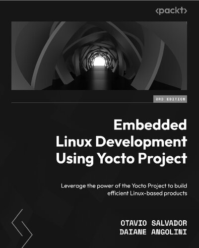

# Embedded Linux Development Using Yocto Project

## Chapter 1/17 (published)

What is the default referencing build system in the Yocto Project?

> Poky is the default Yocto Project reference distribution, which uses
> OpenEmbedded build system technology.

> Origins:
> - Embedded Linux Development Using Yocto Project - Chapter 1

> References:
---

What are the constituents of the Poky build tool?

> It is composed of a collection of tools, configuration files, and recipe data
> (known as metadata).
>
> |Poky Build Tool|
> |---|
> |BitBake Tool (bitbake)|
> |OpenEmbedded Core (meta)|
> |Poky Distribution Metadata (meta-poky)|
> |Yocto Project Reference BSP (meta-yocto-bsp)|
>
> It is platform-independent and performs cross-compiling using the BitBake
> tool, OpenEmbedded Core, and a default set of metadata.
>
> In addition, it provides the mechanism to build and combine thousands of
> distributed open source projects to form a fully customizable, complete, and
> coherent Linux software stack.

> Origins:
> - Embedded Linux Development Using Yocto Project - Chapter 1

> References:
---

What are the responsibilities of BitBake in the Yocto Project?

> BitBake is a task scheduler and execution system that parses Python and Shell
> Script code. The code that is parsed generates and runs tasks, which are a
> set of steps ordered per the code’s dependencies.
>
> BitBake evaluates all available metadata, managing dynamic variable
> expansion, dependencies, and code generation. In addition, it keeps track of
> all tasks to ensure their completion, maximizing the use of processing
> resources to reduce build time and predictability.
>
> The source code is in the `bitbake` subdirectory of Poky.

> Origins:
> - Embedded Linux Development Using Yocto Project - Chapter 1

> References:
---

What are the responsibilities of OpenEmbedded Core in the Yocto Project?

> The OpenEmbedded Core metadata collection provides the engine of the Poky
> build system. It provides the core features and aims to be generic and as
> lean as possible. It supports seven different processor architectures (ARM,
> ARM64, x86, x86-64, PowerPC, PowerPC 64, MIPS, MIPS64, RISC-V32, and RISC-V
> 64), only supporting platforms to be emulated by QEMU.
>
> The OpenEmbedded Core houses its metadata inside the `meta` subdirectory of
> Poky.

> Origins:
> - Embedded Linux Development Using Yocto Project - Chapter 1

> References:
---

What are the responsibilities of Metadata in the Yocto Project?

> The metadata includes recipes and configuration files. It is composed of a
> mix of Python and Shell Script text files, providing a tremendously flexible
> tool. Poky uses this to extend OpenEmbedded Core and includes two different
> layers, which are other metadata subsets, shown as follows:
>
> - `meta-poky`: This layer provides the default and supported distribution
>   policies, visual branding, and metadata tracking information (maintainers,
>   upstream status, and so on). This is to serve as a curated template that
>   could be used by distribution builders to seed their custom distribution.
> - `meta-yocto-bsp`: This provides the Board Support Package (BSP) used as the
>   reference hardware for the Yocto Project development and Quality Assurance
>   (QA) process.

> Origins:
> - Embedded Linux Development Using Yocto Project - Chapter 1

> References:
---

What are the release cycles of the Yocto Project?

> The Yocto Project has a release every six months, in April and October.
>
> The support for the stable release is for 7 months, offering 1 month of
> overlapped support for every stable release. The LTS release has a minimal
> support period of 2 years, optionally extended. After the official support
> period ends, it moves to Community support and finally reaches End Of Life
> (EOL).
>
> `Initial Release -> Stable Release -> Community -> End of Life`

> Origins:
> - Embedded Linux Development Using Yocto Project - Chapter 1

> References:
---

## Chapter 2/17
## Chapter 3/17
## Chapter 4/17
## Chapter 5/17
## Chapter 6/17
## Chapter 7/17
## Chapter 8/17
## Chapter 9/17
## Chapter 10/17
## Chapter 11/17
## Chapter 12/17
## Chapter 13/17
## Chapter 14/17
## Chapter 15/17
## Chapter 16/17
## Chapter 17/17
