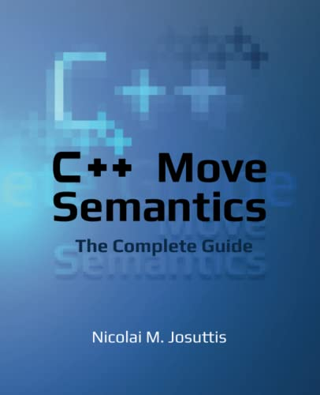

# C++ Move Semantics: The Complete Guide


## Chapter 1/15 <sup>(completed)</sup>

<details>
<summary>Where does move semantics apply optimizations compared to prior C++11 standard?</summary>

> ```cpp
> #include <vector>
> #include <string>
>
> std::vector<std::string> f()
> {
>     std::vector<std::string> cells; // default constructed vector without allocations
>     cells.reserve(3);               // allocate 3 elements of std::string
>     std::string s{"data"};          // default constructed std::string
>     cells.push_back(s);             // 1st vector element copy constructed
>     cells.push_back(s+s);           // default construction of temporary object; move construction of 2nd vector element
>     cells.push_back(std::move(s));  // move constructed 3rd vector element; empty out s object
>     return cells;                   // optimize out vector as return value
> }
>
> int main()
> {
>     std::vector<std::string> v;
>     v = f();                        // move assigned constructed vector by return value
> }
> ``````

> Origins:
> - C++ Move Semantics: The Complete Guide - Chapter 1

> References:
> - [std::move](https://en.cppreference.com/w/cpp/utility/move)
---
</details>

<details>
<summary>How move semantics can be implemented for a class?</summary>

> ```cpp
> #include <utility>
>
> class bag
> {
> private:
>     unsigned int _count;
>     int* _storage;
>
> public:
>     bag(int const& number): _count{0}, _storage{nullptr}
>     {
>         _count++;
>         _storage = new int{number};
>     }
>
>     virtual ~bag()
>     {
>         if (_count)
>             delete _storage;
>     }
>
>     bag(bag const& other): _count{other._count}
>     {
>         _storage = new int{*other._storage};
>     }
>
>     bag(bag&& other): _count{other._count}, _storage{other._storage}
>     {
>         other._count = 0;
>         other._storage = nullptr;
>     }
> };
>
> int main()
> {
>     bag a{1};
>     bag b{std::move(a)};
> }
> ``````

> Origins:
> - C++ Move Semantics: The Complete Guide - Chapter 1

> References:
> - [Move constructors](https://en.cppreference.com/w/cpp/language/move_constructor "cpp/language/move_constructor")
> - [Move assignment operator](https://en.cppreference.com/w/cpp/language/move_assignment "cpp/language/move_assignment")
---
</details>

<details>
<summary>What happens to an object when move semantics is not available?</summary>

> The rule is that for a temporary object or an object marked with
> `std::move()`, if available, a function declaring parameters as an rvalue
> reference is preferred. However, if no such function exists, the usual copy
> semantics is used as a fallback.

> Origins:
> - C++ Move Semantics: The Complete Guide - Chapter 1

> References:
---
</details>

<details>
<summary>What happens to an object declared with <code>const</code> when moved?</summary>

> The objects declared with const cannot be moved because any optimizing
> implementation requires that the passed argument can be modified.
>
> ```cpp
> std::vector<std::string> coll;
> const std::string s{"data"};
>
> coll.push_back(std::move(s));   // OK, calls push_back(const std::string &)
> ``````

> Origins:
> - C++ Move Semantics: The Complete Guide - Chapter 1

> References:
---
</details>

<details>
<summary>Why return values should not be marked as <code>const</code>?</summary>

> Declaring the return value as a whole to be `const` disables move semantics
> and it also disables **return value optimization**. `const` should be used to
> declare parts of return type instead, such as the object a returned reference
> or poionter refers to.
>
> ```cpp
> const std::string getValues(); // BAD: disables move semantics for return value
> const std::string& getRef();   // OK
> const std::string* getPtr();   // OK
> ``````

> Origins:
> - C++ Move Semantics: The Complete Guide - Chapter 1

> References:
---
</details>

<details>
<summary>What should be the state of an object after it has been moved?</summary>

> The implementer has to ensure that the passed argument is in a valid state
> after the call.

> Origins:
> - C++ Move Semantics: The Complete Guide - Chapter 1

> References:
---
</details>

<details>
<summary>When do compilers automatically switch to move semantics?</summary>

> - When the value of a temporary object is passed that will automatically be
>   destroyed after the statement.
> - When a non-`const` object marked with `std::move()`.

> Origins:
> - C++ Move Semantics: The Complete Guide - Chapter 1

> References:
---
</details>

## Chapter 2/15 <sup>(completed)</sup>

<details>
<summary>What header file should be included when using move semantics?</summary>

> `std::move()` is defined a a function in C++ standard library `<utility>`. No
> standard header is required t include `utility` header file. Therefore, when
> using `std::move()`, you should explicitly include `<utility>` to make your
> program portable.

> Origins:
> - C++ Move Semantics: The Complete Guide - Chapter 2

> References:
---
</details>

<details>
<summary>What is the equivallent form of <code>std::move()</code>?</summary>

> ```cpp
> function(static_cast<decltype(object)&&>(object)
> ``````

> Origins:
> - C++ Move Semantics: The Complete Guide - Chapter 2

> References:
---
</details>

<details>
<summary>What is the behavior of a parameter that is declared as an rvalue reference?</summary>

> According to the semantics of rvalue references, the caller claims that it is
> *no longer interested in the value*. Therefore, you can modify the object the
> parameter refers to. However, the caller might still be interested in using
> the object. Therefore, any modification should keep the referenced object in
> a valid state.
>
> ```cpp
> void foo(std::string&& rv);
> std::string s{"data"};
>
> foo(s);     // ERROR
> foo(std::move(s));      // OK
> foo(returnStringByValue());     // OK
> ``````

> Origins:
> - C++ Move Semantics: The Complete Guide - Chapter 2

> References:
---
</details>

<details>
<summary>What is the moved-from object state?</summary>

> Moved-from objects are still valid objects for which at least the destructor
> will be called. However, they should also be valid in the sense that they
> have a consisten state and all operations work as expected. The only thing
> you do not know is their value.
>
> ```cpp
> std::string s{"data"};
>
> foo(std::move(s));
>
> std::cout << s << '\n'; // OK (don't know which value is written)
> std::cout << s.size() << '\n';  // OK (writes current number of characters)
> std::cout << s[0] << '\n';  // ERROR (potentially undefined behavior)
> std::cout << s.front() << '\n'; // ERROR (potentially undefined behavior)
> s = "new value";  // OK
> ``````

> Origins:
> - C++ Move Semantics: The Complete Guide - Chapter 2

> References:
---
</details>

<details>
<summary>What are the major ways of call-by-reference and what kind of arguments does each take?</summary>

> **const lvalue reference**
>
> The function has only read access to the passed argument.
>
> ```cpp
> void foo(const std::string& arg);
> ``````
>
> You can pass everything to a function declared that way if the type fits:
>
> - A modifiable named object
> - A `const` named object
> - A temporary object that does not have a name
> - A non-`const` object marked with `std::move()`
>
> **non-const lvalue reference**
>
> The function has write access to the passed argument. You can no longer pass
> everything to a function declared that way even if the type fits.
>
> ```cpp
> void foo(std::string& arg);
> ``````
>
> You can pass:
>
> - A modifiable object
>
> **non-const rvalue reference**
>
> ```cpp
> void foo(std::string&& arg);
> ``````
>
> The function has write access to the passed argument.
> However, you have restrictions on what you can pass:
>
> - A temporary object that does not have a name
> - A non-`const` object marked with `std::move()`
>
> The semantic meaning is that we give `foo()` write access to the passed
> argument to steal the value.
>
> **const rvalue reference**
>
> ```cpp
> void foo(const std::string&& arg);
> ``````
>
> This also means that you have read access to the passed argument.
> You can only pass:
>
> - A temporary object that does not have name
> - A `const` or non-`const` object marked with `std::move()`
>
> However, there is no useful semantic meaning of this case.

> Origins:
> - C++ Move Semantics: The Complete Guide - Chapter 2

> References:
---
</details>

<details>
<summary>When does the call-by-value become cheap with move semantics?</summary>

> With move semantics call-by-value can become cheap if a temporary object is
> passed or the passed argument is marked with `std::move()`. Retuurning a
> local object by value can be optimized away. However, if it is not optimized
> away, the call is guaranteed to be cheap now.
>
> ```cpp
> void fooByVal(std::string str);
> void fooByRRef(std::string&& str);;
>
> std::string s1{"data"}, s2{"data"};
>
> fooByVal(std::move(s1));    // s1 is moved
> fooByRRef(std::move(s2));   // s2 might be moved
> ``````
>
> The function taking the string by value will use move semantics because a new
> string is created with the value of passed argument. The function taking the
> string by rvalue reference might use move semantics. Passing the argument
> does not create a new string. Wether the value of the passed argument is
> stolen/modified depends on the implementation of the function.
>
> Move semantics does not guarantee that any optimization happens at all or
> what the effect of any optimization is. All we know is that the passed object
> is subsequently in a valid but unspecified state.

> Origins:
> - C++ Move Semantics: The Complete Guide - Chapter 2

> References:
---
</details>

## Chapter 3/15 <sup>(completed)</sup>

<details>
<summary>Why does automatic move operations disable when use declares special member functions?</summary>

> If classes have changed the usual behavior of copying or assignment, they
> probably also have to do some things different when optimizing these
> operations. Any form of an explicit declaration of a copy constructor, copy
> assignment operator, or destructor disables move semantics, even if
> declarations are marked with `=default`.

> Origins:
> - C++ Move Semantics: The Complete Guide - Chapter 3

> References:
---
</details>

<details>
<summary>According to the exact rules for <b>generated special member functions</b>, when is the <b>copy constructor</b> and <b>copy assignment operator</b> automatically generated?</summary>

> The copy constructor is automatically generated when all of the following
> conditions are met:
>
> * No <b>move constructor</b> is user-declared
> * No <b>move assignment operator</b> is user-declared

> Origins:
> - C++ Move Semantics: The Complete Guide - Chapter 3

> References:
> - [Copy Constructors](https://en.cppreference.com/w/cpp/language/copy_constructor)
---
</details>

<details>
<summary>According to the exact rules for <b>generated special member functions</b>, when is the <b>move constructor</b> and <b>move assignment operator</b> automatically generated?</summary>

> The move constructor is automatically generated when all of the following
> conditions are met:
>
> * No <b>copy constructor</b> is user-declared
> * No <b>copy assignment operator</b> is user-declared
> * No <b>move assignment operator</b> is user-declared
> * No <b>destructor</b> is user-declared

> Origins:
> - C++ Move Semantics: The Complete Guide - Chapter 3

> References:
> - [Move Constructor](https://en.cppreference.com/w/cpp/language/move_constructor)
---
</details>

<details>
<summary>According to the exact rules for <b>generated special member functions</b>, when does the <b>destructor</b> disable automatic move operations?</summary>

> Declaring destructors in anyway disables the automatic generation of move
> operations.

> Origins:
> - C++ Move Semantics: The Complete Guide - Chapter 3

> References:
> [Destructor](https://en.cppreference.com/w/cpp/language/destructor)
---
</details>

<details>
<summary>What does it mean to say move semantics is not passed through?</summary>

> Move constructor is called when the caller no longer needs the value. Inside
> the move constructor, we hdecide where an how long we need it. In particular,
> we might need the value multiple times and not lose it with its first use.
>
> ```cpp
> void insertTwice(std::vector<std::string>& coll, std::string&& str)
> {
>     coll.push_back(str);    // copy str into coll
>     coll.push_back(std::move(str));     // move str into coll
> }
> ``````
>
> The important lesson to learn here is that a parameter being declared as an
> rvalue reference restricts what we can pass to this function but behaves just
> like any other non-`const` object of this type.

> Origins:
> - C++ Move Semantics: The Complete Guide - Chapter 3

> References:
---
</details>

<details>
<summary>What special member functions are generated by default for a class?</summary>

> By default, both copying and moving special member functions are generated
> for class.
>
> ```cpp
> class Person
> {
>     ...
> public:
>     ...
>     // NO copy constructor/assignment declared
>     // NO move constructor/assignment declared
>     // NO destructor declared
> };
> ``````

> Origins:
> - C++ Move Semantics: The Complete Guide - Chapter 3

> References:
---
</details>

<details>
<summary>Why deleting moving operations does not make semantic sence?</summary>

> if you declare the move constructor as deleted, you cannot move (you have
> disabled this operation; any fallback is not used) and cannot copy (because a
> declared move constructor disables copy operations).
>
> ```cpp
> class Person
> {
> public:
>     ...
>     // NO copy constructor declared
>
>     // move constructor/assignment declared as deleted:
>     Person(Person&&) = delete;
>     Person& operator=(Person&&) = delete;
>     ...
> };
>
> Person p{"Tina", "Fox"};
> coll.push_back(p); // ERROR: copying disabled
> coll.push_back(std::move(p)); // ERROR: moving disabled
> ``````
> You get the same effect by declaring copying special member functions as
> deleted and that is probably less confusing for other programmers.
>
> Deleting the move operations and enabling the copy operations really makes no sense:
> ```cpp
> class Person
> {
> public:
>     ...
>     // copy constructor explicitly declared:
>     Person(const Person& p) = default;
>     Person& operator=(const Person&) = default;
>
>     // move constructor/assignment declared as deleted:
>     Person(Person&&) = delete;
>     Person& operator=(Person&&) = delete;
>     ...
> };
>
> Person p{"Tina", "Fox"};
> coll.push_back(p); // OK: copying enabled
> coll.push_back(std::move(p)); // ERROR: moving disabled
> ``````
>
> In this case, `=delete` disables the fallback mechanism.

> Origins:
> - C++ Move Semantics: The Complete Guide - Chapter 3

> References:
---
</details>

<details>
<summary>How to properly disable move semantics in an object without disabling fallback mechanism?</summary>

> Declaring the special move member functions as deleted is usually not the
> right way to do it because it disables the fallback mechanism. The right way
> to disable move semantics while providing copy semantics is to declare one of
> the other special member functions (copy constructor, assignment operator, or
> destructor). I recommend that you default the copy constructor and the
> assignment operator (declaring one of them would be enough but might cause
> unnecessary confusion):
>
> ```cpp
> class Customer
> {
>     ...
> public:
>     ...
>     Customer(const Customer&) = default;    // disable move semantics
>     Customer& operator=(const Customer&) = default;     // disable move semantics
> };
> ``````

> Origins:
> - C++ Move Semantics: The Complete Guide - Chapter 3

> References:
---
</details>

<details>
<summary>How does moving members with disabled move semantics work for a class?</summary>

> If move semantics is unavailable or has been deleted for a type, this has no
> influence on the generation of move semantics for classes that have members
> of this type.
>
> ```cpp
> class Customer
> {
>     ...
> public:
>     ...
>     Customer(const Customer&) = default;
>     // copying calls enabled
>     Customer& operator=(const Customer&) = default; // copying calls enabled
>     Customer(Customer&&) = delete;
>     // moving calls disabled
>     Customer& operator=(Customer&&) = delete;
>     // moving calls disabled
> };
>
> class Invoice
> {
>     std::string id;
>     Customer cust;
> public:
>     ... // no special member functions
> };
>
> Invoice i;
> Invoice i1{std::move(i)}; // OK, moves id, copies cust
> ``````

> Origins:
> - C++ Move Semantics: The Complete Guide - Chapter 3

> References:
---
</details>

<details>
<summary>What declarations does the <b>Rule of Five</b> formulate to simplify special member functions generation?</summary>

> The guideline is to either declare all five (copy constructor, move
> constructor, copy assignment operator, move assignment operator, and
> destructor) or none of them. Declaration means either to implement, set as
> default, or set as deleted.

> Origins:
> - C++ Move Semantics: The Complete Guide - Chapter 3

> References:
> - [The Rule of Three/Five/Zero](https://en.cppreference.com/w/cpp/language/rule_of_three)
---
</details>

## Chapter 4/15 <sup>(completed)</sup>

<details>
<summary>Why should we avoid using <code>std::move</code> when returning a local object?</summary>

> Returning a local object by value automatically uses move semantics if
> supported. On the other hand, `std::move` is just a `static_cast` to an
> rvalue reference, therefore disables **return value optimization**, which
> usually allows the returned object to be used as a return value instead.
>
> ```cpp
> std::string foo()
> {
>     std::string s;
>     return std::move(s); // BAD, returns std::string&&
> }
> ``````

> Origins:
> - C++ Move Semantics: The Complete Guide - Chapter 4

> References:
> - [std::move](https://en.cppreference.com/w/cpp/utility/move)
---
</details>

<details>
<summary>Does <code>virtual</code> destructor in a base class disable automatic move operations in its derived classes?</summary>

> Usually, in polymorphic derived classes there is no need to declare special
> member functions, especially virtual destructor.
>
> ```cpp
> class Base
> {
> public:
>     virtual void do_something() const = 0;
>     virtual ~Base() = default;
> };
>
> class Derived: public Base
> {
> public:
>     virtual void do_something() const override;
>     virtual ~Derived() = default; // BAD, redundant, disables move
> };
> ``````

> Origins:
> - C++ Move Semantics: The Complete Guide - Chapter 4

> References:
> - [Destructors](https://en.cppreference.com/w/cpp/language/destructor)
---
</details>

## Chapter 5/15 <sup>(completed)</sup>

<details>
<summary>How to implement getter member functions using move semantics and reference semantics in order to avoid expensive copy of returned object?</summary>

> A getter returning by value is safe but each time we call it we might make a
> copy:
>
> ```cpp
> class Recipients
> {
> private:
>     std::vector<std::string> _names;
> public:
>     std::vector<std::string> names() const {
>         return _names;
>     }
> };
> ``````
>
> A getter returning by reference is fast but unsafe because the caller has to
> ensure that the object the returned reference refers to lives long enough.
>
> ```cpp
> class Recipients
> {
> private:
>     std::vector<std::string> _names;
> public:
>     std::vector<std::string> const& names() const {
>         return _names;
>     }
> };
> ``````
>
> This will fail when object is an rvalue reference:
>
> ```cpp
> for (std::string name: returnRecipients().names()) // undefined behavior
> {
>     if (name == "manager")
>         ...
> };
> ``````
>
> Using move semantics we can return by reference if it is safe to do so, and
> return by value if we might run into lifetime issues:
>
> ```cpp
> class Recipients
> {
> private:
>     std::vector<std::string> _names;
> public:
>     std::vector<std::string> names() && { // where we no longer need the value
>         return std::move(_names); // we steal and return by value
>     }
>     std::vector<std::string> const& names() const& { // in all other cases
>         return _names; // we give access to the member
>     }
> };
> ``````
>
> We overload the getter with different reference qualifiers in the same way as
> when overloading a function for `&&` and `const&` parameters.
>
> The version with the `&&` qualifier is used when we have an object where we
> no longer need the value, an object that is about to die or that we have
> marked with `std::move()`.
>
> The version with `const&` qualifier is used in all other cases. It is only
> the fallback if we cannot take the `&&` version. Thus this function is used
> if we have an object that is not about to die or marked with `std::move()`.
>
> We now have both good performance and safety.

> Origins:
> - C++ Move Semantics: The Complete Guide - Chapter 5

> References:
> - [Non-static member functions](https://en.cppreference.com/w/cpp/language/member_functions)
---
</details>

<details>
<summary>How many reference qualified member functions can we implement and how would each of them be called?</summary>

> Since C++98 we can overload member functions for implementing a const and
> non-const version.
>
> ```cpp
> class C
> {
> public:
>     void foo();
>     void foo() const;
> };
> ``````
>
> Now with move semantics we have new ways to overload functions with
> qualifiers because we have different reference qualifiers.
>
> ```cpp
> class C
> {
> public:
>     void foo() const&;
>     void foo() &&;
>     void foo() &;
>     void foo() const&&;
> };
>
> int main()
> {
>     C x;
>     x.foo();                // foo() &
>     C{}.foo();              // foo() &&
>     std::move(x).foo();     // foo() &&
>
>     const C cx;
>     cx.foo();               // foo() const&
>     std::move(cx).foo();    // foo() const&&
> }
> ``````
>
> Usually, we have only two or three of these overloads, such as using `&&` and
> `const&` (and `&`) for getters.

> Origins:
> - C++ Move Semantics: The Complete Guide - Chapter 5

> References:
> - [Non-static member functions](https://en.cppreference.com/w/cpp/language/member_functions)
---
</details>

<details>
<summary>Is it possible to overload for both reference and non-reference qualifiers?</summary>

> Overloading for both reference and value qualifiers is not allowed.
>
> ```cpp
> class C
> {
> public:
>     void foo() &&;
>     void foo() const; // ERROR
> };
> ``````

> Origins:
> - C++ Move Semantics: The Complete Guide - Chapter 5

> References:
> - [Non-static member functions](https://en.cppreference.com/w/cpp/language/member_functions)
---
</details>

<details>
<summary>Why should we use reference qualifiers?</summary>

> Reference qualifiers allow us to implement functions differently when they
> are called for objects of a specific value category.
>
> Although we do have this feature, it is not used as much as it could be. In
> particular, we should use it to ensure that operations that modify objects
> are not called for temporary objects that are about to die.

> Origins:
> - C++ Move Semantics: The Complete Guide - Chapter 5

> References:
> - [Non-static member functions](https://en.cppreference.com/w/cpp/language/member_functions)
---
</details>

<details>
<summary>What references qualifiers should be used for assignment operators to prevent accidental assignment of a new value to a temporary object?</summary>

> The assignment operators for strings are declared as follows:
>
> ```cpp
> namespace std {
>     template<typename charT, ...>
>     class basic_string {
>     public:
>         constexpr basic_string& operator=(const basic_string& str);
>         constexpr basic_string& operator=(basic_string&& str) noexcept(...);
>         constexpr basic_string& operator=(const charT* s);
>     };
> }
> ``````
>
> This enables accidental assignment of a new value to a temporary string:
>
> ```cpp
> std::string getString();
> getString() = "sample";     // Okay
> foo(getString() = "");      // Okay, accidental assignment instead of comparison
> ``````
>
> Accidental assignments can be prevented by using reference qualifiers:
>
> ```cpp
> namespace std {
>     template<typename charT, ...>
>     class basic_string {
>     public:
>         constexpr basic_string& operator=(const basic_string& str) &;
>         constexpr basic_string& operator=(basic_string&& str) & noexcept(...);
>         constexpr basic_string& operator=(const charT* s) &;
>     };
> }
> ``````
>
> Code like this will no longer compile:
>
> ```cpp
> std::string getString();
> getString() = "sample";     // Error
> foo(getString() = "");      // Error
> ``````
>
> In general, you should do this for every member function that might modify an object.
>
> ```cpp
> class MyType {
>     public:
>         // disable assigning value to temporary objects
>         MyType& operator=(const MyType&) & = default;
>         MyType& operator=(MyType&&) & = default;
>
>         // enable these because they were disabled by assignment operators
>         MyType(MyType const&) = default;
>         MyType(MyType&&) = default;
> };
> ``````

> Origins:
> - C++ Move Semantics: The Complete Guide - Chapter 5

> References:
> - [Assignment operators](https://en.cppreference.com/w/cpp/language/operator_assignment)
---
</details>

## Chapter 6/15
## Chapter 7/15 <sup>(completed)</sup>

<details>
<summary>Why <i>strong exception handling guarantee</i> is required for <code>std::vector</code> to use move operations instead of copying objects?</summary>

> When an exception is thrown in the middle of the reallocation of the vector
> the C++ standard library guarantees to roll back the vector to its previous
> state. However, when using move semantics if an exception is thrown during
> the reallocation, we might not be able to roll back. The elements in the new
> memory have already stolen the values of the elements in the old memory. The
> final decision was to use move semantics on reallocation only when the move
> constructor of the element types guarantees not to throw.
>
> ```cpp
> #include <string>
> #include <vector>
> #include <utility>
> #include <iostream>
>
> class Person
> {
>     std::string name;
> public:
>     Person(char const* n) : name{n} { }
>     Person(Person const& p): name{p.name} { std::cout << "COPY " << name << '\n'; }
>     Person(Person&& p): name{std::move(p.name)} { std::cout << "MOVE " << name << '\n'; }
> };
>
> int main()
> {
>     std::vector<Person> artists{
>         "Wolfgang Amadeus Mozart",
>         "Johann Sebastian Bach",
>         "Ludwig van Beethoven"};
>
>     std::cout << "Capacity: " << artists.capacity() << '\n';
>     artists.push_back("Pjotr Iljitsch Tschaikowski");
> }
> ``````
>
> Add exception handling guarantee by adding conditional `noexcept` to move operators.
>
> ```cpp
> Person(Person&& p) noexcept(std::is_nothrow_move_constructible_v<std::string>
>         && noexcept(std::cout << name)
>    : name{std::move(p.name)} { std::cout << "MOVE " << name << '\n'; }
> ``````
>
> This still fails because the move constructor for strings does guarantee not
> to throw but the output operator does not.
>
> ```cpp
> Person(Person&& p) = default;
> ``````
>
> The compiler will detect `noexcept` guarantees for you if you do not
> implement the move constructor yourself. For classes where all members
> guarantee not to throw in the move constructor, a generated or defaulted move
> constructor will give the guarantee as a whole.

> Origins:
> - C++ Move Semantics: The Complete Guide - Chapter 7

> References:
---
</details>

<details>
<summary>What condition can be specified for <code>noexcept</code>?</summary>

> The `noexcept` condition must be a compile-time expression that yields a value convertible to `bool`.

> Origins:
> - C++ Move Semantics: The Complete Guide - Chapter 7

> References:
---
</details>

<details>
<summary>What does <code>noexcept</code> change when overloading functions?</summary>

> You cannot overload functions that have only different `noexcept` conditions.

> Origins:
> - C++ Move Semantics: The Complete Guide - Chapter 7

> References:
---
</details>

<details>
<summary>What changes does <code>noexcept</code> imply in a class hierarchy?</summary>

> In class hierarchies, a `noexcept` condition is part of the specified
> interface. Overwriting a base class function that is `noexcept` with a
> function that is not `noexcept` is an error (but not the other way around).
>
> ```cpp
> class Base
> {
> public:
>     ...
>     virtual void foo(int) noexcept;
>     virtual void foo(int); // ERROR: overload on different noexcept clause only
>     virtual void bar(int);
> };
>
> class Derived : public Base
> {
> public:
>     ...
>     virtual void foo(int) override; // ERROR: override giving up the noexcept guarantee
>     virtual void bar(int) noexcept; // OK (here we also guarantee not to throw)
> };
> ``````
>
> However, for non-virtual functions, derived-class members can hide base-class
> members with a different `noexcept` declaration:
>
> ```cpp
> class Base
> {
> public:
>     ...
>     void foo(int) noexcept;
> };
>
> class Derived : public Base
> {
> public:
>     ...
>     void foo(int); // OK, hiding instead of overriding
> };
> ``````

> Origins:
> - C++ Move Semantics: The Complete Guide - Chapter 7

> References:
---
</details>

<details>
<summary>What are the <i>strong exception handling guarantees</i> for classes with copy and move special member functions generated but not implemented?</summary>

> In that case, the operations guarantee not to throw if the corresponding
> operations called for all bases classes and non-`static` members guarantee
> not to throw.
>
> ```cpp
> #include <iostream>
> #include <type_traits>
>
> class B
> {
>     std::string s;
> };
>
> int main()
> {
>     std::cout << std::boolalpha;
>     std::cout << std::is_nothrow_default_constructible<B>::value << '\n'; // true
>     std::cout << std::is_nothrow_copy_constructible<B>::value << '\n'; // false
>     std::cout << std::is_nothrow_move_constructible<B>::value << '\n'; // true
>     std::cout << std::is_nothrow_copy_assignable<B>::value << '\n'; // false
>     std::cout << std::is_nothrow_move_assignable<B>::value << '\n'; // true
> }
> ``````

> Origins:
> - C++ Move Semantics: The Complete Guide - Chapter 7

> References:
---
</details>

<details>
<summary>What are the <i>strong exception handling guarantees</i> for classes having special member functions defaulted?</summary>

> The noexcept condition is even generated when these special member functions
> are user-declared with `=default`.
>
> ```cpp
> class B
> {
>     std::string s;
> public:
>     B(const B&) = default;             // noexcept condition automatically generated
>     B(B&&) = default;                  // noexcept condition automatically generated
>     B& operator= (const B&) = default; // noexcept condition automatically generated
>     B& operator= (B&&) = default;      // noexcept condition automatically generated
> };
> ``````

> Origins:
> - C++ Move Semantics: The Complete Guide - Chapter 7

> References:
---
</details>

<details>
<summary>What happens when generated an specified <code>noexception</code> condition contradicts for special member functions?</summary>

> When you have a defaulted special member function you can explicitly specify
> a different `noexcept` guarantee than the generated one.
>
> ```cpp
> class C
> {
>     ...
> public:
>     C(const C&) noexcept = default; // guarantees not to throw (OK since C++20)
>     C(C&&) noexcept(false) = default; // specifies that it might throw (OK since C++20)
>     ...
> };
> ``````
>
> Before C++20, if the generated and specified `noexcept` condition contradict,
> the defined function was deleted.

> Origins:
> - C++ Move Semantics: The Complete Guide - Chapter 7

> References:
---
</details>

## Chapter 8/15
## Chapter 9/15
## Chapter 10/15
## Chapter 11/15
## Chapter 12/15
## Chapter 13/15 <sup>(completed)</sup>

<details>
<summary>How to declare move-only types?</summary>

> ```cpp
> class MoveOnly
> {
> public:
>     // constructors:
>     MoveOnly();
>     ...
>
>     // copying disabled:
>     MoveOnly(const MoveOnly&) = delete;
>     MoveOnly& operator= (const MoveOnly&) = delete;
>
>     // moving enabled:
>     MoveOnly(MoveOnly&&) noexcept;
>     MoveOnly& operator= (MoveOnly&&) noexcept;
> };
>
> std::vector<MoveOnly> coll;
> ...
> coll.push_back(MoveOnly{}); // OK, creates a temporary object, which is moved into coll
> ...
> MoveOnly mo;
> coll.push_back(mo); // ERROR: can’t copy mo into coll
> coll.push_back(std::move(mo)); // OK, moves mo into coll
> ``````
>
> By rule, it would be enough to declare the moving special member function
> (because declaring special move members marks the copying members as
> deleted). However, explicitly marking the copying special member function
> with =delete makes the intention more clear.

> Origins:
> - C++ Move Semantics: The Complete Guide - Chapter 13

> References:
---
</details>

<details>
<summary>What happens to a move-only object when removed from a container?</summary>

> To move the value of a move-only element out of the container, simply use
> std::move() for a reference to the element. For example:
>
> ```cpp
> mo = std::move(coll[0]); // move assign first element (still there with moved-from state)
> ``````
>
> However, remember that after this call, the element is still in the container
> with a moved-from state. Moving out all elements is also possible in loops:
>
> ```cpp
> for (auto& elem : coll)
> {
>     // note: non-const reference
>     coll2.push_back(std::move(elem)); // move element to coll2
> }
> ``````
>
> Again: the elements are still in the container with their moved-from state.

> Origins:
> - C++ Move Semantics: The Complete Guide - Chapter 13

> References:
---
</details>

<details>
<summary>Why <code>std::initializer_list</code>s cannot be used for move-only objects?</summary>

> You cannot use `std::initializer_list`s because they are usually passed by
> value, which requires copying of the elements:
>
> ```cpp
> std::vector<MoveOnly> coll{ MoveOnly{}, ... }; // ERROR
> ``````

> Origins:
> - C++ Move Semantics: The Complete Guide - Chapter 13

> References:
---
</details>

<details>
<summary>What is the only way to iterate over move-only elements of a container?</summary>

> You can only iterate by reference over all move-only elements of a container:
>
> ```cpp
> std::vector<MoveOnly> coll;
>
> for (const auto& elem : coll) { // OK
>     ...
> }
>
> for (auto elem : coll) { // ERROR: can’t copy move-only elements
>     ...
> }
> ``````

> Origins:
> - C++ Move Semantics: The Complete Guide - Chapter 13

> References:
---
</details>

<details>
<summary>What is the only way to pass or return move-only values?</summary>

> You can pass and return move-only objects by value provided move semantics is
> used:
>
> ```cpp
> void sink(MoveOnly arg); // sink() takes ownership of the passed argument
>
> sink(MoveOnly{}); // OK, moves temporary objects to arg
> MoveOnly mo;
> sink(mo); // ERROR: can’t copy mo to arg
> sink(std::move(mo)); // OK, moves mo to arg because passed by value
>
> MoveOnly source()
> {
>     MoveOnly mo;
>     ...
>     return mo; // moves mo to the caller
> }
> MoveOnly m{source()}; // takes ownership of the associated value/resource
> ``````

> Origins:
> - C++ Move Semantics: The Complete Guide - Chapter 13

> References:
---
</details>

<details>
<summary>How to ensure that we have lost the ownership of a move-only object when passed to a function?</summary>

> If you pass a move-only object to a sink function and want to ensure that you
> have lost ownership (file closed, memory freed, etc.), explicitly release the
> resource directly afterwards.

> Origins:
> - C++ Move Semantics: The Complete Guide - Chapter 13

> References:
---
</details>

## Chapter 14/15 <sup>(completed)</sup>

<details>
<summary>How to move elements of a range to another using move semantics and the C++ standard library algorithms?</summary>

> `std::move()` moves elements to another range in the same range (do not
> confuse this algorithm with the `std::move()` to mark an object that you no
> longer need its value). The effect of these algorithms is a move assignment
> to the destination range calling `std::move(elem)` for each element while
> iterating over them.
>
> ```cpp
> #include <iostream>
> #include <string>
> #include <vector>
> #include <list>
> #include <algorithm>
>
> int main(int argc, char** argv)
> {
>     std::list<std::string> coll1 { "love", "is", "all", "you", "need" };
>     std::vector<std::string> coll2;
>
>     // ensure coll2 has enough elements to overwrite their values:
>     coll2.resize(coll1.size());
>
>     // coll1 (5 elems): ’love’ ’is’ ’all’ ’you’ ’need’
>     // coll2 (5 elems): ’’ ’’ ’’ ’’ ’’
>
>     // move assign the values from coll1 to coll2
>     // - not changing any size
>     std::move(coll1.begin(), coll1.end(),   // source range
>               coll2.begin());               // destination range
>
>     // coll1 (5 elems): ’?’ ’?’ ’?’ ’?’ ’?’
>     // coll2 (5 elems): ’love’ ’is’ ’all’ ’you’ ’need’
>
>     // move assign the first three values inside coll2 to the end
>     // - not changing any size
>     std::move_backward(coll2.begin(), coll2.begin()+3,  // source range
>                        coll2.end());                    // destination range
>
>     // coll1 (5 elems): ’?’ ’?’ ’?’ ’?’ ’?’
>     // coll2 (5 elems): ’?’ ’?’ ’love’ ’is’ ’all’
> }
> ``````

> Origins:
> - C++ Move Semantics: The Complete Guide - Chapter 14

> References:
---
</details>

<details>
<summary>How to use move iterators in algorithms when we no longer want the elements of a container?</summary>

> While iterating over elements of a container or range, each access to an
> element uses `std::move()`. This might be significantly faster but it leaves
> the element in a valid but unspecified state. You should not use an element
> twice.
>
> ```cpp
> #include <iostream>
> #include <string>
> #include <vector>
> #include <algorithm>
>
> int main()
> {
>     std::vector<std::string> coll{"don't", "vote", "for", "liars"};
>
>     // move away only the elements processed:
>     std::for_each(std::make_move_iterator(coll.begin()),
>                   std::make_move_iterator(coll.end()),
>                   [] (auto&& elem) {
>                     if (elem.size() != 4) {
>                         process(std::move(elem));
>                     }
>                   });
> }
> ``````
>
> As you can see, a helper function `std::make_move_iterator()` is used so that
> you do not have to specify the element type when declaring the iterator.
> Since C++17, *class template argument deduction (CTAD)* enables simply
> declaring the type `std::move_iterator` directly without the need to specify
> the element type:
>
> ```cpp
> std::for_each(std::move_iterator(coll.begin()),
>               std::move_iterator(coll.end()),
>               [] (auto&& elem) {
>                 if (elem.size() != 4) {
>                     process(std::move(elem));
>                 }
>               });
> ``````

> Origins:
> - C++ Move Semantics: The Complete Guide - Chapter 14

> References:
---
</details>

<details>
<summary>How to use move iterators to construct containers?</summary>

> You can also use move iterators wherever an algorithm that reads elements
> once is used. A useful scenario might be to move elements of a source
> container to another container (of the same or a different kind).
>
> ```cpp
> #include <iostream>
> #include <string>
> #include <list>
> #include <vector>
>
> int main()
> {
>     std::list<std::string> src{"don't", "vote", "for", "liars"};
>
>     // move all elements from the list to the vector:
>     std::vector<std::string> vec{
>         std::make_move_iterator(src.begin()),
>         std::make_move_iterator(src.end())
>     };
> }
> ``````
>
> Note again that the number of elements in the source container did not
> change. We moved all elements to the initialized new container. Therefore,
> the elements in the source range are in a moved-from state afterwards and we
> do not know their values.

> Origins:
> - C++ Move Semantics: The Complete Guide - Chapter 14

> References:
---
</details>

## Chapter 15/15 <sup>(completed)</sup>

<details>
<summary>When do containers support move semantics?</summary>

> All containers support move semantics when doing the following:
>
> * Copying the containers
> * Assigning the containers
> * Inserting elements into the container
>
> However, there is one exception: `std::array<>` does not allocate memory on
> the heap.
>
> ```cpp
> std::list<std::string> createAndInsert()
> {
>     std::list<std::string> coll;
>     ...
>     return coll; // move constructor if not optimized away
> }
>
> std::list<std::string> v;
> ...
> v = createAndInsert(); // move assignment
> ``````

> Origins:
> - C++ Move Semantics: The Complete Guide - Chapter 15

> References:
---
</details>

<details>
<summary>What is the time complexity of move constructors in containers?</summary>

> For the move constructor:
>
> ```cpp
> ContainerType cont1{ ... };
> ContainerType cont2{std::move(cont1)}; // move the container
> ``````
>
> The C++ standard specifies constant complexity. This means that the duration
> of a move does not depend on the number of elements. With this guarantee,
> implementers have no other option but to steal the memory of elements as a
> whole from the source object `cont1` to the destination object `cont2`,
> leaving the source object `cont1` in an initial/empty state.

> Origins:
> - C++ Move Semantics: The Complete Guide - Chapter 15

> References:
---
</details>

<details>
<summary>What does the C++ standard guarantee for move assignment operators of containers?</summary>

> For the move assignment operator:
>
> ```cpp
> ContainerType cont1{ ... }, cont2{ ... };
> cont2 = std::move(cont1); // move assign the container
> ``````
>
> the C++ standard guarantees that this operation either overwrites or destroys each element of the destination object cont2.
> This guarantees that all resources that the elements of the destination container dest2 own on entry are released.
>
> As a consequence, there are only two ways to implement a move assignment:
> * Destroy the old elements and move the whole contents of the source to the destination (i.e., move the pointer to the memory from the source to the destination).
> * Move element by element from the source cont1 to the destination cont2 and destroy all remaining elements not overwritten in the destination.
>
> Both ways require linear complexity, which is therefore specified.

> Origins:
> - C++ Move Semantics: The Complete Guide - Chapter 15

> References:
---
</details>

<details>
<summary>How many ways are there for elements to be moved into a container?</summary>

> All containers support moving a new element into the container.
>
> 1. Insert Functions: all containers have corresponding overloads.
>
> ```cpp
> template<typename Key, typename T, typename Compare = less<Key>,
> typename Allocator = allocator<pair<const Key, T>>>
> class map {
> public:
> ...
> pair<iterator, bool> insert(const value_type& x);
> pair<iterator, bool> insert(value_type&& x);
> ...
> };
> ``````
>
> 1. Emplace Functions
>
> ```cpp
>

> Origins:
> - C++ Move Semantics: The Complete Guide - Chapter 15

> References:
---
</details>
