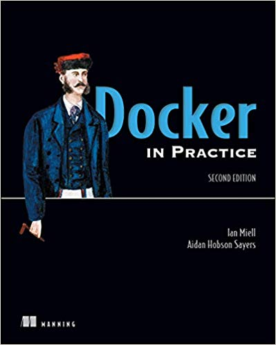

# Docker in Practice


## Chapter 1/16 <sup>(writing)</sup>

<details>
<summary>How many ways exist to create a docker image?</summary>

> 1. **Docker commands:** run a container and input the commands to create new image with `docker commit`.
> 2. **Dockerfile:** Build from a known base image, and specify the build with a limited set of simple commands.
> 3. **Dockerfile and configuration management (CM) tool:** Same as Dockerfile, but you hand over control of the build to a more sophisticated CM tool.
> 4. **Scratch image and import a set of files:** From an empty image, import a TAR file with the required files.

> **Resources**
> - Docker in Practice - Chapter 1.2.1

> **References**
> ---
</details>

<details>
<summary>How to write a basic Dockerfile?</summary>

> You begin the Dockerfile by defining the base image with the `FROM` command.
>
> ```docker
> FROM node
> ``````
>
> Next, you declare the maintainer with the `LABEL` command.
> This line isn’t required to make a working Docker image, but it’s good practice to include it.
>
> ```docker
> LABEL maintainer user@domain.tld
> ``````
>
> Next, you clone the source code with a `RUN` command.
> **Note:** Git is installed inside the base *node* image in this case, but you can’t take this kind of thing for granted.
>
> ```docker
> RUN git clone -q https://domain.com/username/repository.git
> ``````
>
> Now you move to the new cloned directory with a `WORKDIR` command.
> Not only does this change directories within the build context,
> but the last `WORKDIR` command determines which directory you’re in by default when you start up your container from your built image.
>
> ```docker
> WORKDIR repository
> ``````
>
> Next, you run the node package manager’s install command (npm).
>
> ```docker
> RUN npm install > /dev/null
> ``````
>
> Because port 8000 is used by the application, you use the `EXPOSE` command to tell Docker that containers from the built image should listen on this port.
>
> ```docker
> EXPOSE 8000
> ``````
>
> Finally, you use the CMD command to tell Docker which command will be run when the container is started up.
>
> ```docker
> CMD ["npm", "start"]
> ``````

> **Resources**
> - Docker in Practice - Chapter 1.2.2
> ---
> **References**
> ---
</details>

<details>
<summary>How to build an image using a Dockerfile?</summary>

> ```sh
> docker build .
> docker image build .
> ``````
>
> Each command results in a new image being created, and the image ID is output.
>
> ---
> **Resources**
> - Docker in Practice - Chapter 1.2.3
> ---
> **References**
> ---
</details>

<details>
<summary>How to tag an image after building it?</summary>

> ```sh
> docker tag 67c76cea05bb todoapp
> docker image tag ...
> ``````
>
> ---
> **Resources**
> - Docker in Practice - Chapter 1.2.3
> ---
> **References**
> ---
</details>

<details>
<summary>How to run a container?</summary>

> ```sh
> docker run -i -t -p 8000:8000 --name example todoapp
> docker container run ...
> ``````
>
> The `-p` flag maps the container’s port 8000 to the port 8000 on the host machine.
> The `--name` flag gives the container a unique name you can refer to later for convenience.
>
> ---
> **Resources**
> - Docker in Practice - Chapter 1.2.4
> ---
> **References**
> ---
</details>

<details>
<summary>How to terminate the process and the container?</summary>

> Once the container has been started, you can press `Ctrl-C` to terminate the process and the container.
>
> ---
> **Resources**
> - Docker in Practice - Chapter 1.2.4
> ---
> **References**
> ---
</details>

<details>
<summary>How to list the running processes in docker?</summary>

> ```sh
> docker ps -a
> docker container ps ...
> docker container ls ...
> docker container list ...
> ``````
>
> ---
> **Resources**
> - Docker in Practice - Chapter 1.2.4

> **References**
> ---
</details>

<details>
<summary>How to restart a stopped container?</summary>

> ```sh
> docker start example
> docker container start ...
> ``````
>
> ---
> **Resources**
> - Docker in Practice - Chapter 1.2.4
> ---
> **References**
> ---
</details>

<details>
<summary>How to check what files have been affected since the image was instantiated as a container?</summary>

> ```sh
> docker diff example
> docker container diff ...
> ``````
>
> The docker diff subcommand shows you which files have been affected since the image was instantiated as a container.
> In this case, the todo directory has been changed (C), and the other listed files have been added (A).
> No files have been deleted (D), which is the other possibility.
>
> ---
> **Resources**
> - Docker in Practice - Chapter 1.2.4
> ---
> **References**
> ---
</details>

## Chapter 2/16 <sup>(writing)</sup>

<details>
<summary>How to make docker daemon accessible from outside network?</summary>

> Once the Docker daemon has been stopped, you can restart it manually and open it up to outside users with the following command:
>
> ```sh
> sudo docker daemon -H tcp://0.0.0.0:2375
> ``````
>
> ```sh
> docker -H tcp://<your host's ip>:2375 <subcommand>
> ``````
>
> Or you can export the `DOCKER_HOST` environment variable:
>
> ```sh
> export DOCKER_HOST=tcp://<your host's ip>:2375
> sudo --preserve-env=DOCKER_HOST docker <subcommand>
> ``````
>
> ---
> **Resources**
> - Docker in Practice - Chapter 2.2
> ---
> **References**
> ---
</details>

<details>
<summary>How to run a container in background?</summary>

> ```sh
> docker run -d -p 1234:1234 --name daemon ubuntu:20.04 nc -l 1234
> docker run --detach -publish 1234:1234 --name daemon ...
> docker container run ...
> ``````
>
> The `-d` flag, when used with docker run, runs the container as a daemon.
> With `-p` you publish the 1234 port from the container to the host.
> The `--name` flag lets you give the container a name so you can refer to it later.
> Finally, you run a simple listening echo server on port 1234 with **netcat**.
>
> ```sh
> nc localhost 1234
> Look ma, I know docker!^C
> ``````
>
> ```sh
> docker container logs daemon
> Look ma, I know docker!
> ``````
>
> ---
> **Resources**
> - Docker in Practice - Chapter 2.2
> ---
> **References**
> ---
</details>

<details>
<summary>How to see the logs of a container?</summary>

>
> ```sh
> docker logs daemon
> docker container logs ...
> ``````
>
> ---
> **Resources**
> - Docker in Practice - Chapter 2.2

> **References**
> ---
</details>

<details>
<summary>How to recover a service when it stops in the background?</summary>

> Restart policy allows you to apply a set of rules to be followed when the container terminates:
>
> * `no`: Don’t restart when the container exits
> * `always`: Always restart when the container exits
> * `unless-stopped`: Always restart, but remember explicitly stopping
> * `on-failure[:max-retry]`: Restart only on failure
>
> ```sh
> docker container run --detach --restart=on-failure:10 --name daemon ubuntu /usr/bin/false
> docker container logs daemon
> ``````
>
> ---
> **Resources**
> - Docker in Practice - Chapter 2.1
> ---
> **References**
> ---
</details>

<details>
<summary>How to monitor docker API traffic using socat?</summary>

> ```sh
> socat -v UNIX-LISTEN:/tmp/dockerapi.sock,fork UNIX-CONNECT:/var/run/docker.sock &
> docker -H unix:///tmp/dockerapi.sock ps -a
> ``````
>
> ---
> **Resources**
> - Docker in Practice - Chapter 2.3
> ---
> **References**
> ---
</details>

<details>
<summary>How to search for images on Docker Hub?</summary>

> ```sh
> docker search node
> ``````
>
> ---
> **Resources**
> - Docker in Practice - Chapter 2.5

> **References**
> ---
</details>

## Chapter 3/16
## Chapter 4/16
## Chapter 5/16
## Chapter 6/16
## Chapter 7/16
## Chapter 8/16
## Chapter 9/16
## Chapter 10/16
## Chapter 11/16
## Chapter 12/16
## Chapter 13/16
## Chapter 14/16
## Chapter 15/16
## Chapter 16/16
