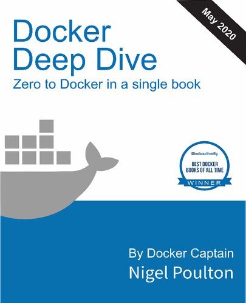

# [Docker Deep Dive](https://www.amazon.com/Docker-Deep-Dive-Nigel-Poulton/dp/1521822808/ref=sr_1_1?crid=1N7GS32JNOLMN&keywords=docker+deep+dive&qid=1680158055&sprefix=docker+deep+dive%2Caps%2C836&sr=8-1)

## Chapter 1/16
## Chapter 2/16
## Chapter 3/16
## Chapter 4/16

docker version

*****

docker image ls

*****

docker container runtells the Do=EE=80=BAer daemon to start a new container=
. =EE=81=89e-itf
l ags tell Do=EE=80=BAer to make the container interactive and to a=EE=80=
=BCa=EE=80=BB the current
shell to the container=E2=80=99s terminal

*****

PressCtrl-PQto exit the container without terminating it.

*****

You can a=EE=80=BCa=EE=80=BB your shell to the terminal of a running contai=
ner with
thedocker container execcommand.

*****

docker container exec -it vigilant_borg bash

*****

docker container ls

*****

Stop the container and kill it using thedocker container stopanddocker
container rmcommands.

*****

Verify that the container was successfully deleted by running thedocker
container lscommand with the-a f l ag. Adding-atells Do=EE=80=BAer to list =
all
containers, even those in the stopped state.

## Chapter 5/16
## Chapter 6/16

docker info

*****

=EE=81=89e following examples show how to pull various dif f erent images f=
rom of f
i cial repositories:
$ docker image pull mongo:4.2.6

*****

Pulling images from an unof f i cial repository is essentially the same =E2=
=80=94
you just need to prepend the repository name with a Do=EE=80=BAer Hub usern=
ame or
organization name. =EE=81=89e following example shows how to pull thev2 ima=
ge from
thetu-demorepository owned by a not-to-be-trusted person whose Do=EE=80=BAe=
r Hub
account name is nigelpoulton.
$ docker image pull nigelpoulton/tu-demo:v2

*****

If you want to pull images from 3rd party registries (not Do=EE=80=BAer Hub=
), you
need to prepend the repository name with the DNS name of the registry. For
example, the following command pulls the3.1.5image from the
google-containers/git-syncrepo on the Google Container Registry (gcr.io).
$ docker image pull gcr.io/google-containers/git-sync:v3.1.5

*****

docker image ls --filter dangling=3Dtrue

*****

A dangling image is an image that is no longer tagged, and appears in
listings as<none>:<none>. A common way they occur is when building a new
image giving it a tag that already exists.

*****

You can delete all dangling images on a system with thedocker image
prunecommand. If you add the-af l ag, Do=EE=80=BAer will also remove all un=
used
images (those not in use by any containers).

*****

dangling:Acceptstrueorfalse, and returns only dangling images (true), or
non-dangling images (false).
=E2=80=A2before:Requires an image name or ID as argument, and returns all i=
mages
created before it.
=E2=80=A2since:Same as above, but returns images created a=EE=80=B9er the s=
pecif i ed image.
=E2=80=A2label:Filters images based on the presence of a label or label and=
 value.
=EE=81=89edocker image lscommand does not display labels in its output.

*****

Here=E2=80=99s an example usingreferenceto display only images tagged as =
=E2=80=9Clatest=E2=80=9D.
$ docker image ls --filter=3Dreference=3D"*:latest"

*****

You can also use the--formatf l ag to format output using Go templates. For
example, the following command will only return the size property of images
on a Do=EE=80=BAer host.
$ docker image ls --format "{{.Size}}"

*****

Use the following command to return all images, but only display repo, tag
and size.
$ docker image ls --format "{{.Repository}}: {{.Tag}}: {{.Size}}"

*****

$ docker search nigelpoulton

*****

=EE=81=89e =E2=80=9CNAME=E2=80=9D f i eld is the repository name. =EE=81=89=
is includes the Do=EE=80=BAer ID, or
organization name, for unof f i cial repositories. For example,

*****

use--filter "is-official=3Dtrue"so that only of f i cial repos are displaye=
d.
$ docker search alpine --filter "is-official=3Dtrue"

*****

docker search alpine --filter "is-automated=3Dtrue"

*****

By default, Do=EE=80=BAer will only display 25 lines of results. However, y=
ou can
use the--limitf l ag to increase that to a maximum of 100.

*****

Another way to see the layers of an image is to inspect the image with
thedocker image inspectcommand.
=EE=81=89e following example inspects the sameubuntu:latestimage.
$ docker image inspect ubuntu:latest

*****

=EE=81=89edocker historycommand is another way of inspecting an image and s=
eeing
layer data. However, it shows the build history of an image and is not a
strict list of layers in the f i nal image.

*****

the image is always the combination of all layers sta=EE=80=BAed in the ord=
er they
were added.

*****

You can also view the digests of images in your Do=EE=80=BAer host=E2=80=99=
s local
repository by adding the--digestsf l ag to thedocker image lscommand. =EE=
=81=89ese
are both shown in the following example.

*****

docker image pull alpine

*****

docker image ls --digests alpine

*****

Assume you are running Do=EE=80=BAer on a Raspberry Pi (Linux running on AR=
M
ar=EE=80=BBitecture). When you pull an image, your Do=EE=80=BAer client mak=
es the relevant
calls to the Do=EE=80=BAer Registry API exposed by Do=EE=80=BAer Hub. If a =
manifest list
exists for the image, it will be parsed to see if an entry exists for Linux
on ARM. If an ARM entry 69 exists, the manifest for that image is retrieved
and parsed for the crypto ID=E2=80=99s of the layers that make up the image=
. Ea=EE=80=BB
layer is then pulled from Do=EE=80=BAer Hub.

*****

docker manifest inspect golang

*****

You can create your own builds for dif f erent platforms and ar=EE=80=BBite=
ctures
withdocker buildxand then usedocker manifest createto create your own
manifest lists.

*****

=EE=81=89e following command builds an image for ARMv7 calledmyimage:arm-v7=
from the
contents of the current directory. It=E2=80=99s based on code in the code i=
nhttps://
github.com/nigelpoulton/psweb.
$ docker buildx build --platform linux/arm/v7 -t myimage:arm-v7 .

*****

=EE=81=89e beauty of the command is that you don=E2=80=99t have to run it f=
rom an ARMv7
Do=EE=80=BAer node.

*****

At the time of writing,buildxis an experimental feature and
requiresexperimental=3Dtruese=EE=80=BCing in your =E2=88=BC/.docker/config.=
jsonf i le as
follows.
{ "experimental": true }

*****

When you no longer need an image on your Do=EE=80=BAer host, you can delete=
 it with
thedocker image rmcommand.
rmis short for remove.

*****

You can list multiple images on the same command by separating them with
whitespace like the following.
$ docker image rm f70734b6a266 a4d3716dbb72

*****

Images - The commands =E2=80=A2dockerimagepullis the command to download im=
ages. We
pull images from repositories inside of remote registries. By default,
images will be pulled from repositories on Do=EE=80=BAer Hub. =EE=81=89is c=
ommand will pull
the image tagged aslatestfrom thealpinerepository on Do=EE=80=BAer Hub:dock=
er image
pull alpine:latest.
=E2=80=A2docker image lslists all of the images stored in your Do=EE=80=BAe=
r host=E2=80=99s local
image ca=EE=80=BBe. To see the SHA256 digests of images add the--digestsf l=
 ag.
=E2=80=A2docker image inspectis a thing of beauty! It gives you all of the =
glorious
details of an image =E2=80=94 layer data and metadata.
=E2=80=A2docker manifest inspectallows you to inspect the manifest list of =
any
image stored on Do=EE=80=BAer Hub.
=EE=81=89is will show the manifest list for theredisimage:docker manifest i=
nspect
redis.
=E2=80=A2docker buildxis a Do=EE=80=BAer CLI plugin that extends the Do=EE=
=80=BAer CLI to support
multi-ar=EE=80=BB builds.
=E2=80=A2docker image rmis the command to delete images. =EE=81=89is comman=
d shows how to
delete thealpine:latest image =E2=80=94docker image rm alpine:latest. You c=
annot
delete an image that is associated with a container in the running (Up) or
stopped (Exited) states.

*****

## Chapter 7/16

Containers run until the app they are executing exits.

*****

You can manually stop a running container with thedocker container
stopcommand.

*****

To get rid of a container forever, you have to explicitly delete it
withdocker container rm.

*****

If you=E2=80=99re logged on to the container and type exit, you=E2=80=99ll =
terminate the
Bash process and the container will exit (terminate). =EE=81=89is is becaus=
e a
container cannot exist without its designated main process.

*****

Press Ctrl-PQ to exit the container without terminating its main process.
Doing this will place you ba=EE=80=BA in the shell of your Do=EE=80=BAer ho=
st and leave the
container running in the ba=EE=80=BAground.

*****

It=E2=80=99s important to understand that this container is still running a=
nd you
can re-a=EE=80=BCa=EE=80=BB your terminal to it with the docker container e=
xec command.
81 $ docker container exec -it 50949b614477 bash

*****

thedocker container execcommand created a new Bash or PowerShell process
and a=EE=80=BCa=EE=80=BBed to that. =EE=81=89is means typingexitin this she=
ll will not terminate
the container, because the original Bash or PowerShell process will
continue running.

*****

$ docker container run --name percy -it ubuntu:latest /bin/bash

*****

=EE=81=89at=E2=80=99s the container created, and we named it =E2=80=9Cpercy=
=E2=80=9D for persistent.

*****

You can use the container=E2=80=99s name or ID with the docker container st=
op
command. =EE=81=89e format is docker container stop <container-id or
container-name>.

*****

While this example illustrates the persistent nature of containers, it=E2=
=80=99s
important you understand two things:
1. =EE=81=89e data created in this example is stored on the Do=EE=80=BAer h=
osts local f i
lesystem. If the Do=EE=80=BAer host fails, the data will be lost.
2. Containers are designed to be immutable objects and it=E2=80=99s not a g=
ood
practice to write data to them.
For these reasons, Do=EE=80=BAer provides volumes that exist separately fro=
m the
container, but can be mounted into the container at runtime.

*****

=EE=81=89is is a form of self-healing that enables Do=EE=80=BAer to automat=
ically restart
them a=EE=80=B9er certain events or failures have occurred.

*****

Restart policies are applied per-container, and can be conf i gured
imperatively on the command line as part of docker-container runcommands,
or declaratively in YAML f i les for use with higher-level tools su=EE=80=
=BB as
Do=EE=80=BAer Swarm, Do=EE=80=BAer Compose, and Kubernetes.

*****

the following restart policies exist:
85 =E2=80=A2always =E2=80=A2unless-stopped =E2=80=A2on-failed

*****

=EE=81=89e always policy is the simplest. It always restarts a stopped cont=
ainer
unless it has been explicitly stopped,
--
However, if you restart the Do=EE=80=BAer daemon, the container will be
automatically restarted when the daemon comes ba=EE=80=BA up. You need to b=
e aware
of this.

*****

docker container run --name neversaydie -it --restart always alpine sh

*****

Be aware that Do=EE=80=BAer has restarted the same container and not create=
d a new
one. In fact, if you inspect it withdocker container inspectyou can see
therestartCounthas been incremented.

*****

=EE=81=89e main dif f erence between the always and unless-stopped policies=
 is that
containers with the--restart unless-stoppedpolicy will not be restarted
when the daemon restarts if they were in theStopped (Exited) state.

*****

=EE=81=89e on-failure policy will restart a container if it exits with a no=
n-zero
exit code. It will also restart containers when the Do=EE=80=BAer daemon re=
starts,
even containers that were in the stopped state.

*****

When building a Do=EE=80=BAer image, you can embed an instruction that list=
s the
default app for any containers that use the image. You can see this for any
image by running adocker image inspect.

*****

=EE=81=89e entries a=EE=80=B9erCmdshow the command/app that the container w=
ill run unless
you override it with a dif f erent one when you laun=EE=80=BB the container
withdocker container run.

*****

Containers - The commands =E2=80=A2dockercontainerrunis the command used to=
 start
new containers. In its simplest form, it accepts an image and a command as
arguments. =EE=81=89e image is used to create the container and the command=
 is the
application the container will run when it starts. =EE=81=89is example will=
 start
an Ubuntu container in the foreground, and tell it to run the Bash
shell:docker container run -it ubuntu /bin/bash.
=E2=80=A2Ctrl-PQwill deta=EE=80=BB your shell from the terminal of a contai=
ner and leave
the container running(UP)in the ba=EE=80=BAground.
=E2=80=A2docker container lslists all containers in the running(UP)state. I=
f you
add the-af l ag you will also see containers in the stopped(Exited)state.
=E2=80=A2docker container execruns a new process inside of a running contai=
ner.
It=E2=80=99s useful for a=EE=80=BCa=EE=80=BBing the shell of your Do=EE=80=
=BAer host to a terminal inside
of a running container. =EE=81=89is command will start a new Bash shell ins=
ide of a
running container and connect to it:docker container exec -it
<container-name or container-id> bash. For this to work, the image used to
create the container must include the Bash shell.
=E2=80=A2docker container stopwill stop a running container and put it in t=
heExited
(0)state. It does this by issuing aSIGTERMto the process with PID 1 inside
of the container. If the process has not cleaned up and stopped within 10
seconds, a SIGKILL will be issued to forcibly stop the container.docker
container stopaccepts container IDs and container names as arguments.
=E2=80=A2dockercontainerstartwill restart a stopped(Exited)container. You c=
an
givedockercontainer startthe name or ID of a container.
=E2=80=A2docker container rmwill delete a stopped container. You can specif=
y
containers by name or ID. It is recommended that you stop a container with
thedocker container stopcommand before deleting it withdocker container rm.
=E2=80=A2docker container inspectwill show you detailed conf i guration and=
 runtime
information about a container. It accepts container names and container IDs
as its main argument.

*****

## Chapter 8/16

cat Dockerfile FROM alpine LABEL maintainer=3D"nigelpoulton@hotmail.com" RU=
N
apk add --update nodejs nodejs-npm COPY . /src WORKDIR /src RUN npm install
EXPOSE 8080 ENTRYPOINT ["node", "./app.js"]

*****

=EE=81=89eRUN apk add --update nodejs nodejs-npminstruction uses the
Alpineapkpa=EE=80=BAage manager to install nodejsandnodejs-npminto the imag=
e. It
creates a new image layer directly above the Alpine base layer, and
installs the pa=EE=80=BAages in this layer.

*****

=EE=81=89eCOPY . /srcinstruction creates another new layer and copies in th=
e
application and dependency f i les from the build context.

*****

Next, the Do=EE=80=BAerf i le uses theWORKDIRinstruction to set the working
directory inside the image f i lesystem for the rest of the instructions in
the f i le. =EE=81=89is instruction does not create a new image layer.

*****

=EE=81=89en theRUNnpminstallinstruction creates a new layer and usesnpmto i=
nstall
application dependencies listed in thepackage.jsonf i le in the build
context. It runs within the context of theWORKDIRset in the previous
instruction, and installs the dependencies into the newly created layer.

*****

=EE=81=89e application exposes a web service on TCP port 8080, so the Do=EE=
=80=BAerf i le
documents this with theEXPOSE 8080 instruction. =EE=81=89is is added as ima=
ge
metadata and not an image layer.

*****

Finally, theENTRYPOINTinstruction is used to set the main application that
the image (container) should run. =EE=81=89is is also added as metadata and=
 not an
image layer.

*****

=EE=81=89e following command will build a new image calledweb:latest. =EE=
=81=89e period (.)
at the end of the command tells Do=EE=80=BAer to use the shell=E2=80=99s cu=
rrent working
directory as the build context.

*****

docker image build -t web:latest .

*****

docker image ls

*****

You can use thedocker image inspect web:latestcommand to verify the conf i
guration of the image. It will list all of the se=EE=80=BCings that were co=
nf i
gured from the Do=EE=80=BAerf i le. Look out for the list of image layers a=
nd the
Entrypointcommand.

*****

In order to push an image to Do=EE=80=BAer Hub, you need to login with your=
 Do=EE=80=BAer
ID. You also need to tag the image appropriately.

*****

docker login

*****

Before you can push an image, you need to tag it in a special way. =EE=81=
=89is is
because Do=EE=80=BAer needs all of the following information when pushing a=
n image:
=E2=80=A2Registry =E2=80=A2Repository =E2=80=A2Tag

*****

Do=EE=80=BAer is opinionated, so by default it pushes images to Do=EE=80=BA=
er Hub. You can
push to other registries, but you have to explicitly set the registry URL
as part of thedocker image pushcommand.

*****

docker image tag web:latest nigelpoulton/web:latest =EE=81=89e format of th=
e
command isdocker image tag <current-tag> <new-tag>and it adds an additional
tag, it does not overwrite the original.

*****

docker image push nigelpoulton/web:latest

*****

=EE=81=89edocker image buildcommand parses the Do=EE=80=BAerf i le one-line=
-at-a-time
starting from the top.

*****

Comment lines start with the#=EE=80=BBaracter.

*****

All non-comment lines are Instructions and take the formatINSTRUCTION
argument. Instruction names are not case sensitive, but it=E2=80=99s normal
practice to write them in UPPERCASE. =EE=81=89is makes reading the Do=EE=80=
=BAerf i le
easier.

*****

Some instructions create new layers, whereas others just add metadata to
the image conf i g f i le.

*****

Examples of instructions that create new layers areFROM,RUN, andCOPY.
Examples that create metadata include EXPOSE,WORKDIR,ENV, andENTRYPOINT. =
=EE=81=89e
basic premise is this =E2=80=94 if an instruction is adding content su=EE=
=80=BB as f i les
and programs to the image, it will create a new layer. If it is adding
instructions on how to build the image and run the application, it will
create metadata.

*****

You can view the instructions that were used to build the image with
thedocker image history command.
$ docker image history web:latest

*****

You can force the build process to ignore the entire ca=EE=80=BBe by passin=
g
the--no-cache=3Dtruef l ag to thedocker image buildcommand.

*****

It is also important to understand that theCOPYandADDinstructions include
steps to ensure that the content being copied into the image has not =EE=80=
=BBanged
since the last build. For example, it=E2=80=99s possible that theCOPY . /sr=
c
instruction in the Do=EE=80=BAerf i le has not =EE=80=BBanged since the pre=
vious, but=E2=80=A6 the
contents of the directory being copied into the image have =EE=80=BBanged!
To protect against this, Do=EE=80=BAer performs a =EE=80=BBe=EE=80=BAsum ag=
ainst ea=EE=80=BB f i le being
copied, and compares that to a =EE=80=BBe=EE=80=BAsum of the same f i le in=
 the ca=EE=80=BBed
layer. If the =EE=80=BBe=EE=80=BAsums do not mat=EE=80=BB, the ca=EE=80=BBe=
 is invalidated and a new layer
is built.

*****

Add the--squashf l ag to thedocker image buildcommand if you want to create
a squashed image.

*****

If you are building Linux images, and using the apt pa=EE=80=BAage manager,=
 you
should use theno-install-recommends f l ag with theapt-get installcommand.
=EE=81=89is makes sure thataptonly installs main dependencies (pa=EE=80=BAa=
ges in
theDependsf i eld) and not recommended or suggested pa=EE=80=BAages.

*****

Containerizing an app - The commands =E2=80=A2docker image buildis the comm=
and that
reads a Do=EE=80=BAerf i le and containerizes an application. =EE=81=89e-tf=
 l ag tags the
image, and the-ff l ag lets you specify the name and location of the Do=EE=
=80=BAerf
i le. With the-ff l ag, it is possible to use a Do=EE=80=BAerf i le with an
arbitrary name and in an arbitrary location. =EE=81=89e build context is wh=
ere your
application f i les exist, and this can be a directory on your local Do=EE=
=80=BAer
host or a remote Git repo.
=E2=80=A2 =EE=81=89eFROMinstruction in a Do=EE=80=BAerf i le specif i es th=
e base image for the new
image you will build. It is usually the f i rst instruction in a Do=EE=80=
=BAerf i
le and a best-practice is to use images from of f i cial repos on this line=
.
=E2=80=A2 =EE=81=89eRUNinstruction in a Do=EE=80=BAerf i le allows you to r=
un commands inside the
image. Ea=EE=80=BBRUNinstruction creates a single new layer.
=E2=80=A2 =EE=81=89eCOPYinstruction in a Do=EE=80=BAerf i le adds f i les i=
nto the image as a new
layer. It is common to use theCOPY instruction to copy your application
code into an image.
=E2=80=A2 =EE=81=89eEXPOSEinstruction in a Do=EE=80=BAerf i le documents th=
e network port that the
application uses.
=E2=80=A2 =EE=81=89eENTRYPOINTinstruction in a Do=EE=80=BAerf i le sets the=
 default application to
run when the image is started as a container.
=E2=80=A2 Other Do=EE=80=BAerf i le instructions
includeLABEL,ENV,ONBUILD,HEALTHCHECK,CMDand more=E2=80=A6

## Chapter 9/16
## Chapter 10/16
## Chapter 11/16
## Chapter 12/16
## Chapter 13/16
## Chapter 14/16
## Chapter 15/16
## Chapter 16/16

