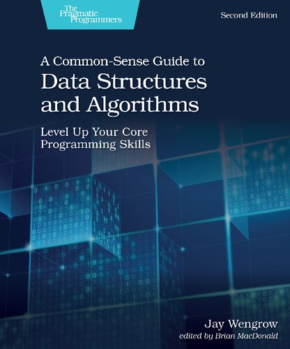

# [A Common-Sense Guide to Data Structures and Algorithms](#)


## Chapter 1/20

<details>
<summary>What are the main data structure operations?</summary>

> - Read
> - Search
> - Insert
> - Delete

> Origin: 1

> References:
---
</details>

<details>
<summary>How do we measure the speed of an operation in code?</summary>

> We can measure the speed of an operation in terms of how many computational steps it takes.

> Origin: 1

> References:
---
</details>

<details>
<summary>How many steps does each of four main operations take for an array?</summary>

> **Read:** Computers read an array in just one step.
>
> **Search:** To Search for a value within an array, computers have no choice but to inspect each cell one at a time.
> This algorithm is called **linear search**.
>
> **Insert:** Inserting data in an array can take N+1 steps for an array containing N elements.
> This is because in the worst case scenario we need to shift all N elements over, and then finally execute the insertion step.
>
> **Delete:** For an array containing N elements, the maximum number of steps that deletion would take is N steps.
> This is because we need one deletion and N-1 shifts.

> Origin: 1

> References:
---
</details>

<details>
<summary>What's the difference between an array-based set and an array?</summary>

> The only difference between array-based set and an array is that the set never allows duplicate values to be inserted into it.

> Origin: 1

> References:
---
</details>

<details>
<summary>How many steps does each of four main operations take for an array-based set?</summary>

> **Reading:** Reading from an array-based set is exactly as reading from an array, it takes just one step for a computer to look up what's contained within a particular index.
>
> **Search:** Searching an array-based set also turns out to be no different than searching an array, it takes up to N steps to search for a value within an array-based set.
>
> **Delete:** Deletion is also identical between an array-based set and an array.
> In the worst case scenario, it takes N steps to delete a value within an array-based set.
>
> **Insert:** Insertion, however is different between arrays and array-based set.
> With an array it takes N shifts and one insertion step.
> With an array-based set however, every insertion first requires a search to check for existence of a duplicate.
> Insertion into the end of an array-based set will take up to N steps to search and one step for the actual insertion, which takes N+1 steps in total.
> In the worst case scenario, inserting a value at the beginning of an array-based set takes N steps to look up for duplicates,
> and N steps to shift all the data to the right, and one last final step to insert the new value.
> That's total of 2N+1 steps.

> Origin: 1

> References:
---
</details>

## Chapter 2/20

<details>
<summary>how many steps does each of four main operations take for an ordered array?</summary>

> **Read:** Same as array and array-based set.
>
> **Delete:** Same as array and array-based set.
>
> **Insert:** In terms of N, it takes N elements in an ordered array, the insertion takes N+2 steps in total, no matter where in the ordered array the new value ends up.
> If the value ends up toward the beginning of the ordered array, we have fewer comparisons and more shifts.
> If the value ends up toward the end, we get more comparisons but fewer shifts.
>
> **Search:** Searching can be applied to ordered array using different algorithms.
> Using **linear search** algorithm, the operation can be stopped early when the value is found.
> Using **binary search** algorithm, it would take only one more step to search each time data set grows twice.

> Origin: 1

> References:
---
</details>

<details>
<summary>What are the advantages and disadvantages of using ordered array over unordered array?</summary>

> Within an ordered array, we can stop a **linear search** early even if the value isn't contained within the array as soon as we reach a value with a higher order.
>
> *pseudocode for C++*
> ```cpp
> iterator linear_search(array, search_value)
> {
>     for (iter = array.begin(); iter != array.end() && *iter >= search_value; ++*iter)
>         if (*iter == search_value)
>             return iter;
>     return nullptr;
> }
> ``````
>
> Though, using an ordered array we can also use **binary search** to attempt a search much faster!
>
> ```cpp
> iterator binary_search(array, search_value)
> {
>     lower_bound = array.begin();
>     upper_bound = array.end() - 1;
> 
>     while (lower_bound <= upper_bound)
>     {
>         midpoint = (upper_bound + lower_bound) / 2;
>         midpoint_value = array[midpoint];
> 
>         if (search_value == midpoint_value)
>             return midpoiont;
>         else if (search_value > midpoint_value)
>             upper_bound = midpoint - 1;
>         else if (search_value < midpoint_value)
>             lower_bound = midpoint + 1;
>     }
> 
>     return nullptr;
> }
> ``````

> Origin: 2

> References:
---
</details>

## Chapter 3/20

<details>
<summary>What is the key question of Big O notation and what does it express?</summary>

> The key question of Big O notation is if there are N data elements, how may steps will the algorithm take?
> Big O tells the story of how much the number of step increases as the data changes.

> Origin: 3

> References:
---
</details>

<details>
<summary>What are the order of main operations for arrays?</summary>

> * **Read:** it would take 1 step to read from an array, so it is `O(1)`.
> * **Search:** it would take N steps to search through an array, so it is `O(N)`.
> * **Insert:** it would take N+1 steps to insert into an array in the worst case scenario, so it is `O(N)`.
> * **Delete:** it would take N steps to delete from an array, so it is `O(N)`.

> Origin: 3

> References:
---
</details>

<details>
<summary>What are the order of main operations for array-based sets?</summary>

> * **Read:** same as arrays, it would take 1 step to read from an array-based set, so it is `O(1)`.
> * **Search:** same as arrays it would take N steps to search through an array-based set, so it is `O(N)`.
> * **Insert:** it would take N steps to search first and N steps to insert into an array in the worst case scenario, so it is `O(N)`.
> * **Delete:** same as arrays it would take N steps to delete from an array-based set, so it is `O(N)`.

> Origin: 3

> References:
---
</details>

<details>
<summary>What are the order of main operations for ordered arrays?</summary>

> * **Read:** same as arrays, it would take 1 step to read from an array-based set, so it is `O(1)`.
> * **Search:** same as arrays it would take N steps to search through an array-based set, so it is `O(N)`.
> * **Insert:** it would take N steps to search first and N steps to insert into an array in the worst case scenario, so it is `O(N)`.
> * **Delete:** same as arrays it would take N steps to delete from an array-based set, so it is `O(N)`.

> Origin: 3

> References:
---
</details>

<details>
<summary>What does the constant time in <code>O(1)</code> mean?</summary>

> In constant time efficiency no matter how many elements exist, the operation always takes one step.

> Origin: 3

> References:
---
</details>

<details>
<summary>What does <code>O(log N)</code> mean in terms of number of steps taken in an algorithm?</summary>

> `O(log N)` means the algorithm takes as many steps as it takes to keep halving the data elements until we remain with 1.

> Origin: 3

> References:
---
</details>

## Chapter 4/20

<details>
<summary>What are the steps taken to sort an array using <b>Bubble Sort</b> algorithm, and what is its efficiency in terms of Big O?</summary>

> 1. Point to two first consecutive values in the array.
> 2. If the two items are out of order, swap them.
> 3. Move pointers one cell to the right.
> 4. Repeat steps 1 through 3 until we reach the end of the array.
> 5. Move back the two pointers back to the first two values of the array, and execute another pass-through of the array until we have a pass-through in which we did not perform any swaps.
>
> ```
> Initial array:  
>  4  2  7  1  3 
> ``````
>
> First pass-through: 3 swaps  
>
> ```
> (4  2) 7  1  3  
> (2  4) 7  1  3    swap  
>  2 (4  7) 1  3  
>  2  4 (7  1) 3  
>  2  4 (1  7) 3    swap  
>  2  4  1 (7  3)  
>  2  4  1 (3  7)   swap
> ``````
>
> Second pass-through: 2 swaps  
>
> ```
> (2  4) 1  3 |7|  
>  2 (4  1) 3 |7|  
>  2 (1  4) 3 |7|   swap  
>  2  1 (4  3)|7|  
>  2  1 (3  4)|7|   swap
> ``````
>
> Third pass-through: 1 swaps  
>
> ```
> (2  1) 3 |4  7|  
> (1  2) 3 |4  7|   swap  
>  1 (2  3)|4  7|
> ``````
>
> Fourth pass-through:  
>
> ```
> (1  2)|3  4  7|   no swap means end of pass-throughs
> ``````
>
> Sorted array:  
>
> ```
>  1  2  3  4  7 
> ``````
> 
> For N elements we make `(N-1) + (N-2) + ... + 1` comparisons and it worst case scenario we make swap for each comparison,
> making it `N²/2` steps which falls into the `O(N²)` general category.

> Origin: 4

> References:
---
</details>

## Chapter 5/20

<details>
<summary>What steps are taken in sorting an array using <b>Selection Sort</b> algorithm and what is its efficiency in terms of Big O?</summary>

> 1. Step through array from left to right to determine which value has least order and keep track of the lowest value we've encountered so far.
> 2. Once we've determined which index contains the lowest value, swap its value with the first value in pass-through.
> 3. Repeat each pass-through from step 1 and 2 until a pass-through starting at the end of the array is reached.
>
> ```
> Initial array:  
>  4  2  7  1  3 
>
> First pass-through: starting at index 0  
> (4) 2  7  1  3        lowest value: 4  
>  4 (2) 7  1  3        lowest value: 2  
>  4  2 (7) 1  3        lowest value: 2  
>  4  2  7 (1) 3        lowest value: 1  
>  4  2  7  1 (3)       lowest value: 1  
> |1| 2  7  4  3        swap lowest value with the first value in pass-through
>
> Second pass-through: starting at index 1  
> |1|(2) 7  4  3        lowest value: 2  
> |1| 2 (7) 4  3        lowest value: 2  
> |1| 2  7 (4) 3        lowest value: 2  
> |1| 2  7  4 (3)       lowest value: 2  
> |1  2| 7  4  3        no swap needed as lowest value is already the first value in pass-through
>
> Third pass-through: starting at index 2  
> |1  2|(7) 4  3        lowest value: 7  
> |1  2| 7 (4) 3        lowest value: 4  
> |1  2| 7  4 (3)       lowest value: 3  
> |1  2  3| 4  7        swap lowest value with the first value in pass-through
>
> Fourth pass-through: starting at index 3  
> |1  2  3|(4) 7        lowest value: 4  
> |1  2  3| 4 (7)       lowest value: 4  
> |1  2  3  4| 7        no swap needed as lowest value is already the first value in pass-through
>
> Fifth pass-through: starting at index 4  
> |1  2  3  4|(7)       pass-through starts at the end of the array
>
> Sorted array:  
>  1  2  3  4  7 
> ``````

> Origin: 5

> References:
---
</details>

<details>
<summary>What are the general categories of algorithm speeds?</summary>

> * `O(1)`
> * `O(log N)`
> * `O(N)`
> * `O(N²)`
> * `O(N³)`
> * `O(2ⁿ)`

> Origin: 5

> References:
---
</details>

<details>
<summary>How do algorithms are classified into different categories of Big O?</summary>

> It's enough to identify them by their general category.

> Origin: 5

> References:
---
</details>

<details>
<summary>How two algorithms in the same category can be compared?</summary>

> When two algorithms fall under the same classification of Big O, it doesn't necessarily mean that both algorithms have the same speed.  
> Further analysis is required to determine which algorithm is faster.

> Origin: 5

> References:
---
</details>

## Chapter 6/20

<details>
<summary>What steps are taken to sort an array using <b>Insertion Sort</b> algorithm and what is its efficiency?</summary>

> 1. In the first pass-through, remove the value at index 1 and store it in a temporary variable. This will leave a gap at that index.
> 2. Begin shifting by taking each value to the left of the gap and compare it to the value in the temporary variable. If the value to the left of the gap is greater from the temporary variable, we shift that value to the right. As soon as a value with lower order than the temporary value encountered in the array, shifting is over.
> 3. Insert the temporarily removed value into the gap.
> 4. Repeat all steps from 1 to 3 until the pass-through begins at the final index of the array.
>
> Initial array:
>
> First pass-through:
>
> Second pass-through:
>
> Third pass-through:
>
> Sorted array:

> Origin: 6

> References:
---
</details>

<details>
<summary>Having different orders of magnitude in the efficiency of an algorithm, how does Big O notation represents the efficiency?</summary>

> Big O notation only takes into account the highest order of N when we have multiple orders added together.
> `N³+2N²+N+5` is expressed as `O(N³)`.

> Origin: 6

> References:
---
</details>

<details>
<summary>What are the wrost, average and best case scenarios of <b>Bubble Sort</b>, <b>Selection Sort</b>, and <b>Insertion Sort</b>?</summary>

> * **Bubble Sort:** worst case `O(N²)`, average case `O(N²)`, best case `O(N²)`.
> * **Selection Sort:** worst case `O(N²/2)`, average case `O(N²/2)`, best case `O(N²/2)`.
> * **Insertion Sort:** worst case `O(N²)`, average case `O(N²/2)`, best case `O(N)`.

> Origin: 6

> References:
---
</details>

<details>
<summary>What considerations should be taken into account when choosing between <b>Insertion Sort</b> and <b>Selection Sort</b>?</summary>

> In an average case, when an array is randomly sorted, they perform similarly.  
> If an array can be assumed to be mostly sorted, then **Insertion Sort** will be a better choice.  
> If an array is known to be mostly sorted in reverse order, then **Selection Sort** will be faster.

> Origin: 6

> References:
---
</details>

## Chapter 7/20

Nothing to import.

## Chapter 8/20

<details>
<summary>What is a hash table?</summary>

> A hash table is a list of paired values.  
> The first item in each pair is called the key, and the second item is called the value.

> Origin: 8

> References:
---
</details>

<details>
<summary>What characteristics should a function have in order to be a valid hash function?</summary>

> A hash function needs to meet only one criterion to be valid.  
> It must convert the same string to the same number every single time it's applied.

> Origin: 8

> References:
---
</details>

<details>
<summary>What is the common value of <b>load factor</b> in implementation of hash tables?</summary>

> The ratio of data to cells ideally is 0.7 which means 7 elements per 10 cells.

> Origin: 8

> References:
---
</details>

<details>
<summary>How hash tables can be used for non-paired objects instead of arrays in order to make look up operations efficient?</summary>

> By storing objects as keys and assign boolean true as the associated value for each object.

> Origin: 8

> References:
---
</details>

## Chapter 9/20

<details>
<summary>What constraints do stacks have?</summary>

> * Data can be inserted only at the end of a stack.
> * Data can be deleted only from the end of a stack.
> * Only the last element of a stack can be read.

> Origin: 9

> References:
---
</details>

<details>
<summary>What operations should stack data structures support?</summary>

> * `push()`
> * `pop()`
> * `top()`

> Origin: 9

> References:
---
</details>

<details>
<summary>What is an <b>Abstract Data Type</b>?</summary>

> It's a kind of data structure that is a set of theoretical rules that revolve around some other basic data structures.  
> The set, stack, and queue are examples of abstract data types.  
> Some implementations of sets use arrays under the hood while other implementations actually use hash tables.  
> The set itself, though, is simply a theoertical concept, it's a list of non-duplicated data elements.

> Origin: 9

> References:
---
</details>

<details>
<summary>What constraints do queues have?</summary>

> * The first data added to a queue is the first item to be removed.
> * Data can be inserted only at the end of a queue, similar to stacks.
> * Data can be deleted only from the front of a queue, in opposite behavior of the stacks.
> * Only the element at the front of a queue can be read.

> Origin: 9

> References:
---
</details>

<details>
<summary>What are the main operations of queues?</summary>

> * `enqueue()`
> * `dequeue()`
> * `front()`

> Origin: 9

> References:
---
</details>

## Chapter 10/20

<details>
<summary>What is base case and why all recursive calls should have one?</summary>

> In recursion terminology, the case in which a function will not recurse is known as the base case.
> All recursive functions should have at least one base case. They will keep recalling themselves infinitely otherwise.

> Origin: 10

> References:
---
</details>

<details>
<summary>How recursive code can be read?</summary>

> 1. Identify the base case.
> 2. Walk through the function for the base case.
> 3. Identify the next-to-last case.
> 4. Walk through function for the next-to-last case.
> 5. Repeat this process by identifying before the case you just analyzed, and walking through the function for that case.
>
> ```ruby
> def factorial(number)
>     if number == 1
>         return 1
>     else
>         return number * factorial(number-1)
>     end
> end
> ``````
>
> Writing upwards from base case:
>
> factorial(1) returns 1
>
> And the for the next-to-last case:
>
> factorial(2) returns 2  
> factorial(1) returns 1
>
> And again a case before that:
>
> factorial(3) returns 6  
> factorial(2) returns 2  
> factorial(1) returns 1

> Origin: 10

> References:
---
</details>

<details>
<summary>When does stack overflow occur in recursive calls?</summary>

> In case of infinite recursion, the same function keeps being pushed onto the call stack.  
> The call stack will eventually be consumed until further calls will not be possible.

> Origin: 10

> References:
---
</details>

## Chapter 11/20

Nothing to import.

## Chapter 12/20

<details>
<summary>What is <b>Overlapping Subproblems</b> in recursion?</summary>

> When a problem is solved by solving smaller version of the same problem, the smaller problem is called a *subproblem*.  
> What makes these subproblem overlapping is the fact that each subproblem calls many of the same functions as each other.

> Origin: 12

> References:
---
</details>

<details>
<summary>What is <b>Dynamic Programming</b> and how can it be an optimization to recursion?</summary>

> **Dynamic Programming** is the process of optimizing recursive problems that have overlapping subproblems.  
> Optimizing an algorithm with dynamic programming is typically accomplished with one of two techniques.  
> The first technique is something called memoization which reduces recursive calls by remembering previously computed functions.  
> The second technique, known as **going bottom-up** uses iteration instead of recursion to prevent duplicate calls.

> Origin: 12

> References:
---
</details>

<details>
<summary>How does <b>Dynamic Programming</b> using <b>Memoization</b> helps in optimizing recursive calls?</summary>

> With memoization, each time we make a new calculation, we store it in a hash table for future calls.  
> This way we only make a calculation if it hadn't ever been made before.

> Origin: 12

> References:
---
</details>

<details>
<summary>How does <b>Dynamic Programming</b> using <b>Memoization</b> helps in optimizing recursive calls?</summary>

> By using iteration instead of recursion to ensure that it doesn't make duplicate calls for overlapping subproblems.

> Origin: 12

> References:
---
</details>

## Chapter 13/20

<details>
<summary>What is the concept of partitioning in Quick Sort algorithm??</summary>

> To partition an array is to take a random value from the array, which is then called the pivot,
> and make sure that every number that is less than the pivot ends up to the left of the pivot,
> and that every number greater than the pivot ends up to the right of the pivot.

> Origin: 13

> References:
---
</details>

<details>
<summary>What steps are take in partitioning algorithm?</summary>

> 0. Set the rightmost index as pivot, leftmost index as the left index and rightmost index other that pivot as right index.
> 1. The left pointer continuously moves one cell to the right until it reaches a value that is less than or equal to the pivot and then stops.
> 2. The right pointer continuously moves one cell to the left and then stops. The right pointer will also stop if it reaches the beginning of the array.
> 3. Once the right pointer has stopped, if the left pointer has reached or gone beyond the right pointer, ew move on to step 4. Otherwise, we swap the values that the left pointers are pointing to, and then go back to repeat steps 1, 2, and 3 again.
> 4. Finally, swap the pivot with the value that the left pointer is currently pointing to.
>
> When we are done with paritioning, we are now assured that all values to the left of the pivot are less than the pivot itself, and all values to the right of the pivot are greater than it.
> And that means the pivot itself is now in its correct place within the array, although the other values are not yet necessarily completely sorted.
>
> ` 0  5  2  1  6  3 `    set the pivot, left and right pointers  
> `<0> 5  2  1 <6>(3)`    compare the left pointer to the pivot  
> `<0> 5  2  1 <6>(3)`    move left pointer since 0 is less than pivot 3  
> ` 0 <5> 2  1 <6>(3)`    left pointer stops, move right pointer since 6 is greater than pivot 3  
> ` 0 <5> 2 <1> 6 (3)`    both pointers stopped, swap the values of the two pointers  
> ` 0 <5> 2 <1> 6 (3)`    left pointer moves further to the next step  
> ` 0  5 <2><1> 6 (3)`    left pointer moves on since its value is less than the pivot  
> ` 0  5  2 «1» 6 (3)`    both pointers point to the same value, we are done moving pointers  
> ` 0  5  2 «3» 6 (1)`    swap the value that the left pointer is pointing to with the pivot  
> ` 0  5  2 |3| 6  1 `    now 3 is in its correct location within the array
>
> ```cpp
> int* partition(int* left_pointer, int* right_pointer)
> {
>     int* pivot_index = right_pointer;
>     int pivot = array[pivot_index];
>     right_pointer--;
> 
>     while (true)
>     {
>         while (array[left_pointer] < pivot)
>             left_pointer++;
> 
>         while (array[right_pointer] > pivot)
>             right_pointer--;
> 
>         if (left_pointer >= right_pointer)
>             break;
>         else
>             std::swap(left_pointer, right_pointer);
>     }
> 
>     std::swap(left_pointer, pivot_index);
> 
>     return left_pointer;
> }
> ``````

> Origin: 13

> References:
---
</details>

<details>
<summary>What steps are taken in Quick Sort algorithm?</summary>

> 1. Partition the array. The pivot is not in its proper place.
> 2. Treat the subarrays to the left and right of the pivot as their own arrays, and recursively repeat step 1 and 2.
> 3. When we have a subarray that has zero or one elements, that is our base case and we do nothing.
>
> ```cpp
> void quicksort(int* left_index, int* right_index)
> {
>     if (right_index - left_index > 0)
>     {
>         int* pivot_index = partition(left_index, right_index);
>         quicksort(left_index, pivot_index - 1);
>         quicksort(pivot_index + 1, right_index);
>     }
> }
> ``````

> Origin: 13

> References:
---
</details>

<details>
<summary>What is the efficiency of Quick Sort algorithm?</summary>

>

> Origin: 13

> References:
---
</details>

<details>
<summary>Compared to Insertion Sort, what are the best and worst cases of Quick Sort algorithm?</summary>

>

> Origin: 13

> References:
---
</details>

<details>
<summary>What is Quick Select algorithm and where is it best known to be used?</summary>

>

> Origin: 13

> References:
---
</details>

## Chapter 14/20

<details>
<summary>What is the linked list data structure container of?</summary>

> A linked list is a data structure that represents a list of connected data dispersed throughout memory known as *nodes*.

> Origin: 14

> References:
---
</details>

<details>
<summary>What is a node in node-based data structures?</summary>

> Each node comes with memory address of its next node in the list.
>
> ```cpp
> #include <memory>
> 
> template <typename T>
> struct Node
> {
>     T data;
>     std::shared_ptr<Node> next;
> 
>     explicit Node(T const& data): data{data}, next{} { }
> };
> 
> int main()
> {
>     auto node1 = std::make_shared<Node>{"once"};
>     auto node2 = std::make_shared<Node>{"upon"};
>     auto node3 = std::make_shared<Node>{"a"};
>     auto node4 = std::make_shared<Node>{"time"};
> 
>     node1->next = node2;
>     node2->next = node3;
>     node3->next = node4;
> }
> ``````
>
> ```
> ["once"|1001] -> ["upon"|1002] -> ["a"|1003] -> ["time"|1004]
> ``````

> Origin: 14

> References:
---
</details>

<details>
<summary>How does a linked list data structure manages its nodes?</summary>

> A linked list class keeps track of its first node of the list.
>
> ```cpp
> #include <memory>
> 
> template <typename T>
> struct Node
> {
>     T data;
>     std::shared_ptr<Node> next;
> 
>     explicit Node(T const& data): data{data}, next{} { }
> };
> 
> template <typename T>
> class LinkedList
> {
>     std::shared_ptr<Node<T>> first_node;
> 
> public:
>     explicit LinkedList(std::shared_ptr<Node<T>> root): first_node{root} { }
> };
> 
> int main()
> {
>     auto node1 = std::make_shared<Node>{"once"};
>     auto node2 = std::make_shared<Node>{"upon"};
>     auto node3 = std::make_shared<Node>{"a"};
>     auto node4 = std::make_shared<Node>{"time"};
>  
>     node1->next = node2;
>     node2->next = node3;
>     node3->next = node4;
> 
>     LinkedList sentence(node1);
> }
> ``````

> Origin: 14

> References:
---
</details>

<details>
<summary>What difference do arrays and node-based data structures have in four main operations of algorithms?</summary>

> **Reading**
> Linked lists having a worst-case read of `O(N)` is a major disadvantage when compared with arrays that can read any element in just `O(1)`.
>
> ```cpp
> template <typename T>
> class LinkedList
> {
>     std::shared_ptr<Node<T>> first_node;
> 
> public:
>     explicit LinkedList(std::shared_ptr<Node<T>> root): first_node{root};
>
>     T read(int index)
>     {
>         std::shared_ptr<Node> current_node{first_node};
>         int current_index{};
> 
>         while (current_index < index)
>         {
>             current_node.reset(current_node.next);
>             current_index++;
> 
>             if (current_node == nullptr)
>                 return nullptr;
>         }
> 
>         return current_node.data;
>     }
> };
> ``````
>
> **Searching**
> Searching means looking for a value within the list and returning its index.  
> Searching an array has a speed of `O(N)`, since the computer needs to inspect each value one at a time.  
> Linked lists also have a search speed of `O(N)` as we need to go through a similar process as we did with reading.
>
> ```cpp
> template <typename T>
> class LinkedList
> {
>     std::shared_ptr<Node<T>> first_node;
> 
> public:
>     explicit LinkedList(std::shared_ptr<Node<T>> root): first_node{root};
>
>     T read(int index);
>
>     int index_of(int index)
>     {
>         std::shared_ptr<Node> current_node{first_node};
>         int current_index{};
> 
>         while (current_index < index)
>         {
>             if (current_node.data == value)
>                 return current_index;
>
>             current_node.reset(current_node.next);
>             current_index++;
>         }
> 
>         return -1;
>     }
> };
> ``````
>
> **Insertion**
> Worst-case scenario for insertion into an array is `O(N)`.  
> With linked lists, however, insertion at the beginning of the list takes just one step, which is `O(1)`.  
> Practically speaking inserting into a linked list is `O(N)`, as the worst-case scenario of inserting at the end of the list will take N+1 steps.
>
> Analysis shows that the best- and worst-case scenarios for arrays and linked lists are the opposite of one another.
>
> * Insert at beginning: array (worst case), linked list (best case)
> * Insert at middle: array (average case), linked list (average case)
> * Insert at end: array (best case), linked list (worst case)
>
> ```cpp
> template <typename T>
> class LinkedList
> {
>     std::shared_ptr<Node<T>> first_node;
> 
> public:
>     explicit LinkedList(std::shared_ptr<Node<T>> root): first_node{root} { }
>
>     T read(int index);
>
>     int index_of(int index);
>
>     void insert_at_index(int index, T value)
>     {
>         auto new_node{std::make_shared<Node>(value)};
> 
>         if (index == 0)
>         {
>             new_node.next = first_node;
>             first_node = new_node;
>             return;
>         }
> 
>         std::shared_ptr<Node> current_node{first_node};
>         int current_index{};
> 
>         while (current_index < (index-1))
>         {
>             current_node.reset(current_node.next);
>             current_index++;
>         }
> 
>         new_node.next = current_node.next;
>         current_node.next = new_node;
>     }
> };
> ``````
>
> **Deletion**
> To delete a node from the beginning of a linked list, all we need to do is change the first node of the linked list to now point to the node after that.
> When it comes to deleeting the final node of a linked list, the actual deletion takes one step, however, it takes N steps to access the second-to-last node in first place.
>
> * Delete at beginning: array (worst case), linked list (best case)
> * Delete at middle: array (average case), linked list (average case)
> * Delete at end: array (best case), linked list (worst case)
>
> ```cpp
> template <typename T>
> class LinkedList
> {
>     std::shared_ptr<Node<T>> first_node;
> 
> public:
>     explicit LinkedList(std::shared_ptr<Node<T>> root): first_node{root} { }
>
>     T read(int index);
>
>     int index_of(int index);
>
>     void insert_at_index(int index, T value);
>
>     void delete_at_index(int index)
>     {
>         if (index == 0)
>         {
>             first_node = first_nodex.next;
>             return;
>         }
>
>         std::shared_ptr<Node> current_node{first_node};
>         int current_index{};
> 
>         while (current_index < (index-1))
>         {
>             current_node.reset(current_node.next);
>             current_index++;
>         }
> 
>         std::shared_ptr<Node> node_after_deleted_node{current_node.next.next};
>         current_node.reset(node_after_deleted_node);
>     }
> };
> ``````
>
> * Read: array O(1), linked list O(N)
> * Search: array O(N), linked list O(N)
> * Insert: array O(N) (O(1) at end), linked list O(N) (O(1) at end)
> * Delete: array O(N) (O(N) at beginning), linked list O(N) (O(1) at end)


> Origin: 14

> References:
---
</details>

<details>
<summary>What is Doubly Linked List?</summary>

> A doubly linked list is like a list except that each node has two links, one that points to the next node, and another that points to the previous node.
> In addition, the doubly linked list always keeps track of both the first and last node.
>
> ```cpp
> #include <memory>
>
> template <typename T>
> struct Node
> {
>     T data;
>     std::shared_ptr<Node> next;
>     std::shared_ptr<Node> previous;
> 
>     explicit Node(T const& data): data{data}, next{} { }
> };
>
> class DoublyLinkedList
> {
>     std::shared_ptr<Node> first_node;
>     std::shared_ptr<Node> last_node;
> };
> ``````
>
> Now we can insert and delete from the end of the list in `O(1)` as well.
>
> ```cpp
> #include <memory>
>
> class DoublyLinkedList
> {
>     std::shared_ptr<Node> first_node;
>     std::shared_ptr<Node> last_node;
>
> public:
>     void insert_at_end(T value)
>     {
>         auto new_node{std::make_shared<Node>(value)};
>     
>         if (first_node)
>         {
>             new_node.previous.reset(last_node);
>             last_node.next.reset(new_node);
>             last_node.reset(new_node);
>         }
>         else
>         {
>             first_node.reset(new_node);
>             last_node.reset(new_node);
>         }
>     }
>
>     std::shared_ptr<Node<T>> remove_from_front()
>     {
>         std::shared_ptr<Node> removed_node{first_node};
>         first_node.reset(first_node.next);
>         return removed_node;
>     }
> };
> ``````

> Origin: 14

> References:
---
</details>

<details>
<summary>Where does doubly linked list can be used to optimize operations?</summary>

> Because doubly linked lists have immediate access to both the front and end of the list, they can insert or delete on either side at `O(1)`.
> Because doubly linked lists can insert data at the end in `O(1)` and delete data from the front in `O(1)` time, they make perfect underlying data structure for a queue.
>
> ```cpp
> template <typename T>
> class Queue
> {
>     DoublyLinkedList<T> data;
> 
> public:
>     void enqueue(T value)
>     {
>         data.insert_at_end(value);
>     }
> 
>     void dequeue()
>     {
>         std::shared_ptr<Node> removed_node{data.remove_from_front()};
>         return removed_node.value;
>     }
> 
>     T read()
>     {
>         if (data.first_node)
>             return data.first_node.data;
>         else
>             return T{};
>     }
> };
> ``````

> Origin: 14

> References:
---
</details>

## Chapter 15/20

<details>
<summary>What is a tree data structure?</summary>

> A tree is a node-based data structure, but within a tree, each node can have links to multiple nodes.

> Origin: 15

> References:
---
</details>

<details>
<summary>What is the structure of a tree?</summary>

> * The upper most node is called **root**.
> * Node below the root are children to root.
> * The root is parent to second level nodes.
> * The last level of the tree is called the depth of the tree.
> * One property of a tree is how balanced it is. A tree is balanced when its nodes' subtrees have the same number of nodes in it.

> Origin: 15

> References:
---
</details>

<details>
<summary>What is a Binary Search Tree?</summary>

> A binary tree is a tree in which each node has zero, one, or two children.  
> A binary search tree is a binary tree that also abides by the following rules:
>
> 1. Each node can have at most one left child and one right child.
> 2. A node's left descendants can only contain values that are less than the node itself. Likewise, a node's right descendants can only contain values that are greater that the node itself.
>
> ```cpp
> template <typename T>
> struct TreeNode
> {
>     T value;
>     std::shared_ptr<TreeNode> left;
>     std::shared_ptr<TreeNode> right;
> 
> public:
>     explicit TreeNode(T value, std::shared_ptr<Node> left = nullptr, std::shared_ptr<node> right = nullptr): left{left}, right{right} { }
> };
> 
> int main()
> {
>     auto node1 = std::make_shared<TreeNode>(25);
>     auto node2 = std::make_shared<TreeNode>(75);
>     auto root = std::make_shared<TreeNode>(50, node1, node2);
> }
> ``````

> Origin: 15

> References:
---
</details>

<details>
<summary>What steps are taken in searching a binary search tree?</summary>

> 1. Designate a node to be the current node, aka. the root node.
> 2. Inspect the value at the current node.
> 3. If we have found the value we are looking for, stop.
> 4. If the value we are looking for is less than the current node, search for it in its left subtree.
> 5. If the value we are looking for is greater than the current node, search for it in its right subtree.
> 6. Repeat steps 1 through 5 until we find the value we are searching for, or until we hit the bottom of the tree, in which case our value must not be in the tree.
>
> Searching a binary search tree takes `O(long N)`.
>
> ```cpp
> std::shared_ptr<TreeNode> search(T value, std::shared_ptr<TreeNode> node)
> {
>     if (node == nullptr || node->value == value)
>         return node;
>     else if (value < node->value)
>         return search(value, node->left);
>     else
>         return search(value, node->right);
> }
> ``````

> Origin: 15

> References:
---
</details>

<details>
<summary>What steps are taken for inserting into a binary search tree?</summary>

> First, we have to find the correct node to attach the new value.  
> Insertion takes `O(log N)`.
>
> ```ruby
> def insert(value, node)
>     if value < node.value
>         if node.left == nil
>             node.left = TreeNode{value}
>         else
>             insert(value, node.left)
>     elif value > node.value
>         if node.right == nill
>             node.right = Node{value}
>         else
>             insert(value, node.right)
> ``````

> Origin: 15

> References:
---
</details>

<details>
<summary>What steps are taken to delete a value in a binary search tree?</summary>

> * If the node being deleted has no children, simply delete it.
> * If the node being deleted has one child, delete the node and plug the child into the spot where the deleted node was.
> * When deleting a node with two children, replace the deleted node with the successor node. The successor node is the child node whose value is the least of all values that are greater than the deleted node.

> Origin: 15

> References:
---
</details>

<details>
<summary>How to find the successor node in a binary search tree when a node with two children is being deleted?</summary>

> Visit the right child of the deleted value and then keep on visiting the left child of each subsequent child until there are no more left children.
> The bottom value is the successor node.
>
> ```
>           50
>          / \
>         /   \
>        /     \
>       /       \
>      /         \
>     25         75
>    / \        /  \
>   11 33      61  89
>      / \    /    / \
>     30 40 (52)  82 95
> ``````
>
> If the successor node has a right child, after plugging the successor node into the spot of the deleted node,
> take the former right child of the successor node and turn it into the left child of the former parent of the successor node.
>
> ```
>           X
>          / \
>         /   \
>        /     \
>       /       \
>      /         \
>     25         75
>    / \        /  \
>   11 33      61  89
>      / \    /    / \
>     30 40 (52)  82 95
>             \
>             55
>
>
>           52
>          / \
>         /   \
>        /     \
>       /       \
>      /         \
>     25         75
>    / \        /  \
>   11 33      61  89
>      / \    /    / \
>     30 40  55   82 95
> ``````
>
> ```ruby
> def delete(valueToDelete, node):
>     if node is None:
>         return None
>     elif valueToDelete < node.value:
>         node.leftChild = delete(valueToDelete, node.leftChild)
>         return node
>     elif valueToDelete > node.value:
>         node.rightChild = delete(valueToDelete, node.rightChild)
>         return node
>     elif valueToDelete == node.value:
>         if node.leftChild is None:
>             return node.rightChild
>         elif node.rightChild is None:
>             return node.leftChild
>         else:
>             node.rightChild = lift(node.rightChild, node)
>             return node
> 
> def lift(node, nodeToDelete):
>     if node.leftChild:
>         node.leftChild = lift(node.leftChild, nodeToDelete)
>         return node
>     else:
>         nodeToDelete.value = node.value
>         return node.rightChild
> ``````

> Origin: 15

> References:
---
</details>

<details>
<summary>What is the traversal algorithm for binary search tree?</summary>

> 1. Call itself recursively on the node's left child. The function will keep getting called until we hit a node that does not have a left child.
> 2. Visit a node.
> 3. Call itself recursively on the node's right child. The function will keep getting called until we hit a node that does not have a right child.
>
> ```ruby
> def traverse_and_print(node):
>     if node is None:
>         return
>     
>     traverse_and_print(node.left)
>     print(node.value)
>     traverse_and_print(node.right)
> ``````

> Origin: 15

> References:
---
</details>

## Chapter 16/20

<details>
<summary>What is a priority queue?</summary>

> A priority queue is a list whose deletions and access are just like a classic queue, but insertions are like an ordered array.

> Origin: 16

> References:
---
</details>

<details>
<summary>Why priority queues cannot be implemented by ordered arrays as their underlying data structure?</summary>

> Array-based priority queues have deletions that are `O(1)` and insertions that are `O(N)`.  
> The `O(N)` insertions may cause some real unwanted drags to applications.  
> Heap data structures serve as a more efficient foundation for the priority queue.

> Origin: 16

> References:
---
</details>

<details>
<summary>What is a Binary Heap data structure?</summary>

> The binary heap is a specific kind of binary tree.  
> The binary heaps come in two flavors: the binary max-heap, and the binary min-heap.

> Origin: 16

> References:
---
</details>

<details>
<summary>What conditions a Binary Max-Heap should meet to be valid?</summary>

> * The value of each node must be greater than each of its descendant nodes. This rule is known as the heap condition.
> * The tree must be complete.

> Origin: 16

> References:
---
</details>

<details>
<summary>What conditions does a tree require to be a valid tree?</summary>

> The heap requires that each nodes' value must be greater than each and every descendants.
>
> ```
>      100
>     /   \
>    /     \
>   88     25
>  / \     / \
> 87 16   8  12
> ``````
>
> The following tree isn't a valid heap, because it doesn't meet the heap condition.
>
> ```
>      100
>     /   \
>    /     \
>   88     25
>  / \     / \
> 87 (92) 8  12
> ``````

> Origin: 16

> References:
---
</details>

<details>
<summary>What is a complete tree?</summary>

> A complete tree is a tree that is completely filled with nodes.
> So if you read each level of the tree from left to right, all the nodes are there.
> However, the bottom row can have empty positions, as long as aren't any nodes to the right of these empty positions.
>
> ```
>           100
>          /   \
>         /     \
>        /       \
>       /         \
>      88         25
>     /  \        / \
>    /    \      /   \
>   87    16    8    12
>  / \   / \   / \
> 86 50 2  15 3  (X)
> ``````

> Origin: 16

> References:
---
</details>

## Chapter 17/20
## Chapter 18/20
## Chapter 19/20
## Chapter 20/20
