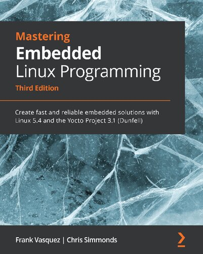

# [Mastering Embedded Linux Programming](https://www.amazon.com/Mastering-Embedded-Linux-Programming-potential/dp/1789530385/ref=sr_1_3?keywords=9781789530384&qid=1661185260&sr=8-3)


> The best first step into Embedded Linux domain is to read this book.

## Chapter 1

<details>
<summary>Project life cycles</summary>

1. Board Bring-Up
1. System Architecture and Design Choice
1. Writing Embedded Applications
1. Debugging and Optimizing Performance
</details>

<details>
<summary>The five elements of embedded Linux</summary>

1. Toolchain
1. Bootloader
1. Kernel
1. Root filesystem
1. Embedded Applications
</details>

<details>
<summary>Hardware selection for embedded Linux</summary>

1. CPU architecture
1. Reasonable amout of RAM
1. Non-volatile storage
1. Serial port
1. Debugging interface (e.g. JTAG)
</details>

## Chapter 2

<details>
<summary>Technical requirements</summary>

```sh
sudo pacman -S base-devel bzip2 cmake git gperf help2man ncurses python rsync unzip wget xz
```
</details>

[LLVM support for kernel build](https://kernel.org/doc/html/latest/kbuild/llvm.html)
<details>
<summary>GNU toolchain consist of three main components</summary>

* binutils **(base-devel)**: [https://gnu.org/software/binutils](https://gnu.org/software/binutils)
* gcc **(base-devel)**: [https://gcc.gnu.org](https://gcc.gnu.org)
* C library + Linux header files
</details>

<details>
<summary>GNU prefixes a tuple for toolchanins combined with four components:</summary>

* CPU Architecture + Endianness (e.g. `x86_64`, `mipsel`, `armeb`)
* Vendor (e.g. `buildroot`)
* Kernel (e.g. `linux`)
* Operating System + ABI (e.g. `gnueabi`, `gnueabihf`, `musleabi`, `musleabihf`)

```sh
gcc -dumpmachine
```
</details>
<details>
<summary>C libraries used in toolchains:</summary>

* glibc: [https://gnu.org/software/libc](https://gnu.org/software/libs)
* musl libs: [https://musl.libc.org](https://musl.libc.org)
* uClibc-ng: [https://uclibc-ng.org](https://uclibc-ng.org)
* eglibc: [https://uclibc.org/home](https://uclibc.org/home)

</details>

Toolchain can be completely built manually by [Cross Linux From Scratch](https://trac.clfs.org).

Another alternative to build toolchains is [crosstool-NG](https://crosstool-ng.github.io).

<details>
<summary>Installing crosstool-ng:</summary>

```sh
git clone https://github.com/crosstool-ng/crosstool-ng.git
cd crosstool-ng
git checkout <latest>
./bootstrap
./configure --enable-local
make -j<cores>
```
</details>

<details>
<summary>List samples of toolchains using crosstool-ng:</summary>

```sh
./ct-ng list-samples
```
</details>

<details>
<summary>Inspect details of a sample using crosstool-ng:</summary>

```sh
./ct-ng show-<sample>
./ct-ng show-armv6-unknown-linux-gnueabihf
./ct-ng show-arm-cortex_a8-linux-gnueabi
./ct-ng show-arm-unknown-linux-gnueabi
```
</details>

<details>
<summary>Building a toolchain for Raspberry Pi Zero:</summary>

```sh
./ct-ng distclean
./ct-ng show-armv6-unknown-linux-gnueabihf
./ct-ng armv6-unknown-linux-gnueabihf
```

Change following parts:

* Tarbal path
* Build path
* Vendor tuple

```sh
./ct-ng build
```
</details>

<details>
<summary>Building a toolchain for BeagleBone Black:</summary>

```sh
./ct-ng distclean
./ct-ng show-arm-cortex_a8-linux-gnueabi
./ct-ng arm-cortex_a8-linux-gnueabi
```

Change following parts:

* **Paths and misc options** >> **Render the toolchain read-only**: disable
* **Target options** >> **Floating point**: **hardware (FPU)**
* **Target options** >> **Use specific FPU**: neon

```sh
./ct-ng build
```
</details>

<details>
<summary>Building a toolchain for QEMU:</summary>

```sh
./ct-ng distclean
./ct-ng show-arm-unknown-linux-gnueai
./ct-ng arm-unknown-linux-gnueai
```

Change following parts:

* **Paths and misc options**: disable **Render the toolchain read-only**

```sh
./ct-ng build
```
</details>

<details>
<summary>Inspect compiler configurations in toolchain:</summary>

```sh
${CROSS_COMPILE}gcc -v
```
</details>

<details>
<summary>Override default compiler options in build:</summary>

```sh
${CROSS_COMPILE}gcc -mcpu=cortex-a5 main.c -o app
```
</details>

<details>
<summary>Inspect architecture specific options of compiler:</summary>

```sh
${CROSS_COMPILE}gcc --target-help
```
</details>

<details>
<summary>Inspect the sysroot path of compiler in toolchain:</summary>

```sh
${CROSS_COMPILE}gcc -print-sysroot
```
</details>

<details>
<summary>C library components:</summary>

* libc (linked by default)
* libm
* libpthread
* librt
</details>

<details>
<summary>Inspect linked libraries of an executable:</summary>

```sh
${CROSS_COMPILE}readelf -a app | grep "Shared library"
```
</details>

<details>
<summary>Inspect the runtime linker used for an executable:</summary>

```sh
${CROSS_COMPILE}readelf -a app | grep "program interpreter"
```
</details>

<details>
<summary>Link a static library in compile time:</summary>

```sh
${CROSS_COMPILE}gcc -static main.c -o app
```
</details>

<details>
<summary>Expose static library locations using toolchain:</summary>

```sh
SYSROOT=$(${CROSS_COMPILE}gcc -print-sysroot)
cd $SYSROOT
ls -l usr/lib/libc.a
```
</details>

<details>
<summary>Create a static library:</summary>

```sh
${CROSS_COMPILE}gcc -c test1.o
${CROSS_COMPILE}gcc -c test2.o
${CROSS_COMPILE}ar rc libtest1.a test1.o test2.o
${CROSS_COMPILE}gcc main.c -ltest -L../libs -I../libs -o app
```
</details>

<details>
<summary>Create a shared librarh:</summary>

```sh
${CROSS_COMPILE}gcc -fPIC -c test1.c
${CROSS_COMPILE}gcc -fPIC -c test2.c
${CROSS_COMPILE}gcc -shared -o libtest.so test1.o test2.o
${CROSS_COMPILE}gcc main.c -ltest -L../libs -I../libs -o app
${CROSS_COMPILE}readelf -a app | grep "program interpreter"
${CROSS_COMPILE}readelf -a app | grep "program interpreter"
```
</details>

<details>
<summary>Inspect SONAME of a shared library:</summary>

```sh
readelf -a /usr/lib/x86_64-linux-gnu/libjpeg.so.8.2.2 | grep SONAME
libjpeg.so.8
```
</details>

<details>
<summary>Cross-compile using Make:</summary>

```sh
make CROSS_COMPILE=armv6-rpi-linux-gnueabihf-
```

```sh
export CROSS_COMPILE=armv6-rpi-linux-gnueabihf-
make
```
</details>

<details>
<summary>Cross-compile using Autotools:</summary>

* GNU Autoconf [https::/gnu.org/software/autoconf/autoconf.html](https::/gnu.org/software/autoconf/autoconf.html)
* GNU Automake [https://gnu.org/savannah-checkouts/gnu/automake](https://gnu.org/savannah-checkouts/gnu/automake)
* GNU Libtool [https://gnu.org/software/libtool/libtool.html](https://gnu.org/software/libtool/libtool.html)
* Gnulib [https://gnu.org/software/gnulib](https://gnu.org/software/gnulib)

```sh
./configure
make
make install
```
</details>

<details>
<summary>Build a project with autotools:</summary>

```sh
CC=armv6-rpi-linux-gnueabihf ./configure --host=armv6-rpi-linux-gnueabihf
```
</details>

<details>
<summary>Cross compile SQlite using autotools and add it to the toolchain:</summary>

```sh
wget http://www.sqlite.org/2020/sqlite-autoconf-3330000.tar.gz
tar xf sqlite-autoconf-3330000.tar.gz
cd sqlite-autoconf-3330000
CC=armv6-rpi-linux-gnueabihf ./configure --host=armv6-rpi-linux-gnueabihf --prefix=/usr
make
make DESTDIR=$(armv6-rpi-linux-gnueabi-gcc -print-sysroot) install

armv6-rpi-linux-gnueabihf main.c -o sqlite-test -lsqlite3
```
</details>

<details>
<summary>Look up library dependencies using pkg-config:</summary>

```sh
cat $(armv6-rpi-linux-gnueabihf-gcc -print-sysroot)/usr/lib/pkgconfig/sqlite3.pc

export PKG_CONFIG_LIBDIR=$(armv6-rpi-linux-gnueabihf-gcc -print-sysroot)/usr/lib/pkgconfig
pkg-config sqlite3 --libs --cflags
armv6-rpi-linux-gnueabihf-gcc $(pkg-config sqlite3 --cflags --libs) main.c -o sqlite-test
```
</details>

<details>
<summary>Cross compile a project using CMake:</summary>

```sh
cmake -S . -B build -D CMAKE_INSTALL_PREFIX:PATH=sysroot -D CMAKE_C_COMPILER:PATH=x-tools/armv6-rpi-linux-gnueabihf-gcc
cmake --build build --parallel
cmake --build build --target install
```
</details>
