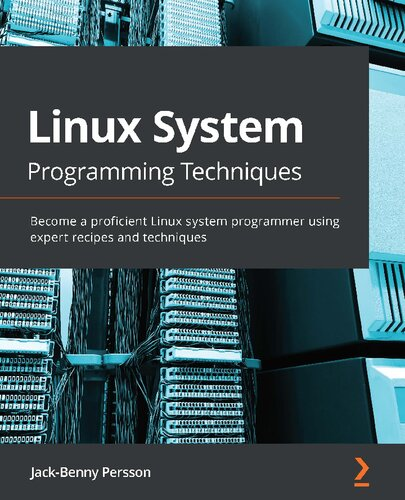

# [Linux System Programming Techniques](https://www.amazon.com/Linux-System-Programming-Techniques-proficient/dp/1789951283)



## Chapter 1/12

<details>
<summary>Lookup system calls in manual pages:</summary>

```sh
man 1 man
```
</details>

* [man(1)](https://manpages.org/man/1)
* [apropos(1)](https://manpages.org/apropos/1)

<details>
<summary>Get multiple numbers from user and sum:</summary>

```c
#ifndef _POSIX_C_SOURCE
#define _POSIX_C_SOURCE 201712L
#endif

#include <stdio.h>
#include <stdlib.h>
#include <errno.h>

int print_user_value(char const* str);

int main(int argc, char **argv)
{
    int result = -1;

    if (argc == 1)
        fprintf(stderr, "usage: %s <number>\n", argv[0]);
    else
        result = print_user_value(argv[1]);

    return result;
}

int print_user_value(char const* str)
{
    errno = 0;
    long double input = strtold(str, NULL);

    if (errno)
        fprintf(stderr, "cannot convert %s to long double\n", str);
    else
        fprintf(stdout, "%.2Lf\n", input);

    return errno;
}
```
</details>

* [printf(3)](https://manpages.org/printf/3)
* [atoi(3)](https://manpages.org/atoi/3) (use [strod(3)](https://manpages.org/strtod/3) instead)
* [stdio.h](https://manpages.org/stdioh)
* [stdlib.h](https://manpages.org/stdlibh)

<details>
<summary>Parse command-line options:</summary>

```c
#ifndef _POSIX_C_SOURCE
#define _POSIX_C_SOURCE 201108L
#endif

#ifndef _GNU_SOURCE
#define _GNU_SOURCE 5000L
#endif

#include <stdio.h>
#include <unistd.h>
#include <getopt.h>
#include <errno.h>

int main(int argc, char **argv)
{
    int option = 0;

    struct option longopts[] = {
        {"help",  no_argument,       NULL, 'h'},
        {"value", required_argument, NULL, 'a'}
    };

    while ((option = getopt_long(argc, argv, "hv:", longopts, NULL)) != -1)
    {
        switch (option)
        {
            case 'h':
                fprintf(stdout, "usage: %s [-h] [-v <value>]\n", argv[0]);
                break;
            case 'v':
                fprintf(stdout, "value: %s\n", optarg);
                break;
            case '?':
                fprintf(stderr, "invalid argument\n");
                break;
            default:
                fprintf(stderr, "usage: %s [-h] [-v <value>]\n", argv[0]);
        }
    }
}
```
</details>

* [getopt(3)](https://manpages.org/getopt/3) [see EXAMPLES]
* [unistd.h](https://manpages.org/unistdh)

## Chapter 2/12

<details>
<summary>Terminate program execution when unrecoverable error occurs:</summary>

```c
#include <stdlib.h>

int main(int argc, char **argv)
{
    if (argc > 1)
        exit(1);

    return 0;
}
```
</details>

* [exit(3)](https://manpages.org/exit/3)

<details>
<summary>Write to standard output using file stream and file descriptor:</summary>

```c
#ifndef _POSIX_C_SOURCE
#define _POSIX_C_SOURCE 202207L
#endif

#include <stdio.h>

int main(void)
{
    fprintf(stdout, "standard output\n");
    fprintf(stderr, "standard error\n");
    dprintf(1, "standard output\n");
    dprintf(2, "standard error\n");
}
```
</details>

* [fprintf(3)](https://manpages.org/fprintf/3)
* [dprintf(3)](https://manpages.org/dprintf/3)

<details>
<summary>Invert user input character case:</summary>

```c
#include <stdio.h>
#include <stdlib.h>
#include <string.h>

#define INPUT_MAX 20

int main(void)
{
    char origin[INPUT_MAX] = {0};
    char inverted[INPUT_MAX] = {0};

    while (fgets(origin, INPUT_MAX, stdin))
    {
        for (int index = 0; index < sizeof(origin); ++index)
        {
            if (origin[index] >= 'a' && origin[index] <= 'z')
                inverted[index] = origin[index] - 32;
            else if (origin[index] >= 'A' && origin[index] <= 'Z')
                inverted[index] = origin[index] + 32;
            else
                inverted[index] = origin[index];
        }

        fprintf(stdout, "%s\n", inverted);
        memset(&inverted, 0, sizeof(inverted));
        memset(&origin, 0, sizeof(origin));
    }
}
```
</details>

* [fgets(3)](https://manpages.org/fgets/3)
* [memset(3)](https://manpages.org/memset/3)
* [string.h](https://manpages.org/stringh)

<details>
<summary>Make user input consists of a range of valid characters:</summary>

```c
#include <stdio.h>
#include <string.h>
#include <stdlib.h>

#define INPUT_MAX 20

int main(void)
{
    char input[INPUT_MAX] = {0};

    if (fgets(input, sizeof(input), stdin) == NULL)
        fprintf(stderr, "invalid input\n");

    if (strspn(input, "0123456789\n") == strlen(input))
        printf("valid\n");
    else
        printf("invalid\n");
}
```
</details>

* [strtol(3)](https://manpages.org/strtol/3)
* [strspn(3)](https://manpages.org/strspn/3)
* [strlen(3)](https://manpages.org/strlen/3)
* [strcmp(3)](https://manpages.org/strcmp/3)

<details>
<summary>Print shell environments and check if shell supports colored output:</summary>

```c
#include <stdio.h>
#include <string.h>
#include <stdlib.h>

#define GRN_COLOR "\033[1;31m"
#define RST_COLOR "\033[0m"

int main(void)
{
    char const *term = getenv("TERM");

    if (strlen(term) && strstr(term, "256color"))
        printf(GRN_COLOR "color supported\n" RST_COLOR);
    else
        printf("color not supported\n");
}
```
</details>

* [getenv(3)](https://manpages.org/getenv/3)
* [setenv(3)](https://manpages.org/setenv/3)
* [strstr(3)](https://manpages.org/strstr/3)

## Chapter 3/12

<details>
<summary>Link against a library, create a shared object, change C standard in compiler options:</summary>

```sh
gcc -Wall -Wextra -pedantic -fPIC -c source.c
gcc -shared -Wl,-soname,libsource.so -o libsource.so source.o
```
</details>

* [gcc reference manual](https://gcc.gnu.org/onlinedocs/gcc-12.1.0/gcc/)

<details>
<summary>Write into the standard output by directly using the `write` system call:</summary>

```c
#include <unistd.h>

int main(void)
{
    write(1, "system call\n", 13);
}
```
</details>

* [intro(2)](https://manpages.org/intro/2)
* [syscalls(2)](https://manpages.org/syscalls/2)
* [write(2)](https://manpages.org/write/2)

<details>
<summary>Get system resources and file system information:</summary>

```c
#include <stdio.h>
#include <errno.h>
#include <unistd.h>
#include <limits.h>
#include <sys/sysinfo.h>

int main(void)
{
    printf("%-20s %s\n", "Current Directory:", getcwd(NULL, PATH_MAX));
    printf("%-20s %d\n", "User ID:",           getuid());
    printf("%-20s %d\n", "Effective User ID:", geteuid());
    printf("%-20s %d\n", "Process ID:",        getpid());
    printf("%-20s %d\n", "Parent Process ID:", getppid());

    struct sysinfo info;
    if (sysinfo(&info) == -1)
    {
        perror("failed to retrieve system information");
        return errno;
    }

    printf("%-20s %ld\n", "Uptime:",              info.uptime);
    printf("%-20s %ld\n", "Total Ram in Use:",    info.totalram);
    printf("%-20s %ld\n", "Free Ram:",            info.freeram);
    printf("%-20s %d\n",  "Number of Processes:", info.procs);
    printf("%-20s %ld\n", "Total Swap:",          info.totalswap);
}
```
</details>

* [sysinfo(2)](https://manpages.org/sysinfo/2)
* [getcwd(2)](https://manpages.org/getcwd/2)
* [getuid(2)](https://manpages.org/getuid/2)
* [geteuid(2)](https://manpages.org/geteuid/2)
* [getpid(2)](https://manpages.org/getpid/2)
* [getppid(2)](https://manpages.org/getppid/2)
* [sys\_types.h](https://manpages.org/sys-typesh)

<details>
<summary>Posix documentations can be found by `apropos -s7 posix`:</summary>

</details>

* [aio(7)](https://manpages.org/aio/7)
* [attributes(7)](https://manpages.org/attiributes/7)
* [mq\_overview(7)](https://manpages.org/mq_overview/7)
* [nptl(7)](https://manpages.org/nptl/7)
* [posixoptions(7)](https://manpages.org/posixoptions/7)
* [pthreads(7)](https://manpages.org/pthreads/7)
* [regex(7)](https://manpages.org/regex/7)
* [sem\_overview(7)](https://manpages.org/sem_overview/7)
* [shm\_overview(7)](https://manpages.org/shm_overview/7)

<details>
<summary>Use feature test macros:</summary>

</details>

* [strdup(3)](https://manpages.org/strdup/3)
* [feature\_test\_macros(7)](https://manpages.org/feature_test_macros/7)
* [standards(7)](https://manpages.org/standards/7)
* [libc(7)](https://manpages.org/libc/7)

<details>
<summary>Inspect four stages of compilation:</summary>

```sh
gcc -P -E # stop at preprocessing stage
gcc -S    # stop at assembly stage
gcc -c    # stop at object file stage
gcc -o    # create an executable
```
</details>

* [gcc(1)](https://manpages.org/gcc/1)
* [gcc reference manual](https://gcc.gnu.org/onlinedocs/gcc-12.1.0/gcc/)

<details>
<summary>Use make to build programs:</summary>

</details>

* [make(1)](https://manpages.org/make/1)
* [make reference manual](https://www.gnu.org/software/make/manual/html_node/)

## Chapter 4/12

<details>
<summary>Check error numbers after system call:</summary>

```c
#include <errno.h>
#include <stdio.h>
#include <stdlib.h>

int main(void)
{
    long int number = strtol("1234", NULL, 10);

    if (errno)
        perror("cannot convert to long int");
    else
        printf("%ld\n", number);

    return errno;
}
```
</details>

* [errno(3)](https://manpages.org/errno/3)
* [strerror(3)](https://manpages.org/strerror/3)
* [perror(3)](https://manpages.org/perror/3)
* [errno.h](https://manpages.org/errnoh)

## Chapter 5/12

<details>
<summary>Create a file:</summary>

```c
#include <stdio.h>
#include <errno.h>
#include <fcntl.h>
#include <limits.h>
#include <string.h>
#include <unistd.h>

int main(int argc, char **argv)
{
    int fd = 0;
    char filepath[PATH_MAX] = {0};

    if (argc != 2)
    {
        printf("usage: %s <filepath>\n", argv[0]);
        return 1;
    }

    strncpy(filepath, argv[1], sizeof(filepath));

    if ((fd = creat(filepath, S_IRUSR | S_IWUSR)) == -1)
    {
        perror(NULL);
        return errno;
    }

    if (write(fd, "another sample\n", 16) == -1)
    {
        perror(NULL);
        return errno;
    }

    if (close(fd) == -1)
    {
        perror(NULL);
        return errno;
    }
}
```
</details>

* [strncpy(3)](https://manpages.org/strncpy/3)
* [creat(2)](https://manpages.org/creat/2)
* [limits.h](https://manpages.org/limitsh)
* [fcntl.h](https://manpages.org/fcntlh)

<details>
<summary>Read inode information of a file:</summary>

```c
#include <stdio.h>
#include <errno.h>
#include <string.h>
#include <limits.h>
#include <sys/stat.h>

int main(int argc, char **argv)
{
    if (argc != 2)
    {
        fprintf(stderr, "usage: %s <filepath>\n", argv[0]);
        return 1;
    }

    char filepath[PATH_MAX] = {0};
    strncpy(filepath, argv[1], sizeof(filepath));

    struct stat filestat;
    if (stat(filepath, &filestat) == -1)
    {
        perror(NULL);
        return errno;
    }

    printf("Name: %s\n", filepath);
    printf("Device: %lu\n", filestat.st_dev);
    printf("Mode: %o\n", filestat.st_mode);
    printf("Inode: %lu\n", filestat.st_ino);
    printf("Size: %zd\n", filestat.st_size);
    printf("Links: %lu\n", filestat.st_nlink);
}
```
</details>

* [stat(2)](https://manpages.org/stat/2)
* [sys\_types.h](https://manpages.org/sys-typesh)
* [sys\_stat.h](https://manpages.org/sys-stath)

<details>
<summary>Create soft links and hard links:</summary>

```c
#include <stdio.h>
#include <errno.h>
#include <string.h>
#include <unistd.h>
#include <limits.h>

int main(int argc, char **argv)
{
    if (argc != 4)
    {
        fprintf(stderr, "usage: %s <realpath> <linkpath> <symlink>\n", argv[0]);
        return 1;
    }

    char realpath[PATH_MAX] = {0};
    strncpy(realpath, argv[1], sizeof(realpath));

    char hardlinkpath[PATH_MAX] = {0};
    strncpy(hardlinkpath, argv[2], sizeof(hardlinkpath));

    char symlinkpath[PATH_MAX] = {0};
    strncpy(symlinkpath, argv[3], sizeof(symlinkpath));

    if (link(realpath, hardlinkpath) == -1)
    {
        perror(NULL);
        return errno;
    }

    if (symlink(realpath, symlinkpath) == -1)
    {
        perror(NULL);
        return errno;
    }
}
```
</details>

* [link(2)](https://manpages.org/link/2)
* [symlink(2)](https://manpages.org/symlink/2)

<details>
<summary>Update file timestamp:</summary>

```c
#include <stdio.h>
#include <utime.h>
#include <errno.h>
#include <string.h>
#include <limits.h>

int main(int argc, char **argv)
{
    if (argc != 2)
    {
        fprintf(stderr, "usage: %s <filepath>\n", argv[0]);
        return 1;
    }

    char filepath[PATH_MAX] = {0};
    strncpy(filepath, argv[1], sizeof(filepath));

    if (utime(filepath, NULL))
    {
        perror(NULL);
        return errno;
    }
}
```
</details>

* [utime(2)](https://manpages.org/utime/2)
* [utime.h](https://manpages.org/utimeh)

* [time(2)](https://manpages.org/time/2)
* [asctime(2)](https://manpages.org/asctime/3)
* [time.h](https://manpages.org/timeh)
* [sys\_time.h](https://manpages.org/sys_timeh)

<details>
<summary>Delete a file:</summary>

```c
#include <stdio.h>
#include <errno.h>
#include <string.h>
#include <unistd.h>
#include <limits.h>

int main(int argc, char **argv)
{
    if (argc != 2)
    {
        fprintf(stderr, "usage: %s <filepath>\n", argv[0]);
        return 1;
    }

    char filepath[PATH_MAX] = {0};
    strncpy(filepath, argv[1], sizeof(filepath));

    if (unlink(filepath) == -1)
    {
        perror(NULL);
        return errno;
    }
}
```
</details>

* [unlink(2)](https://manpages.org/unlink/2)

<details>
<summary>Get access rights and ownership of a file:</summary>

```c
#include <stdio.h>
#include <errno.h>
#include <string.h>
#include <limits.h>
#include <sys/stat.h>
#include <sys/types.h>
#include <pwd.h>
#include <grp.h>

int main(int argc, char **argv)
{
    if (argc != 2)
    {
        fprintf(stderr, "usage: %s <filepath>\n", argv[0]);
        return 1;
    }

    char filepath[PATH_MAX] = {0};
    strncpy(filepath, argv[1], sizeof(filepath));

    struct stat filestat;
    if (stat(filepath, &filestat) == -1)
    {
        perror(NULL);
        return errno;
    }

    printf("Name: %s\n", filepath);
    printf("Device: %lu\n", filestat.st_dev);
    printf("Mode: %o\n", filestat.st_mode);
    printf("Inode: %lu\n", filestat.st_ino);
    printf("Size: %zd\n", filestat.st_size);
    printf("Links: %lu\n", filestat.st_nlink);

    struct passwd *userinfo;

    if ((userinfo = getpwuid(filestat.st_uid)) == NULL)
        perror(NULL);
    else
        printf("User: %u (%s)\n", userinfo->pw_uid, userinfo->pw_name);

    struct group *groupinfo;

    if ((groupinfo = getgrgid(filestat.st_gid)) == NULL)
        perror(NULL);
    else
        printf("Group: %u (%s)\n", groupinfo->gr_gid, groupinfo->gr_name);
}
```
</details>

* [getpwuid(2)](https://manpages.org/getpwuid/2)
* [getpwnam(2)](https://manpages.og/getpwnam/2)
* [pwd.h](https://manpages.org/pwdh)

* [getgrgid(2)](https://manpages.org/getgrgid/2)
* [getgrnam(2)](https://manpages.org/getgrnam/2)
* [grp.h](https://manpages.org/grph)

<details>
<summary>Change access mode of a file:</summary>

```c
#include <stdio.h>
#include <errno.h>
#include <string.h>
#include <stdlib.h>
#include <limits.h>
#include <sys/stat.h>
#include <sys/types.h>

int main(int argc, char **argv)
{
    if (argc != 3)
    {
        fprintf(stderr, "usage: %s <mode> <filepath>\n", argv[0]);
        return 1;
    }

    mode_t mode = 0;

    mode = strtol(argv[1], NULL, 8);
    if (errno)
    {
        perror(NULL);
        return errno;
    }

    char filepath[PATH_MAX] = {0};
    strncpy(filepath, argv[2], sizeof(filepath));

    if (chmod(filepath, mode) == -1)
    {
        perror(NULL);
        return errno;
    }
}
```
</details>

* [strspn(3)](https://manpages.org/strspn/3)
* [strlen(3)](https://manpages.org/strlen/3)
* [chmod(3)](https://manpages.org/chmod/2)

<details>
<summary>Change ownership of a file:</summary>

```c
#include <stdio.h>
#include <errno.h>
#include <string.h>
#include <unistd.h>
#include <limits.h>
#include <sys/types.h>
#include <pwd.h>
#include <grp.h>

int main(int argc, char **argv)
{
    if (argc != 3)
    {
        fprintf(stderr, "usage: %s <user[:group]> <filepath>\n", argv[0]);
        return 1;
    }

    char *owner = strtok(argv[1], ":");
    char *group = strtok(NULL, ":");

    char filepath[PATH_MAX] = {0};
    strncpy(filepath, argv[2], sizeof(filepath));

    struct passwd *userinfo;
    struct group *groupinfo;

    if ((userinfo = getpwnam(owner)) == NULL)
    {
        if (errno == 0)
            fprintf(stderr, "\033[1;31m%s\033[0m\n", "owner not found");
        else
            fprintf(stderr, "\033[1;31m%s\033[0m\n", strerror(errno));
        return errno;
    }

    if ((groupinfo = getgrnam(group)) == NULL)
    {
        if (errno == 0)
            fprintf(stderr, "\033[1;31m%s\033[0m\n", "group not found");
        else
            fprintf(stderr, "\033[1;31m%s\033[0m\n", strerror(errno));

        return errno;
    }

    if (chown(filepath, userinfo->pw_uid, groupinfo->gr_gid) == -1)
    {
        perror(NULL);
        fprintf(stderr, "\033[1;31m%s\033[0m\n", strerror(errno));
        return errno;
    }
}
```
</details>

* [stat(2)](https://manpages.org/stat/2)
* [getpwnam(2)](https://manpages.og/getpwnam/2)
* [getgrnam(2)](https://manpages.org/getgrnam/2)
* [strtok(3)](https://manpages.org/strtok/3)
* [chown(2)](https://manpages.org/chown/2)

<details>
<summary>Write to file with file descriptor:</summary>

```c
#include <stdio.h>
#include <fcntl.h>
#include <errno.h>
#include <string.h>
#include <unistd.h>
#include <limits.h>
#include <time.h>

int main(int argc, char **argv)
{
    if (argc != 2)
    {
        fprintf(stderr, "usage: %s <filepath>\n", argv[0]);
        return 1;
    }

    char filepath[PATH_MAX] = {0};
    strncpy(filepath, argv[1], sizeof(filepath));

    int fd = 0;

    if ((fd = open(filepath, O_CREAT|O_RDWR|O_TRUNC, S_IRUSR|S_IWUSR|S_IRGRP|S_IROTH)) == -1)
    {
        perror(NULL);
        return errno;
    }

    time_t const epoch = time(NULL);
    char const *now = ctime(&epoch);

    if (write(fd, now, strlen(now)) == -1)
    {
        perror(NULL);
        return errno;
    }

    if (close(fd) == -1)
    {
        perror(NULL);
        return errno;
    }
}
```
</details>

* [open(2)](https://manpages.org/open/2)
* [write(2)](https://manpages.org/write/2)
* [close(2)](https://manpages.org/close/2)

<details>
<summary>Read from file with file descriptor:</summary>

```c
#include <stdio.h>
#include <fcntl.h>
#include <errno.h>
#include <unistd.h>
#include <string.h>
#include <limits.h>

int main(int argc, char **argv)
{
    if (argc != 2)
    {
        fprintf(stderr, "usage: %s <filepath>\n", argv[0]);
        return 1;
    }

    char filepath[PATH_MAX] = {0};
    strncpy(filepath, argv[1], sizeof(filepath));

    int fd = 0;
    if ((fd = open(filepath, O_RDONLY)) == -1)
    {
        perror(NULL);
        return errno;
    }

    char buffer[100] = {0};
    if (read(fd, buffer, sizeof(buffer)) == -1)
    {
        perror(NULL);
        return errno;
    }

    printf("%s\n", buffer);

    if (close(fd) == -1)
    {
        perror(NULL);
        return errno;
    }
}
```
</details>

* [read(2)](https://manpages.org/read/2)
* [fstat(2)](https://manpages.org/fstat/2)
* [limits.h](https://manpages.org/limitsh)
* [sys\_types.h](https://manpages.org/sys-typesh)

<details>
<summary>Read from and write to file with file stream:</summary>

```c
#include <stdio.h>
#include <string.h>
#include <limits.h>

int main(int argc, char **argv)
{
    if (argc != 2)
    {
        fprintf(stderr, "usage: %s <filepath>\n", argv[0]);
        return 1;
    }

    char filepath[PATH_MAX] = {0};
    strncpy(filepath, argv[1], sizeof(filepath));

    FILE *fp = NULL;
    if ((fp = fopen(filepath, "w")) == NULL)
    {
        perror(NULL);
        return 2;
    }

    char buffer[100] = {0};

    while (fgets(buffer, sizeof(buffer), stdin))
    {
        fprintf(fp, "%s\n", buffer);
    }

    if (fclose(fp) == -1)
    {
        perror(NULL);
        return 3;
    }
}
```
</details>

* [fopen(3)](https://manpages.org/fopen/3)
* [fclose(3)](https://manpages.org/fclose/3)
* [fgets(3)](https://manpages.org/fgets/3)

<details>
<summary>Read/write binary data from/to file:</summary>

```c
#include <stdio.h>
#include <string.h>
#include <limits.h>

int main(int argc, char **argv)
{
    if (argc != 2)
    {
        fprintf(stderr, "usage: %s <filepath>\n", argv[0]);
        return 1;
    }

    char filepath[PATH_MAX] = {0};
    strncpy(filepath, argv[1], sizeof(filepath));

    FILE *fp = NULL;
    if ((fp = fopen(filepath, "rwb")) == NULL)
    {
        perror(NULL);
        return 2;
    }

    double numbers[3] = {1.1, 2.2, 3.3};

    if (fwrite(&numbers, sizeof(double), sizeof(numbers)/sizeof(double), fp) == -1)
    {
        perror(NULL);
        return 3;
    }

    printf("wrote %.1f %.1f %.1f numbers\n", numbers[0], numbers[1], numbers[2]);

    double buffer[3] = {0};

    if (fread(&buffer, sizeof(double), sizeof(buffer)/sizeof(double), fp) == -1)
    {
        perror(NULL);
        return 4;
    }

    printf("read %.1f %.1f %.1f numbers\n", buffer[0], buffer[1], buffer[2]);

    if (fclose(fp) == -1)
    {
        perror(NULL);
        return 5;
    }
}
```
</details>

**Note:** `fwrite(3)` requires chunck size and count in order to write.

* [fwrite(3)](https://manpages.org/fwrite/3)
* [scanf(3)](https://manpages.org/scanf/3)

<details>
<summary>Move around inside a file with file descriptor:</summary>

```c
#include <stdio.h>
#include <fcntl.h>
#include <stdlib.h>
#include <string.h>
#include <unistd.h>
#include <limits.h>

int main(int argc, char **argv)
{
    if (argc != 3)
    {
        fprintf(stderr, "usage: %s <filepath> <offset>\n", argv[0]);
        return 1;
    }

    char filepath[PATH_MAX] = {0};
    strncpy(filepath, argv[1], sizeof(filepath));

    off_t offset = strtol(argv[2], NULL, 10);

    int fd = 0;
    if ((fd = open(filepath, O_RDONLY)) == 0)
    {
        perror(NULL);
        return 2;
    }

    if (lseek(fd, offset, SEEK_SET) == -1)
    {
        perror(NULL);
        return 3;
    }

    char buffer[10000] = {0};
    if (read(fd, buffer, sizeof(buffer)) == -1)
    {
        perror(NULL);
        return 4;
    }

    printf("%s\n", buffer);

    if (close(fd) == -1)
    {
        perror(NULL);
        return 5;
    }
}
```
</details>

* [lseek(2)](https://manpages.org/lseek/2)
* [read(2)](https://manpages.org/read/2)

<details>
<summary>Move around a file with file stream:</summary>

```c
#include <stdio.h>
#include <stdlib.h>
#include <string.h>
#include <unistd.h>
#include <limits.h>

int main(int argc, char **argv)
{
    if (argc != 3)
    {
        fprintf(stderr, "usage: %s <filepath> <offset>\n", argv[0]);
        return 1;
    }

    char filepath[PATH_MAX] = {0};
    strncpy(filepath, argv[1], sizeof(filepath));

    off_t offset = strtol(argv[2], NULL, 10);

    FILE *fp = NULL;
    if ((fp = fopen(filepath, "r")) == NULL)
    {
        perror(NULL);
        return 2;
    }

    if (fseek(fp, offset, SEEK_SET) == -1)
    {
        perror(NULL);
        return 3;
    }

    char buffer[1000] = {0};
    while (fgets(buffer, sizeof(buffer), fp) != NULL)
    {
        printf("%s", buffer);
    }
    printf("\n");

    if (fclose(fp) == -1)
    {
        perror(NULL);
        return 5;
    }
}
```
</details>

**Note:** to read a specific range of file, read character by character.

**Note:** to check where is the file pointer, use `ftell()`.

* [fseek(3)](https://manpages.org/fseek/3)
* [ftell(3)](https://manpages.org/ftell/3)
* [rewind(3)](https://manpages.org/rewind/3)
* [fgetpos(3)](https://manpages.org/fgetpos/3)
* [fsetpos(3)](https://manpages.org/fsetpos/3)
* [fgetc(3)](https://manpages.org/fgetc/3)
* [putchar(3)](https://manpages.org/putchar/3)

## Chapter 6/12

<details>
<summary>Handle signals:</summary>

```c
#ifndef _POSIX_C_SOURCE
#define _POSIX_C_SOURCE 11082022L
#endif

#include <stdio.h>
#include <signal.h>
#include <unistd.h>
#include <stdlib.h>

void signal_handler(int);

int main(void)
{
    struct sigaction action;

    action.sa_flags = SA_RESTART;
    action.sa_handler = signal_handler;
    sigfillset(&action.sa_mask);

    sigaction(SIGHUP, &action, NULL);
    sigaction(SIGINT, &action, NULL);

    for (;;)
        sleep(10);
}

void signal_handler(int signal)
{
    printf("\nprocess killed by signal %d\n", signal);
    exit(signal);
}
```
</details>

* [sigfillset(3)](https://manpages.org/sigfillset/3)
* [sigaction(2)](https://manpages.org/sigaction/2)
* [signal.h](httpsH//manpages.org/signalh)

<details>
<summary>Ignore signals:</summary>

```c
#include <stdio.h>
#include <signal.h>
#include <unistd.h>

int main(void)
{
    sigset_t signals;
    sigset_t old_signals;

    if (sigemptyset(&signals) == -1)
    {
        perror(NULL);
        return 1;
    }

    if (sigaddset(&signals, SIGHUP) == -1)
    {
        perror(NULL);
        return 2;
    }

    if (sigprocmask(SIG_BLOCK, &signals, &old_signals) == -1)
    {
        perror(NULL);
        return 3;
    }

    sleep(10);

    sigprocmask(SIG_UNBLOCK, &signals, &old_signals);
}
```
</details>

* [sigemptyset(3)](https://manpages.org/sigemptyset/3)
* [sigprocmask(3)](https://manpages.org/sigprocmask/3)
* [sigaddset(3)](https://manpages.org/sigaddset/3)
* [sigdelset(3)](https:/manpages.org/sigdelset/3)
* [sigsetops(3)](https://manpages.org/sigsetops/3)

* [signal(2) **[deprecated]**](https://manpages.org/signal/2)

<details>
<summary>Fork a new process:</summary>

```c
#include <stdio.h>
#include <errno.h>
#include <unistd.h>
#include <sys/types.h>
#include <sys/wait.h>

int main(void)
{
    pid_t child;
    int status;

    if ((child = fork()) == -1)
    {
        perror(NULL);
        return errno;
    }

    if (child == 0)
    {
        printf("child:  %d\n", getpid());

        if (execl("/usr/bin/ps", "ps", "-f", "--forest", (char*)NULL) == -1)
        {
            perror(NULL);
            return errno;
        }
    }
    else
    {
        printf("parent: %d\n", getpid());
        waitpid(child, &status, 0);
        printf("return: %d\n", status);
    }
}
```
</details>

* [fork(2)](https://manpages.org/fork/2)
* [waitpid(2)](https://manpages.org/waitpid/2)
* [sys\_wait.h](https://manpages.org/sys-waith)

<details>
<summary>Create a zombie process:</summary>

```c
#include <stdio.h>
#include <signal.h>
#include <unistd.h>
#include <stdlib.h>
#include <sys/types.h>

int main(void)
{
    pid_t child_pid;
    int seconds = 20;

    printf("parent: %d\n", getpid());

    if ((child_pid = fork()) == -1)
    {
        perror(NULL);
        return 1;
    }

    if (child_pid == 0)
    {
        printf("child: %d\n", getpid());
        exit(0);
    }
    else
    {
        printf("parent waiting for %ds\n", seconds);
        sleep(seconds);
    }
}
```
</details>

**Note:** a zombie process is created when it exits and its parent is not waiting for it.

<details>
<summary>Create an orphan process:</summary>

```c
#include <stdio.h>
#include <unistd.h>
#include <sys/types.h>

int main(void)
{
    pid_t child;
    int seconds = 20;

    if ((child = fork()) == -1)
    {
        perror(NULL);
        return 1;
    }

    if (child == 0)
    {
        printf("child:  %d\n", getpid());
        sleep(seconds);
    }
    else
    {
        printf("parent: %d\n", getpid());
    }
}
```
</details>

**Note:** an orphan process is one that its parent gets killed before it exits.

<details>
<summary>Replace execution of a forked process with another program:</summary>

```c
#include <stdio.h>
#include <errno.h>
#include <unistd.h>
#include <signal.h>
#include <sys/types.h>
#include <sys/wait.h>

int main(void)
{
    pid_t child = 0;
    int status = 0;

    if ((child = fork()) == -1)
    {
        perror(NULL);
        return errno;
    }

    if (child == 0)
    {
        if (execl("/usr/bin/ping", "ping", "localhost", (char*)NULL) == -1)
        {
            perror(NULL);
            return errno;
        }
    }
    else
    {
        sleep(3);
        printf("stopping...\n");

        if (kill(child, SIGINT) == -1)
        {
            perror(NULL);
            return errno;
        }

        waitpid(child, &status, 0);
    }
}
```
</details>

* [execl(2)](https://manpages.org/exec/2)

<details>
<summary>Run an external program without replacing execution of the process:</summary>

```c
#include <stdio.h>
#include <stdlib.h>

int main(void)
{
    if (system("/usr/bin/ping -c3 localhost") != 0)
    {
        perror("cannot run command");
    }
}
```
</details>

* [system(2)](https://manpages.org/system/2)

<details>
<summary>Create a SysV style daemon running in background:</summary>

```c
#ifndef _POSIX_C_SOURCE
#define _POSIX_C_SOURCE 11082022L
#endif

#include <stdio.h>
#include <errno.h>
#include <fcntl.h>
#include <stdlib.h>
#include <unistd.h>
#include <signal.h>
#include <string.h>
#include <sys/types.h>
#include <sys/wait.h>
#include <sys/stat.h>
#include <time.h>

void signal_handler(int);

int stop = 0;
FILE *fp = NULL;
char const *pidfile = "/var/run/custom-daemon.pid";
char const *storage = "/tmp/daemon.db";

int main(void)
{
    pid_t process_id;
    pid_t session_id;

    if ((process_id = fork()) == -1)
    {
        perror("cannot fork");
        return 1;
    }

    if (process_id > 0)
    {
        waitpid(process_id, NULL, 0);
        return 0;
    }

    if ((session_id = setsid()) == -1)
    {
        perror("cannot create new session");
        return errno;
    }

    printf("new parent process id %d with session id %d\n", getpid(), session_id);

    if ((process_id = fork()) == -1)
    {
        perror("cannot create daemon process");
        return errno;
    }

    if (process_id > 0)
    {
        if ((fp = fopen(pidfile, "w")) == NULL)
        {
            perror("cannot create pid file");
            kill(process_id, SIGKILL);
            return errno;
        }

        fprintf(fp, "%d\n", process_id);
        printf("daemon started with id %d\n", process_id);

        if (fclose(fp) == -1)
        {
            perror("cannot close pid file");
            return errno;
        }

        exit(0);
    }

    mode_t process_mask = 0022;
    umask(process_mask);

    if (chdir("/") == -1)
        perror("cannot change working directory of daemon");

    errno = 0;

    if ((fp = fopen(storage, "w")) == NULL)
    {
        perror("cannot create storage");
        return errno;
    }

    fprintf(fp, "daemon running with id %d\n", getpid());

    struct sigaction signals;
    signals.sa_flags = SA_RESTART;
    signals.sa_handler = signal_handler;
    sigaction(SIGINT, &signals, NULL);
    sigaction(SIGTERM, &signals, NULL);
    sigaction(SIGABRT, &signals, NULL);
    sigaction(SIGQUIT, &signals, NULL);
    sigaction(SIGHUP, &signals, NULL);

    close(STDIN_FILENO);
    close(STDOUT_FILENO);
    close(STDERR_FILENO);
    open("/dev/null", 1);
    open("/dev/null", 2);
    open("/dev/null", 3);

    time_t now;

    while (stop == 0)
    {
        now = time(NULL);
        fprintf(fp, "%s", ctime(&now));
        fflush(fp);
        sleep(5);
    }

    fprintf(fp, "daemon stopped\n");

    if (fclose(fp) == -1)
        exit(errno);
}

void signal_handler(int signal)
{
    stop = 1;
    fprintf(fp, "stopping daemon\n");

    if (unlink(pidfile) == -1)
        fprintf(fp, "cannot remove pid file: %s\n", strerror(errno));
}
```
</details>

```
Starting Process
  \_ Controlling Process
      \_ Daemon Process
```

* [setsid(2)](https://manpages.org/setsid/2)
* [umask(2)](https://manpages.org/umask/2)
* [chdir(2)](https://manpages.org/chdir/2)

## Chapter 7/12

<details>
<summary>Write systemd(1) unit file for a daemon:</summary>

```desktop
[Unit]
Description=Sample Daemon
After=network-online.target
Wants=network-online.target

[Service]
Type=forking
ExecStart=/usr/local/sbin/sample-daemon
Restart=on-failure
PIDFile=/var/run/sample-daemon.pid

[Install]
WantedBy=multi-user.target
```
</details>

* [systemd(1)](https://manpages.org/systemd/1)
* [systemd.unit(5)](https://manpages.org/systemdunit/5)

<details>
<summary>Create a systemd style daemon:</summary>

```desktop
[Unit]
Description=Modern Daemon
After=network-online.target
Wants=network-online.target

[Service]
Type=simple
ExecStart=/usr/local/bin/daemon
Restart=on-failure

[Install]
WantedBy=multi-user.target
```
</details>

## Chapter 8/12

<details>
<summary>Use `libcurl` shared library to retrieve public IP:</summary>

```c
#include <stdio.h>
#include <curl/curl.h>

int main(void)
{
    CURL *curl = NULL;

    curl = curl_easy_init();
    if (curl)
    {
        curl_easy_setopt(curl, CURLOPT_URL, "https://ifconfig.me/ip");
        curl_easy_perform(curl);
        curl_easy_cleanup(curl);
    }
    else
    {
        fprintf(stderr, "curl initialization failed\n");
        return 1;
    }
}
```
</details>

* [libcurl(3)](https://manpages.org/libcurl/3)
* [curl\_easy\_init(3)](https://manpages.org/curl-easy-init/3)
* [curl\_easy\_setopt(3)](https://manpages.org/curl-easy-setopt/3)
* [curl\_easy\_perform(3)](https://manpages.org/curl-easy-perform/3)
* [curl\_easy\_cleanup(3)](https://manpages.org/curl-easy-cleanup/3)

<details>
<summary>Inspect function names in shared objects:</summary>

```sh
file object.o
ar -cvr libobject.a object.o
nm libobject.a
strip app
```
</details>

* [nm(1)](https://manpages.org/nm/1)
* [ar(1)](https://manpages.org/ar/1)
* [strip(1)](https://manpages.org/strip/1)
* [readelf(1)](https://manpages.org/readelf/1)
* [file(1)](https://manpages.org/file/1)

<details>
<summary>Create static and dynamic libraries:</summary>

```sh
gcc -c object.c
ar -cvr libobject.a object.o
gcc main.c libobject.a -o app

gcc -c -fPIC object.c
gcc -shared -Wl,-soname,libobject.so -o libobject.so.1 object.o
gcc -lobject main.c -o app
```
</details>

* [gcc(1)](https://manpages.org/gcc/1)
* [gcc user manual](https://gcc.gnu.org/onlinedocs/gcc-12.1.0/gcc/)

<details>
<summary>Install a dynamic library on system:</summary>

```sh
sudo install -o root -g root -m 644 libobject.a /usr/local/lib/libobject.a
```
</details>

* [ld(1)](https://manpages.org/ld/1)
* [ldd(1)](https://manpages.org/ldd/1)
* [ldconfig(8)](https://manpages.org/ldconfig/8)
* [ld.so(8)](https://manpages.org/ldso/8)

## Chapter 9/12

<details>
<summary>Inspect terminal information:</summary>

```sh
tty
stty -a
```
</details>

* [tty(4)](https://manpages.org/tty/4)
* [tty(1)](https://manpages.org/tty/1)
* [stty(1)](https://manpages.org/stty/1)

<details>
<summary>Check if process connected to terminal:</summary>

```c
#include <stdio.h>
#include <unistd.h>

int main(void)
{
    if (isatty(STDOUT_FILENO) == 1)
        printf("tty name: %s\n", ttyname(STDOUT_FILENO));
    else
        perror("no tty");
}
```
</details>

* [isatty(3)](https://manpages.org/isatty/3)
* [ttyname(3)](https://manpages.org/ttyname/3)

<details>
<summary>Create a PTY:</summary>

```c
#ifndef _XOPEN_SOURCE
#define _XOPEN_SOURCE 600
#endif

#include <stdio.h>
#include <errno.h>
#include <unistd.h>
#include <string.h>
#include <stdlib.h>
#include <fcntl.h>

inline void check_error(int const);
int read_input(int);

int main(void)
{
    int master = 0;

    check_error((master = posix_openpt(O_RDWR)));
    check_error(grantpt(master));
    check_error(unlockpt(master));

    printf("slave: %s\n", ptsname(master));

    while (read_input(master))
    { }
}

void check_error(int const ret)
{
    if (ret == -1)
    {
        perror(NULL);
        exit(errno);
    }
}

int read_input(int pts)
{
    char rxbuf[1];
    char txbuf[3];
    int read_bytes = 0;

    if ((read_bytes = read(pts, rxbuf, 1)) == -1)
    {
        perror("input failed");
        read_bytes = 0;
    }

    if (read_bytes == 1)
    {
        if ('\r' == rxbuf[0])
        {
            printf("\n\r");
            sprintf(txbuf, "\n\r");
        }
        else
        {
            printf("%c", rxbuf[0]);
            sprintf(txbuf, "%c", rxbuf[0]);
        }

        fflush(stdout);
        write(pts, txbuf, strlen(txbuf));
    }
    else
    {
        fprintf(stderr, "disconnected\n\r");
    }

    return read_bytes;
}

```
</details>

* [posix\_openpt(3)](https://manpages.org/posix-openpt/3)
* [ptsname(3)](https://manpages.org/ptsname/3)
* [grantpt(3)](https://manpages.org/grantpt/3)
* [unlockpt(3)](https://manpages.org/unlockpt/3)
* [fflush(3)](https://manpages.org/fflush/3)
* [sprintf(3)](https://manpages.org/sprintf/3)
* [write(2)](https://manpages.org/write/2)

<details>
<summary>Disable echo on PTY:</summary>

```c
#include <stdio.h>
#include <errno.h>
#include <unistd.h>
#include <termios.h>

int main(void)
{
    struct termios terminal;

    tcgetattr(STDIN_FILENO, &terminal);
    terminal.c_lflag = terminal.c_lflag & ~ECHO;
    tcsetattr(STDIN_FILENO, TCSAFLUSH, &terminal);

    char buffer[100] = {0};

    printf("Enter sensitive data: ");
    scanf("%s", buffer);
    printf("\nSpoilers!\nYou entered: %s\n", buffer);

    terminal.c_lflag = terminal.c_lflag | ECHO;
    tcsetattr(STDIN_FILENO, TCSAFLUSH, &terminal);
}
```
</details>

* [termios.h](https://manpages.org/termiosh)
* [tcgetattr(3)](https://manpages.org/tcgetattr/3)
* [tcsetattr(3)](https://manpages.org/tcsetattr/3)

<details>
<summary>Get terminal size:</summary>

```c
#include <stdio.h>
#include <unistd.h>
#include <sys/ioctl.h>

int main(void)
{
    struct winsize window = {0};

    if (ioctl(STDOUT_FILENO, TIOCGWINSZ, &window) == -1)
        perror("cannot retrieve window size");

    printf("%dx%d\n", window.ws_row, window.ws_col);
}
```
</details>

* [sys\_ioctl.h]()
* [ioctl(2)]()
* [ioctl\_tty(2)]()
* [console\_codes(4)]()

## Chapter 10/12

<details>
<summary>Send signals to a process given by user:</summary>

```c
#ifndef _POSIX_C_SOURCE
#define _POSIX_C_SOURCE 600
#endif

#include <stdio.h>
#include <errno.h>
#include <string.h>
#include <signal.h>

int main(int argc, char **argv)
{
    if (argc != 2)
    {
        fprintf(stderr, "usage: %s <pid>\n", argv[0]);
        return 1;
    }

    int pid = 0;
    sscanf(argv[1], "%d", &pid);

    if (kill(pid, SIGINT) == -1)
    {
        fprintf(stderr, "cannot kill process %d: %s\n", pid, strerror(errno));
        return errno;
    }

    return errno;
}
```
</details>

* [kill(2)](https://manpages.org/kill/2)

<details>
<summary>Create a pipe between a parent and a forked child process:</summary>

```c
#ifndef _POSIX_C_SOURCE
#define _POSIX_C_SOURCE 200809L
#endif

#include <stdio.h>
#include <errno.h>
#include <unistd.h>
#include <sys/types.h>
#include <sys/wait.h>

int main(void)
{
    char buffer[100] = {0};
    int pipefd[2] = {0};
    int status = 0;
    pid_t child = 0;

    if (pipe(pipefd) == -1)
    {
        perror("cannot create pipe");
        return errno;
    }

    if ((child = fork()) == -1)
    {
        perror("cannot fork");
        return errno;
    }

    if (0 == child)
    {
        close(pipefd[STDOUT_FILENO]);

        printf("child:  %d\n", getpid());

        if (read(pipefd[STDIN_FILENO], buffer, sizeof(buffer)) == -1)
        {
            perror("cannot read from pipe");
            return errno;
        }

        printf("%s\n", buffer);

        close(pipefd[STDIN_FILENO]);
    }
    else
    {
        close(pipefd[STDIN_FILENO]);

        printf("parent: %d - child: %d\n", getpid(), child);
        dprintf(pipefd[STDOUT_FILENO], "parent starting conversation");

        close(pipefd[STDOUT_FILENO]);
        waitpid(child, &status, 0);
    }
}
```
</details>

* [fork(2)](https://manpages.org/fork/2)
* [fcntl.h](https://manpages.org/fcntlh)

<details>
<summary>Create a message sender and receiver using FIFO:</summary>

```c
#ifndef _POSIX_C_SOURCE
#define _POSIX_C_SOURCE 200809L
#endif

#include <stdio.h>
#include <errno.h>
#include <fcntl.h>
#include <time.h>
#include <stdlib.h>
#include <string.h>
#include <unistd.h>
#include <signal.h>
#include <sys/types.h>
#include <sys/stat.h>

int fifofd = 0;
char const *fifoname = "/tmp/named-pipe";

inline void close_pipe(void);
inline void remove_pipe(void);
inline void setup_signals(void);

void clean_up(int);

int main(int argc, char **argv)
{
    time_t now = time(NULL);

    setup_signals();

    if (mkfifo(fifoname, 0600) == -1)
    {
        perror("cannot create named pipe");
        return errno;
    }

    if ((fifofd = open(fifoname, O_WRONLY)) == -1)
    {
        perror("cannot open named pipe");
        remove_pipe();
        return errno;
    }

    if (dprintf(fifofd, "%s\n", ctime(&now)) == -1)
    {
        perror("failed to write into named pipe");
        clean_up(0);
        return errno;
    }

    clean_up(0);
}

void clean_up(int signal)
{
    close_pipe();
    remove_pipe();
    exit(errno);
}

void close_pipe(void)
{
    if (close(fifofd) == -1)
    {
        perror("failed to close named pipe");
    }
}

void remove_pipe(void)
{
    if (unlink(fifoname) == -1)
    {
        perror("failed to remove named pipe");
    }
}

void setup_signals(void)
{
    struct sigaction action;
    action.sa_flags = SA_RESTART;
    action.sa_handler = clean_up;
    sigfillset(&action.sa_mask);
    sigaction(SIGINT, &action, NULL);
    sigaction(SIGTERM, &action, NULL);
    sigaction(SIGABRT, &action, NULL);
    sigaction(SIGQUIT, &action, NULL);
    sigaction(SIGHUP, &action, NULL);
    sigaction(SIGPIPE, &action, NULL);
}
```
</details>

* [mkfifo(1)](https://manpages.org/mkfifo/1)
* [fifo(7)](https://manpages.org/fifo/7)
* [mkfifo(3)](https://manpages.org/mkfifo/3)

<details>
<summary>Create a message sender message queue:</summary>

```c
#include <stdio.h>
#include <errno.h>
#include <fcntl.h>
#include <string.h>
#include <mqueue.h>
#include <sys/stat.h>
#include <sys/types.h>

int main(int argc, char **argv)
{
    if (argc != 2)
    {
        fprintf(stderr, "usage: %s <message>\n", argv[0]);
        return 1;
    }

    int fd = 0;
    char message[100] = {0};
    strncpy(message, argv[1], sizeof(message));

    struct mq_attr attributes;
    attributes.mq_maxmsg = 10;
    attributes.mq_msgsize = 100;

    fd = mq_open("/msgs", O_CREAT|O_RDWR, S_IRUSR|S_IWUSR|S_IRGRP|S_IROTH, &attributes);
    if (fd == -1)
    {
        perror("cannot create message queue");
        return errno;
    }

    if (mq_send(fd, message, strlen(message), 1) == -1)
        perror("failed to write into message queue");

    if (mq_close(fd) == -1)
    {
        perror("cannot close message queue");
        return errno;
    }
}
```
</details>

<details>
<summary>Create a message receiver using message queues:</summary>

```c
#include <stdio.h>
#include <errno.h>
#include <fcntl.h>
#include <string.h>
#include <stdlib.h>
#include <mqueue.h>
#include <sys/stat.h>
#include <sys/types.h>

int main(void)
{
    int fd = 0;

    struct mq_attr attributes;

    if ((fd = mq_open("/msgs", O_RDONLY)) == -1)
    {
        perror("cannot open message queue");
        return errno;
    }

    if (mq_getattr(fd, &attributes) == -1)
    {
        perror("cannot get message queue attributes");
        return errno;
    }

    char *buffer = NULL;
    if ((buffer = calloc(attributes.mq_msgsize, sizeof(char))) == NULL)
    {
        perror("cannot allocate memory for message queue");
        return errno;
    }

    printf("%ld messages in queue\n", attributes.mq_curmsgs);

    for (int i = 0; i < attributes.mq_curmsgs; ++i)
    {
        if (mq_receive(fd, buffer, attributes.mq_msgsize, NULL) == -1)
        {
            perror("failed to receive message");
        }

        printf("%s\n", buffer);
        memset(buffer, '\0', attributes.mq_msgsize);
    }

    free(buffer);

    if (mq_close(fd) == -1)
    {
        perror("cannot close message queue descriptor");
    }

    if (mq_unlink("/msgs") == -1)
    {
        perror("cannot remove message queue");
    }

    return errno;
}
```
</details>

* [mq\_open(2)](https://manpages.org/mq-open/2)
* [mq\_send(2)](https://manpages.org/mq-send/2)
* [mq\_close(2)](https://manpages.org/mq-close/2)
* [mqueue.h](https://manpages.org/mqueueh)

* [mq\_getattr(2)](https://manpages.org/mq-getattr/2)
* [calloc(3)](https://manpages.org/calloc/3)
* [free(3)](https://manpages.org/free/3)
* [mq\_receive(2)](https://manpages.org/mq-receive/2)
* [mq\_unlink(2)](https://manpages.org/mq-unlink/2)
* [memset(3)](https://manpages.org/memset/3)

<details>
<summary>Create a shared memory between a parent process and its child:</summary>

```c
#include <stdio.h>
#include <errno.h>
#include <unistd.h>
#include <string.h>
#include <sys/mman.h>
#include <sys/stat.h>
#include <sys/wait.h>
#include <sys/types.h>

int main(void)
{
    char *mem_name = NULL;
    int status = 0;
    pid_t child = 0;

    mem_name = mmap(NULL, 100, PROT_WRITE|PROT_READ, MAP_SHARED|MAP_ANONYMOUS, -1, 0);
    if (mem_name == MAP_FAILED)
    {
        perror("memory map failed");
        return errno;
    }

    char const *parent_msg = "parent message";
    char const *child_msg = "child message";

    if ((child = fork()) == -1)
    {
        perror("cannot fork");
        return errno;
    }

    if (0 == child)
    {
        memcpy(mem_name, child_msg, strlen(child_msg) + 1);
        printf("parent %d: %s\n", getpid(), mem_name);
    }
    else
    {
        waitpid(child, &status, 0);
        memcpy(mem_name, parent_msg, strlen(parent_msg) + 1);
        printf("child  %d: %s\n", child, mem_name);
    }

    munmap(mem_name, 100);
}
```
</details>

<details>
<summary>Create a shared memory between two distinct processes:</summary>

```c
```
</details>

* [shm\_open(3)](https://manpages.org/shm-open/3)
* [ftruncate(2)](https://manpages.org/ftruncate/2)
* [mmap(2)](https://manpages.org/mmap/2)
* [memcpy(3)](https://manpages.org/memcpy/3)
* [munmap(2)](https://manpages.org/munmap/2)
* [shm\_unlink(2)](https://manpages.org/shm-unlink/2)
* [sys\_mman.h](https://manpages.org/mmanh)

<details>
<summary>Create a server communicating over Unix sockets:</summary>

```c
#ifndef _XOPEN_SOURCE
#define _XOPEN_SOURCE 800
#endif

#include <stdio.h>
#include <errno.h>
#include <string.h>
#include <unistd.h>
#include <stdlib.h>
#include <signal.h>
#include <sys/un.h>
#include <sys/types.h>
#include <sys/socket.h>

char const *socket_name = "/tmp/socket";
int connection = 0;
int client = 0;

void clean_up(int);
void setup_signals(void);
int setup_connection(void);
int get_client(int);
void message_client(int, int);

int main(void)
{
    setup_signals();
    connection = setup_connection();
    client = get_client(connection);
    message_client(connection, client);
}

void setup_signals(void)
{
    struct sigaction action;
    action.sa_flags = SA_RESTART;
    action.sa_handler = clean_up;
    sigfillset(&action.sa_mask);
    sigaction(SIGINT, &action, NULL);
    sigaction(SIGTERM, &action, NULL);
    sigaction(SIGABRT, &action, NULL);
    sigaction(SIGQUIT, &action, NULL);
    sigaction(SIGHUP, &action, NULL);
    sigaction(SIGPIPE, &action, NULL);
}

int setup_connection(void)
{
    int connection = 0;
    if ((connection = socket(AF_UNIX, SOCK_SEQPACKET, 0)) == -1)
    {
        perror("cannot create socket");
        exit(errno);
    }

    struct sockaddr_un address;
    address.sun_family = AF_UNIX;
    strncpy(address.sun_path, socket_name, sizeof(address.sun_path));

    if (bind(connection, (struct sockaddr const*)&address, sizeof(address)) == -1)
    {
        perror("cannot bind to socket");
        close(connection);
        exit(errno);
    }

    if (listen(connection, 10) == -1)
    {
        perror("cannot listen to socket");
        close(connection);
        exit(errno);
    }

    return connection;
}

int get_client(int connection)
{
    int client = 0;

    if ((client = accept(connection, NULL, NULL)) == -1)
    {
        perror("cannot accept new connection");
        close(connection);
        exit(errno);
    }

    return client;
}

void message_client(int connection, int client)
{
    int bytes_read = 0;
    char buffer[100] = {0};

    while (1)
    {
        if ((bytes_read = read(client, buffer, sizeof(buffer))) == -1)
        {
            perror("failed to read from client");
            clean_up(0);
        }
        else if (bytes_read == 0)
        {
            fprintf(stderr, "client disconnected\n");
            clean_up(0);
        }
        else
        {
            printf("message: %s\n", buffer);
        }

        write(client, "message received\n", 18);
    }
}

void clean_up(int signal)
{
    printf("\nuser interrupted\n");

    if (close(connection) == -1)
        perror("cannot close connection");

    if (close(client) == -1)
        perror("cannot disconnect client");

    if (unlink(socket_name) == -1)
        perror("cannot remove socket");

    exit(errno);
}
```
</details>

<details>
<summary>Create a server communicating over Unix sockets:</summary>

```c
```
</details>

* [socket(2)](https://manpages.org/socket/2)
* [connect(2)](https://manpages.org/connect/2)
* [send(2)](https://manpages.org/send/2)
* [recv(2)](https://manpages.org/recv/2)
* [bind(2)](https://manpages.org/bind/2)
* [listen(2)](https://manpages.org/listen/2)
* [accept(2)](https://manpages.org/accept/2)
* [close(2)](https://manpages.org/close/2)
* [unlink(2)](https://manpages.org/unlink/2)
* [sys\_socket.h](https://manpages.org/sys-socketh)
* [sys\_un.h](https://manpages.org/sys-unh)

## Chapter 11/12

<details>
<summary>Create two threads to handle two different jobs:</summary>

```c
#include <stdio.h>
#include <unistd.h>
#include <pthread.h>

void *worker(void *);
void *progress(void *);

int main()
{
    pthread_t worker_thread = 0;
    pthread_t progress_thread = 0;
    pthread_attr_t attributes;

    pthread_attr_init(&attributes);
    pthread_create(&worker_thread, &attributes, worker, NULL);
    pthread_create(&progress_thread, &attributes, progress, NULL);
    pthread_detach(progress_thread);
    pthread_join(worker_thread, NULL);
    pthread_attr_destroy(&attributes);
    pthread_cancel(progress_thread);
}

void *worker(void *arg)
{
    sleep(3);

    return NULL;
}

void *progress(void *arg)
{
    for (;;)
    {
        sleep(1);
        putchar('.');
        fflush(stdout);
    }

    return NULL;
}
```
</details>

* [pthread\_attr\_init(3)](https://manpages.org/pthread-attr-init/3)
* [pthread\_attr\_destroy(3)](https://manpages.org/pthread-attr-destroy/3)
* [pthread\_create(3)](https://manpages.org/pthread-create/3)
* [pthread\_detach(3)](https://manpages.org/pthread-detach/3)
* [pthread\_cancel(3)](https://manpages.org/pthread-cancel/3)
* [pthread\_join(3)](https://manpages.org/pthread-join/3)
* [sleep(3)](https://manpages.org/sleep/3)
* [pthread\_setcancelstate(3)](https://manpages.org/pthread-setcancelstate/3)
* [pthreads(7)](https://manpages.org/pthreads/7)
* [pthread.h](https://manpages.org/pthreadh)

<details>
<summary>Synchronize working threads using mutex locks:</summary>

```c
#include <stdio.h>
#include <unistd.h>
#include <pthread.h>

void *add(void *);
void *progress(void *);

pthread_mutex_t add_mutex;

int main(void)
{
    pthread_attr_t attributes;
    pthread_attr_init(&attributes);

    pthread_t add_worker1, add_worker2, progress_worker;

    pthread_mutex_init(&add_mutex, NULL);

    pthread_create(&progress_worker, &attributes, progress, NULL);
    pthread_detach(progress_worker);

    pthread_create(&add_worker1, &attributes, add, NULL);
    pthread_create(&add_worker2, &attributes, add, NULL);

    pthread_join(add_worker1, NULL);
    pthread_join(add_worker2, NULL);

    pthread_cancel(progress_worker);

    pthread_mutex_destroy(&add_mutex);
}

void *add(void *arg)
{
    pthread_mutex_lock(&add_mutex);
    sleep(1);
    pthread_mutex_unlock(&add_mutex);
    return NULL;
}

void *progress(void *arg)
{
    int milli = 3;
    int max = milli * 100000;

    printf("waiting");

    while (1)
    {
        for (int i = 0; i < 3; ++i)
        {
            putchar('.');
            fflush(stdout);
            usleep(max);
        }
        printf("\b\b\b   \b\b\b");
    }

    return NULL;
}
```
</details>

* [pthread\_mutex\_init(3)](https://manpages.org/pthread-mutex-init/3)
* [pthread\_mutex\_lock(3)](https://manpages.org/pthread-mutex-lock/3)
* [pthread\_mutex\_unlock(3)](https://manpages.org/pthread-mutex-unlock/3)
* [pthread\_mutex\_destroy(3)](https://manpages.org/pthread-mutex-destroy/3)

<details>
<summary>Use condition variables to synchronize threads:</summary>

```c
#include <stdio.h>
#include <unistd.h>
#include <pthread.h>

void *delay(void *);
void *progress(void *);

pthread_mutex_t delay_mutex;
pthread_cond_t delay_cond;

int main(void)
{
    pthread_t delay_thread;
    pthread_t progress_thread;

    pthread_mutex_init(&delay_mutex, NULL);
    pthread_cond_init(&delay_cond, NULL);

    pthread_attr_t attributes;
    pthread_attr_init(&attributes);

    pthread_create(&delay_thread, &attributes, delay, NULL);
    pthread_create(&progress_thread, &attributes, progress, NULL);

    pthread_mutex_lock(&delay_mutex);
    for (int i = 0; i < 2; ++i)
    {
    }
    pthread_mutex_unlock(&delay_mutex);

    pthread_detach(progress_thread);
    pthread_join(delay_thread, NULL);

    pthread_attr_destroy(&attributes);
    pthread_cancel(progress_thread);
}

void *delay(void *arg)
{
    sleep(1);
    return NULL;
}

void *progress(void *arg)
{
    while (1)
    {
        putchar('.');
        fflush(stdout);
        usleep(100000);
    }
    return NULL;
}
```
</details>

* [pthread\_cond\_init(3)](https://manpages.org/pthread-cond-init/3)
* [pthread\_cond\_wait(3)](https://manpages.org/pthread-cond-wait/3)
* [pthread\_self(3)](https://manpages.org/pthread-self/3)
* [pthread\_cond\_signal(3)](https://manpages.org/pthread-cond-signal/3)
* [pthread\_cond\_destroy(3)](https://manpages.org/pthread-cond-destroy/3)

## Chapter 12/12

* [gdb(1)](https://manpages.org/gdb/1)
* [gdb manual reference](https://sourceware.org/gdb/current/onlinedocs/gdb/)

<details>
<summary>Start debugger:</summary>

```sh
gdb -q ./program
```
</details>

<details>
<summary>Start a program in debugger:</summary>

```gdb
run args
```
</details>

<details>
<summary>Create a break in debugger:</summary>

```gdb
break main
```
</details>

<details>
<summary>Watch a variable changing through program execution:</summary>

```gdb
watch var
```
</details>

<details>
<summary>Move forward next statement:</summary>

```gdb
next
```
</details>

<details>
<summary>Print variable content in each deubbing step:</summary>

```gdb
print var
```
</details>

<details>
<summary>Step into function:</summary>

```gdb
step
```
</details>

<details>
<summary>Return from stepped in function:</summary>

```gdb
finish
```
</details>

<details>
<summary>Examine memory in debugger:</summary>

```gdb
x/20bd text
x/8x $rip
```
</details>

<details>
<summary>Modify variables during debugging:</summary>

```gdb
set var = 20
set text[20] = '\0'
x/20bd text
```
</details>

<details>
<summary>Follow a fork in program:</summary>

```gdb
break main
set follow-fork-mode child
run
```
</details>

<details>
<summary>Debug threads of program:</summary>

```gdb
info threads
thread 3
next
```
</details>

<details>
<summary>Use Valgrind to check memory leaks:</summary>

```sh
valgrind ./leaked
```
</details>
