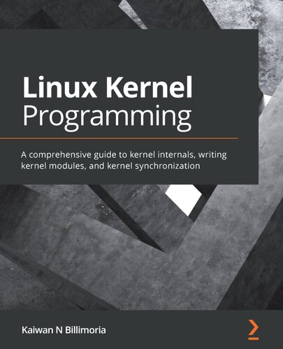

# [Linux Kernel Programming](https://www.amazon.com/Linux-Kernel-Development-Cookbook-programming/dp/178995343X/ref=sr_1_1?crid=157ODC31BDOMQ&keywords=linux+kernel+programming&qid=1662213659&sprefix=%2Caps%2C2646&sr=8-1)


> A good source to dive into the kernel programming domain.
> Somehow this topic might be oversimplified in the book for newbies though.
> Make sure you already have read the "Mastering Embedded Linux Programming" book.

## Chapter 1/13

<details>
<summary>List of required packages for linux development:</summary>

```sh
base linux-firmware git gcc bison flex gdb make cmake gnupg ctags
```
</details>


## Chapter 2/13


## Chapter 3/13


## Chapter 4/13
## Chapter 5/13
## Chapter 6/13
## Chapter 7/13
## Chapter 8/13
## Chapter 9/13
## Chapter 10/13
## Chapter 11/13
## Chapter 12/13
## Chapter 13/13
