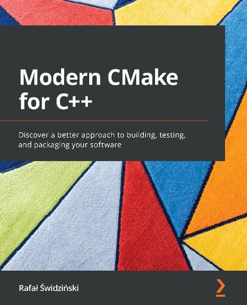

# [Modern CMake for C++](https://www.amazon.com/Modern-CMake-Discover-approach-packaging/dp/1801070059/ref=sr_1_2?keywords=CMake+Best+Practices%3A+Discover+proven+techniques+for+creating+and+maintaining+programming+projects+with+CMake&qid=1669926068&s=books&sr=1-2)

## Chapter 1/13
## Chapter 2/13
## Chapter 3/13
## Chapter 4/13
## Chapter 5/13
## Chapter 6/13
## Chapter 7/13
## Chapter 8/13
## Chapter 9/13
## Chapter 10/13
## Chapter 11/13
## Chapter 12/13
## Chapter 13/13
