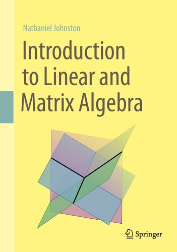

# [Introduction to Linear and Matrix Algebra](http://www.njohnston.ca/publications/introduction-to-linear-and-matrix-algebra/)

> Learning algebra with this book is so fun
> you can't put it aside after 2 minutes read.

## Chapter 1/12
## Chapter 2/12

Having two vectors v,w ∈ R, what vector operation tells us how much v points in the direction of w?

> dot product

## Chapter 3/12
## Chapter 4/12

What are the two properties of linear transformation functions?

> A linear transformation is a function T: Rⁿ → Rⁿ that satisfies the following two properties:
- T(v+w) = T(v) + T(w) for all vectors v,w ∈ Rⁿ
- T(cv) = cT(v) for all vectors v ∈ Rⁿ and all scalars c ∈ R

Determine whether or not function T(v1, v2) = (1+v1, 2+v2) when T: R² → R² is a linear transformation?

> This transformation is **not** linear.
> One way to see this is to notice that 2T(0,0) = 2(1,2) = (2,4)
> But T(2(0,0)) = T(0,0) = (1,2)
> Since these are not the same, T is not linear.

Determine whether or not function T(v1, v2) = (v1-v2, v1v2) when T: R² → R² is a linear transformation?

> This transformation is **not** linear.
> One way to see this is to notice that 2T(1,1) = 2(0,1) = (0,2)
> But T(2(1,1)) = T(2,2) = (0,4)
> Since these are not the same, T is not linear.

Determine whether or not function T(v1, v2) = (v1-v2, v1+v2) when T: R² → R² is a linear transformation?

> This transformation **is** linear.
> We can check the two defining properties of linear transformations.

Using the fact that linear transformation functions preserve linear combinations, write linear transformation T(v) as linear combination of its basis vectors when T: Rⁿ → Rⁿ?

> T(c₁v₁ + c₂v₂ + … + ckvk) = c₁T(v₁) + c₂T(v₂) + … + ckT(vk)
> for all v₁,v₂,…,vk ∈ Rⁿ and all c₁,c₂,…,ck ∈ R
>
> So we have:
> T(v) = T(v₁e₁+v₂e₂+…+vnen) = v₁T(e₁)+v₂T(e₂)+…+vnT(en)

Suppose T: R² → R² is a linear transformation for which we have its standard basis vector transformations T(e₁) = (1,1) and T(e₂) = (-1,1). Compute T(2,3) and find a general formula for T(v₁,v₂).

> If we know what T does to the standard basis vectors, then we know everything about T.
>
> Since (2,3) = 2e₁+3e₂, we know that:
> T(2,3) = T(2e₁+3e₂) = 2T(e₁)+3T(e₂) = 2(1,1) + 3(-1,1) = (-1,5)
>
> We can also find the formula for this linear transformation as follows:
> T(v₁,v₂) = T(v₁e₁+v₂e₂) = v₁T(e₁)+v₂T(e₂) = v₁(1,1)+v₂(-1,1) = (v₁-v₂,v₁+v₂)

## Chapter 5/12
## Chapter 6/12
## Chapter 7/12
## Chapter 8/12
## Chapter 9/12
## Chapter 10/12
## Chapter 11/12
## Chapter 12/12
