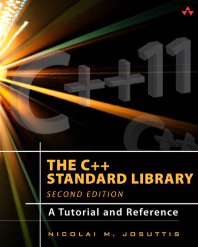
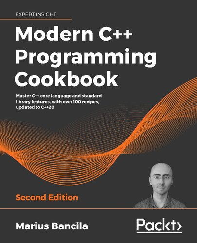
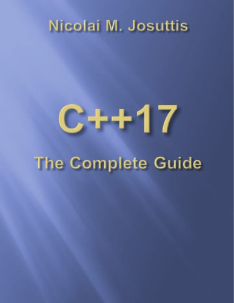
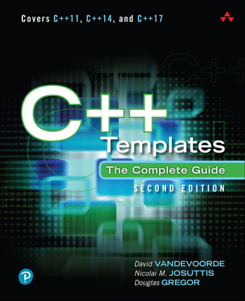
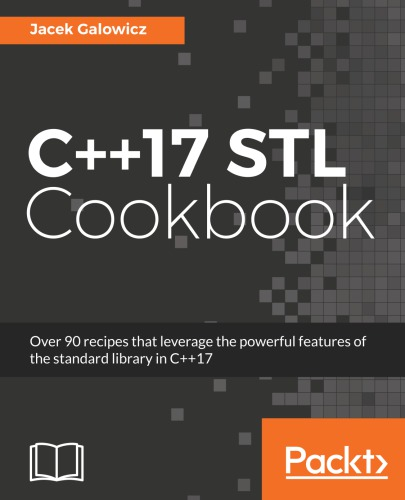
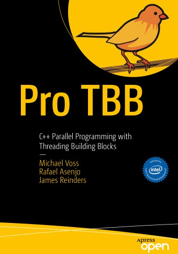
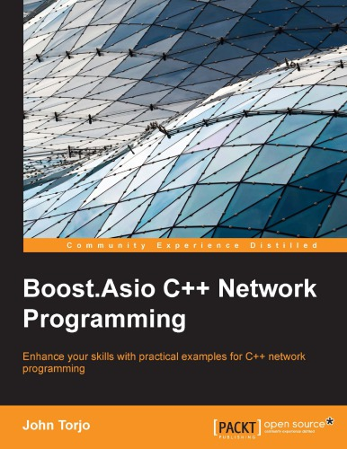

# C++ Programming

This major covers the C++ programming language and its libraries.

## Table of Content

### C++ Language

* [Deciphering Object-Oriented Programming with C++](#-deciphering-object-oriented-programming-with-c++)
* [C++ Concurrency in Action](#-c-concurrency-in-action)
* [Concurrency with Modern C++](#-concurrency-with-modern-c)
* [Design Patterns in Modern C++20](#-design-patterns-in-modern-c20)
* [The C++ Standard Library](#-the-c-standard-library)
* [Modern C++ Programming Cookbook](#-modern-c-programming-cookbook)
* [C++17: The Complete Guide](#-c17-the-complete-guide)
* [C++20: The Complete Guide](#-c20-the-complete-guide)
* [C++ Move Semantics: The Complete Guide](#-c-move-semantics-the-complete-guide)
* [C++ Templates: The Complete Guide](#-c-templates-the-complete-guide)
* [C++17 STL Cookbook](#-c17-stl-cookbook)
* [Boost.Asio C++ Network Programming](#boost.asio-c-network-programming]
* [Boost Libraries](#-boost-libraries)
* [Other Resources](#other-resources)

### User Interface

* [Qt Manual](https://doc.qt.io)

### Image Processing

* [OpenCV Manual](http://docs.opencv.org)
* [Learning OpenCV 3](#-learning-opencv-3)

## ☆☆☆☆☆ [Deciphering Object-Oriented Programming with C++](books/9781804613900.md)

## ★★★★★ [C++ Concurrency in Action](books/9781617294693.md)

## ★★★★★ [Concurrency with Modern C++](books/concurrency-with-modern-cpp.md)

## ★★★☆☆ [Design Patterns in Modern C++20](books/9781484272947.md)

## ★★★★★ [The C++ Standard Library](books/9780321623218.md)

## ★★★★★ [Modern C++ Programming Cookbook](books/9781800208988.md)

## ★★★★★ [C++17: The Complete Guide](books/9783967300178.md)

## ★★★★★ [C++20: The Complete Guide](books/cxx20-the-complete-guide.md)

## ★★★★★ [C++ Move Semantics: The Complete Guide](books/9783967309003.md)

## ★★★★★ [C++ Templates: The Complete Guide](books/9780321714121.md)

## ★★★★★ [C++17 STL Cookbook](books/9781787120495.md)

## ☆☆☆☆☆ [Pro Tbb: C++ Parallel Programming with Threading Building Blocks](books/9781484243978.md)

## ★★★☆☆ [Boost.Asio C++ Network Programming](books/9781782163268.md)

## [Boost Libraries](https://www.boost.org/doc/libs/?view=condensed)

Following libraries are covered:

* `boost::program_options`
* `boost::asio`

## Other Resources

### References

* [cppreference.com](http://en.cppreference.com/w/cpp)
* [isocpp.org](http://isocpp.org)
* [learncpp.com](http://learncpp.com)

### Authors

* [stroustrup.com](http://stroustrup.com)
* [josuttis.com](http://josuttis.com)

## ☆☆☆☆☆ [Learning OpenCV 3](books/.md)

