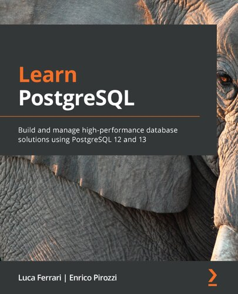
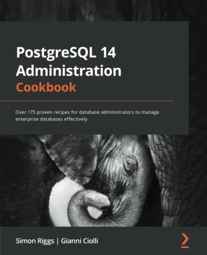
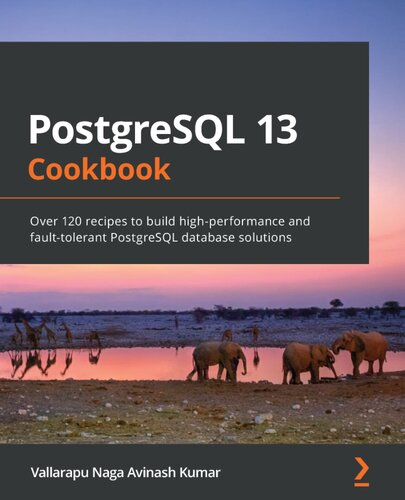

# Databases

This major covers database concepts, languages, and popular projects.

## Table of Content

### PostgreSQL

* [Reference](https://www.postgresql.org/docs)

* [The Art of PostgreSQL](#-the-art-of-postgresql)
* [Learn PostgreSQL](#-learn-postgresql)
* [PostgreSQL 14 Administration Cookbook](#-postgresql-14-administration-cookbook)
* [PostgreSQL 13 Cookbook](#postgresql-13-cookbook)

- - -

## ★★★★★ [The Art of PostgreSQL](books/the-art-of-postgresql.md)

## ★★★☆☆ [Learn PostgreSQL](books/9781838985288.md)

## ☆☆☆☆☆ [PostgreSQL 14 Administration Cookbook](books/9781803248974.md)

## ☆☆☆☆☆ [PostgreSQL 13 Cookbook](books/9781838648138.md)

