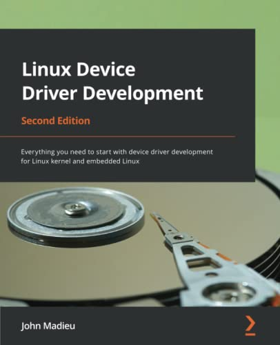
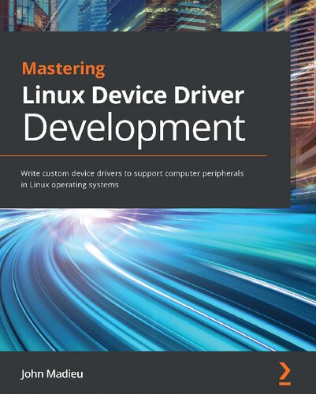
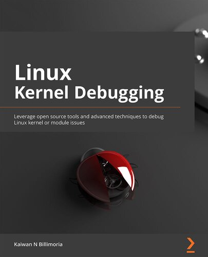
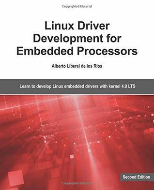
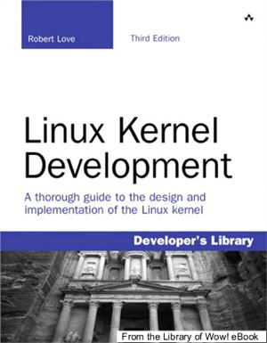

# Linux Kernel Development

This subject covers kernel development knowledge and the tools used in that process.

## Table of Content

## ★★★★★ [Mastering Embedded Linux Programming](books/9781789530384.md)

## ★★★★★ [Linux Device Driver Development](books/9781803240060.md)

## ★★★★★ [Mastering Linux Device Driver Development](books/9781789342208.md)

## ★★★★★ [Linux Kernel Programming](books/9781789953435.md)

## ★★★★★ [Linux Kernel Programming Part 2](books/9781801079518.md)

## ★★★★★ [Linux Kernel Debugging](books/9781801075039.md)

## ☆☆☆☆☆ [Linux Driver Development for Embedded Processors](books/9781729321829.md)

## ☆☆☆☆☆ [Mastering Linux Kernel Development](books/9781785883057.md)

## ☆☆☆☆☆ [Linux Kernel Development](books/9780672329463.md)

## ★★★☆☆ [Embedded Linux Full Course](courses/embedded-linux-full-course.md)

