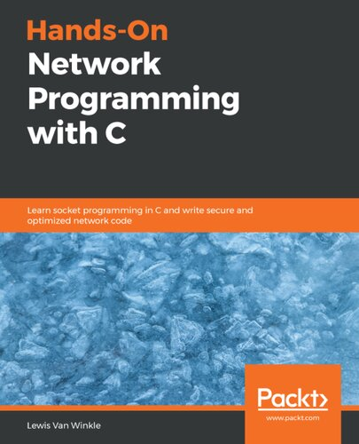

# Linux System Programming

This major covers user space programming in C and C++.

## Table of Content

* [Linux System Programming Techniques](#-linux-system-programming-techniques)
* [Hands-On Network Programming with C](#-hands-on-network-programming-with-c)
* [The Linux Programming Interface](#-the-linux-programming-interface)

- - -

## ★★★★★ [Linux System Programming Techniques](https://www.amazon.com/Linux-System-Programming-Techniques-proficient/dp/1789951283)

> Consider this book essential after reading your first few C books.

### Chapter 1/12

Get user input and sum numbers:

* [printf(3)](https://manpages.org/printf/3)
* [atoi(3)](https://manpages.org/atoi/3)

Parse command-line options:

* [getopt(3)](https://manpages.org/getopt/3)

### Chapter 2/12

Exit program when errors occured:

* [exit(3)](https://manpages.org/exit/3)

Change case of user input and print into standard output and error
using file descriptors:

* [dprintf(3)](https://manpages.org/dprintf/3)
* [fgets(3)](https://manpages.org/fgets/3)
* [memset(3)](https://manpages.org/memset/3)

Convert a temprature unit into another by filtering possible characters:

* [strtol(3)](https://manpages.org/strtol/3)
* [strspn(3)](https://manpages.org/strspn/3)
* [strlen(3)](https://manpages.org/strlen/3)
* [strcmp(3)](https://manpages.org/strcmp/3)

Print shell environments and check if shell supports colored output:

* [getenv(3)](https://manpages.org/getenv/3)
* [setenv(3)](https://manpages.org/setenv/3)
* [strstr(3)](https://manpages.org/strstr/3)

Generally, reading headers' manual pages would help:

* [unistd.h](https://manpages.org/unistdh)
* [stdio.h](https://manpages.org/stdioh)
* [stdlib.h](https://manpages.org/stdlibh)
* [string.h](https://manpages.org/stringh)

### Chapter 3/12

Link against math library, create shared object,
change C standard in compiler options:

* [gcc reference manual](https://gcc.gnu.org/onlinedocs/gcc-12.1.0/gcc/)

Print into terminal using a systemcall directly:

* [intro(2)](https://manpages.org/intro/2)
* [syscalls(2)](https://manpages.org/syscalls/2)
* [write(2)](https://manpages.org/write/2)

Get system resources and file system information:

* [sysinfo(2)](https://manpages.org/sysinfo/2)
* [getcwd(2)](https://manpages.org/getcwd/2)
* [getuid(2)](https://manpages.org/getuid/2)
* [geteuid(2)](https://manpages.org/geteuid/2)
* [getpid(2)](https://manpages.org/getpid/2)
* [getppid(2)](https://manpages.org/getppid/2)
* [sys\_types.h](https://manpages.org/sys-typesh)

Posix documentations can be found by `apropos -s7 posix`:

* [aio(7)](https://manpages.org/aio/7)
* [attributes(7)](https://manpages.org/attiributes/7)
* [mq\_overview(7)](https://manpages.org/mq_overview/7)
* [nptl(7)](https://manpages.org/nptl/7)
* [posixoptions(7)](https://manpages.org/posixoptions/7)
* [pthreads(7)](https://manpages.org/pthreads/7)
* [regex(7)](https://manpages.org/regex/7)
* [sem\_overview(7)](https://manpages.org/sem_overview/7)
* [shm\_overview(7)](https://manpages.org/shm_overview/7)

Use feature test macros:

* [strdup(3)](https://manpages.org/strdup/3)
* [feature\_test\_macros(7)](https://manpages.org/feature_test_macros/7)
* [standards(7)](https://manpages.org/standards/7)
* [libc(7)](https://manpages.org/libc/7)

Inspect four stages of compilation:

* [gcc(1)](https://manpages.org/gcc/1)
* [gcc reference manual](https://gcc.gnu.org/onlinedocs/gcc-12.1.0/gcc/)

Use make to build programs:

* [make(1)](https://manpages.org/make/1)
* [make reference manual](https://www.gnu.org/software/make/manual/html_node/)

### Chapter 4/12

Create a file using appropriate system call:

* [strncpy(3)](https://manpages.org/strncpy/3)
* [creat(2)](https://manpages.org/creat/2)
* [limits.h](https://manpages.org/limitsh)
* [fcntl.h](https://manpages.org/fcntlh)

Check error numbers after system call:

* [errno(3)](https://manpages.org/errno/3)
* [strerror(3)](https://manpages.org/strerror/3)
* [perror(3)](https://manpages.org/perror/3)
* [errno.h](https://manpages.org/errnoh)

### Chapter 5/12

Retrieve statistics of a file given by user:

* [stat(2)](https://manpages.org/stat/2)
* [sys\_types.h](https://manpages.org/sys-typesh)
* [sys\_stat.h](https://manpages.org/sys-stath)

Create soft links and hard links:

* [link(2)](https://manpages.org/link/2)
* [symlink(2)](https://manpages.org/symlink/2)

Update file timestamp:

* [utime(2)](https://manpages.org/utime/2)
* [utime.h](https://manpages.org/utimeh)

* [time(2)](https://manpages.org/time/2)
* [asctime(2)](https://manpages.org/asctime/3)
* [time.h](https://manpages.org/timeh)
* [sys\_time.h](https://manpages.org/sys_timeh)

Delete a file:

* [unlink(2)](https://manpages.org/unlink/2)

Get access rights and ownership of a file:

* [getpwuid(2)](https://manpages.org/getpwuid/2)
* [getpwnam(2)](https://manpages.og/getpwnam/2)
* [pwd.h](https://manpages.org/pwdh)

* [getgrgid(2)](https://manpages.org/getgrgid/2)
* [getgrnam(2)](https://manpages.org/getgrnam/2)
* [grp.h](https://manpages.org/grph)

Change access mode of a file:

* [strspn(3)](https://manpages.org/strspn/3)
* [strlen(3)](https://manpages.org/strlen/3)
* [chmod(3)](https://manpages.org/chmod/2)

Change ownership of a file:

* [stat(2)](https://manpages.org/stat/2)
* [getpwnam(2)](https://manpages.og/getpwnam/2)
* [getgrnam(2)](https://manpages.org/getgrnam/2)
* [strtok(3)](https://manpages.org/strtok/3)
* [chown(2)](https://manpages.org/chown/2)

Write to file with file descriptor:

* [open(2)](https://manpages.org/open/2)
* [write(2)](https://manpages.org/write/2)
* [close(2)](https://manpages.org/close/2)

Read from file with file descriptor:

**Note:** there should be limited size buffer to store input.

* [read(2)](https://manpages.org/read/2)
* [fstat(2)](https://manpages.org/fstat/2)
* [limits.h](https://manpages.org/limitsh)
* [sys\_types.h](https://manpages.org/sys-typesh)

Read from and write to file with file stream:

* [fopen(3)](https://manpages.org/fopen/3)
* [fclose(3)](https://manpages.org/fclose/3)
* [fgets(3)](https://manpages.org/fgets/3)

Read/write binary data from/to file:

**Note:** `fwrite(3)` requires chunck size and count in order to write.

* [fwrite(3)](https://manpages.org/fwrite/3)
* [scanf(3)](https://manpages.org/scanf/3)

Move around a file with file descriptor:

* [lseek(2)](https://manpages.org/lseek/2)
* [read(2)](https://manpages.org/read/2)

Move around a file with file stream:

**Note:** to read a specific range of file, read character by character.

* [fseek(3)](https://manpages.org/fseek/3)
* [ftell(3)](https://manpages.org/ftell/3)
* [rewind(3)](https://manpages.org/rewind/3)
* [fgetpos(3)](https://manpages.org/fgetpos/3)
* [fsetpos(3)](https://manpages.org/fsetpos/3)
* [fgetc(3)](https://manpages.org/fgetc/3)
* [putchar(3)](https://manpages.org/putchar/3)

### Chapter 6/12

Handle signals:

* [sigfillset(3)](https://manpages.org/sigfillset/3)
* [sigaction(2)](https://manpages.org/sigaction/2)
* [signal.h](httpsH//manpages.org/signalh)

Ignore signals:

* [sigemptyset(3)](https://manpages.org/sigemptyset/3)
* [sigprocmask(3)](https://manpages.org/sigprocmask/3)
* [sigaddset(3)](https://manpages.org/sigaddset/3)
* [sigdelset(3)](https:/manpages.org/sigdelset/3)
* [sigsetops(3)](https://manpages.org/sigsetops/3)

* [signal(2) **[deprecated]**](https://manpages.org/signal/2)

Replace execution of a forked process with another program:

* [fork(2)](https://manpages.org/fork/2)
* [execl(2)](https://manpages.org/exec/2)

Run an external program without replacing execution of the process:

* [system(2)](https://manpages.org/system/2)

- - -

## ★★★★★ [Hands-On Network Programming with C](https://www.amazon.com/Hands-Network-Programming-programming-optimized/dp/1789349869/ref=mp_s_a_1_1?crid=1TNWEFU77MLI9&keywords=network+Programming+in+c&qid=1656491085&sprefix=network+programming+in+%2Caps%2C1749&sr=8-1)

> This book is the most update and best option for learning network programming in C.

- - -

## ★★★★★ [The Linux Programming Interface](https://www.amazon.com/Linux-Programming-Interface-System-Handbook/dp/1593272200/ref=mp_s_a_1_1?keywords=the+Linux+programming+interface&qid=1656499287&sr=8-1)

> This is the ultimate source of learning Linux system programming.

