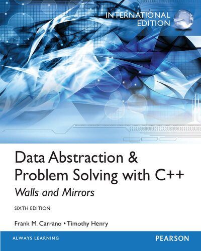

# Linux Programming Books

Covering user space programming in C and C++.

## [Linux System Programming Techniques](https://www.amazon.com/Linux-System-Programming-Techniques-proficient/dp/1789951283) ★★★★★

> Consider this book essential after reading your first C books.

- - -

## [Data Abstraction & Problem Solving with C++](https://www.amazon.com/Data-Abstraction-Problem-Solving-Mirrors/dp/0134463978/ref=mp_s_a_1_1?crid=1P1O9SY7IW0TY&keywords=data+Abstraction+with+c%2B%2B&qid=1656491132&sprefix=data+abstraction+with+c%2Caps%2C833&sr=8-1)

