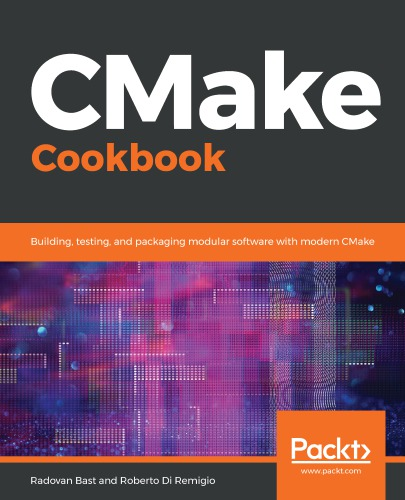

# CMake Cookbook


## Chapter 1/15 <sup>(writing)</sup>

<details>
<summary>What should be the bare minimum content of a <code>CMakeLists.txt</code> file?</summary>

> **Description**
>
> ```cmake
> cmake_minimum_required(VERSION 3.20 FATAL)
> project(Flashback LANGUAGES CXX)
> add_executable(flashback src/main.cpp)
> ``````
>
> ---
> **Resources**
> - CMake Cookbook - Chapter 1
> ---
> **References**
> ---
</details>

<details>
<summary>Separate source and build directories when building a project with cmake?</summary>

> ```sh
> cmake -S <source_dir> -B <build_dir>
> ``````
>
> ---
> **Resources**
> - CMake Cookbook - Chapter 1
> ---
> **References**
> ---
</details>

<details>
<summary>Build a project?</summary>

> ```sh
> cmake --build <build_dir>
> ``````
>
> ---
> **Resources**
> - CMake Cookbook - Chapter 1
> ---
> **References**
> ---
</details>

<details>
<summary>Specify the exact target to build?</summary>

> ```cpp
> cmake --build <build_dir> --target <target>
> ``````
>
> ---
> **Resources**
> - CMake Cookbook - Chapter 1
> ---
> **References**
> ---
</details>

<details>
<summary>Show possible targets within a project?</summary>

> ```cpp
> cmake --build <build_dir> --target help
> ``````
>
> ---
> **Resources**
> - CMake Cookbook - Chapter 1
> ---
> **References**
> ---
</details>

<details>
<summary>What targets are predefined by cmake?</summary>

> - `all`: the default target which builds all targets not `EXLUDED_FROM_ALL`.
> - `clean`: remove all generated artifacts.
> - `depend`: generate the dependencies, if any, for the source files.
> - `rebuild_cache`: rebuild `CMakeCache.txt`.
> - `edit_cache`: edit cache entries directly.
>
> ---
> **Resources**
> - CMake Cookbook - Chapter 1
> ---
> **References**
> ---
</details>

<details>
<summary>Explicitly specify generator for building the project?</summary>

> ```sh
> cmake -S <source_dir> -B <build_dir> -G <generator>
> cmake -S . -B build -G 'Unix Makefiles'
> ``````
>
> ---
> **Resources**
> - CMake Cookbook - Chapter 1
> ---
> **References**
> ---
</details>

<details>
<summary>How many library types are defined in cmake?</summary>

> 1. `STATIC`: archives of object files for use when linking other targets.
> 2. `SHARED`: libraries that can be linked and loaded at runtime.
> 3. `OBJECT`: compile sources in the list to object files, but then neither
>   archive into a static library nor linking them into a shared object. The
>   use of object libraries is particularly useful if one needs to create both
>   static and shared libraries in one go.
> 4. `MODULE`: similar to dynamic shared objects (DSO) but not linked to any
>   other target within the project, but may be loaded dynamicly later on.
>   Useful for building a runtime plugin.
> 5. `IMPORTED`: library located outside the project. Useful to model
>   pre-existing dependencies of the project that are provided by upstream
>   packages. As such these libraries are immutable.
> 6. `INTERFACE`: special library similar to `IMPORTED`, but it is mutable and
>   has no location. Useful to model usage requirements for a target that is
>   outside our project.
> 7. `ALIAS`: an alias for pre-existing library target within the project.
>
> ---
> **Resources**
> - CMake Cookbook - Chapter 1
> ---
> **References**
> ---
</details>

<details>
<summary>Create static and shared libraries?</summary>

> **Description**
>
> ```cmake
> cmake_minimum_required(VERSION 3.20 FATAL_ERROR)
> project(Sample LANGUAGES CXX)
> add_executable(program main.cpp)
> add_library(message-shared SHARED message.hpp message.cpp)
> add_library(message-static STATIC message.hpp message.cpp)
> target_link_libraries(program message-shared)
> ``````
>
> ---
> **Resources**
> - CMake Cookbook - Chapter 1
> ---
> **References**
> ---
</details>

<details>
<summary>Use common library object to use static and shared in one go?</summary>

> ```cmake
> cmake_minimum_required(VERSION 3.20 FATAL_ERROR)
> project(Sample LANGUAGES CXX)
> add_executable(program main.cpp)
> add_library(message-object OBJECT message.hpp message.cpp)
> set_target_properties(message-object PROPERTIES POSITION_INDEPENDENT_CODE 1)
> add_library(message-shared SHARED $<TARGET_OBJECTS:message-object>)
> set_target_properties(message-shared PROPERTIES OUTPUT_NAME "message")
> add_library(message-static STATIC $<TARGET_OBJECTS:message-object>)
> set_target_properties(message-static PROPERTIES OUTPUT_NAME "message")
> target_link_libraries(program message-shared)
> ``````
>
> ---
> **Resources**
> - CMake Cookbook - Chapter 1
> ---
> **References**
> ---
</details>

<details>
<summary>Enable position independent executable for an executable?</summary>

> PIE is enabled by default on Linux and Mac OSX.
>
> ```cmake
> set_target_properties(target PROPERTIES POSITION_INDEPENDENT_CODE 1)
> ``````
>
> ---
> **Resources**
> - CMake Cookbook - Chapter 1
> ---
> **References**
> ---
</details>

<details>
<summary>Change the name of the target on output?</summary>

> ```cmake
> set_target_properties(target PROPERTIES OUTPUT_NAME "primary_target")
> ``````
>
> ---
> **Resources**
> - CMake Cookbook - Chapter 1
> ---
> **References**
> ---
</details>

<details>
<summary>What is the default library build strategy when library type is not specified?</summary>

> `BUILD_SHARED_LIBS` is a global flag offered by cmake.
>
> `add_library` can be invoked without passing the `STATIC/SHARED/OBJECT`
> argument. This command will internally lookup `BUILD_SHARED_LIBS` and will
> use `SHARED` when set, otherwise it uses `STATIC`.
>
> ```cmake
> add_library(message message.hpp message.cpp)
> ``````
>
> ```sh
> cmake -S <source> -B <build> -D BUILD_SHARED_LIBS=ON
> ``````
>
> ---
> **Resources**
> - CMake Cookbook - Chapter 1

> **References**
> ---
</details>

<details>
<summary>What values are equivalent to true and false in cmake?</summary>

> - A logical variable is true if it set to any of the `1, ON, YES, TRUE, Y`,
>   or a non-zero number.
> - A logical variable is false if is set to any of the `0, OFF, NO, FALSE, N,
>   IGNORE, NOTFOUND`, an empty string, or a string ending with `-NOTFOUND`.
>
> ---
> **Resources**
> - CMake Cookbook - Chapter 1

> **References**
> ---
</details>

<details>
<summary>Use conditional statements to either make libraries and link to program or build them into one executable?</summary>

> **Description**
>
> ```cmake
> cmake_minimum_required(VERSION 3.20 FATAL_ERROR)
> project(Sample LANGUAGES CXX)
>
> set(USE_LIBRARY OFF)
> set(BULID_SHARED_LIBS OFF)
>
> if(USE_LIBRARY)
>     add_library(message message.hpp message.cpp)
>     add_executable(program main.cpp)
>     target_link_libraries(program message)
> else()
>     add_executable(program main.cpp ${message_files})
> endif()
> ``````
>
> Use following command to check if library is built into the executable:
>
> ```sh
> objdump --syms build/program
> ``````
>
> ---
> **Resources**
> - CMake Cookbook - Chapter 1

> **References**
> ---
</details>

<details>
<summary>What is the better alternative to making variables optional for user than using if expressions?</summary>

> **Description**
>
> Introducing variables with a given truth value hardcoded, prevents users of
> your code from easily toggling these variables. Also, cmake does not
> communicate to the reader that this is a value that is expected to be
> modified. The recommended way to toggle behavior in the build system
> generation for your project is to present logical switches as options using
> `option()` command.
>
> ```cmake
> cmake_minimum_required(VERSION 3.20 FATAL_ERROR)
> project(Sample LANGUAGES CXX)
>
> option(USE_LIBRARY "Compile sources into a library" OFF)
> list(APPEND message_files message.hpp message.cpp)
>
> if(USE_LIBRARY)
>     add_library(message ${message_files})
>     add_executable(program main.cpp)
>     target_link_libraries(program message)
> else()
>     add_executable(program main.cpp ${message_files})
> endif()
> ``````
>
> ---
> **Resources**
> - CMake Cookbook - Chapter 1
> ---
> **References**
> ---
</details>

<details>
<summary>What is the common way to pass source files to targets?</summary>

> ```cmake
> list(APPEND source_files main.cpp message.cpp ...)
> add_executable(runtime ${source_files})
> add_library(library ${source_files})
> ``````
>
> ---
> **Resources**
> - CMake Cookbook - Chapter 1

> **References**
> ---
</details>

<details>
<summary>Make an option dependent to another?</summary>

> **Description**
>
> ```cmake
> include(CMakeDependentOption)
>
> cmake_dependent_option(MAKE_STATIC_LIBRARY "Compile sources into a static library" OFF "USE_LIBRARY" ON)
> cmake_dependent_option(MAKE_SHARED_LIBRARY "Compile sources into a shared library" ON "USE_LIBRARY" ON)
> ``````
>
> If `USE_LIBRARY` is `ON`, `MAKE_SHARED_LIBRARY` defaults to `OFF`, while
> `MAKE_STATIC_LIBRARY` defaults to `ON`. So we can run this:
>
> ```sh
> cmake -S <source> -B <build> -D USE_LIBRARY=ON -D MAKE_SHARED_LIBRARY=ON
> ``````
>
> ---
> **Resources**
> - CMake Cookbook - Chapter 1
> ---
> **References**
> ---
</details>

## Chapter 2/15
## Chapter 3/15
## Chapter 4/15
## Chapter 5/15
## Chapter 6/15
## Chapter 7/15
## Chapter 8/15
## Chapter 9/15
## Chapter 10/15
## Chapter 11/15
## Chapter 12/15
## Chapter 13/15
## Chapter 14/15
## Chapter 15/15
