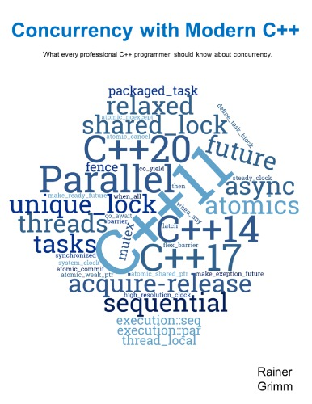

# Concurrency with Modern C++


## Chapter 1/17 <sup>(ignored)</sup>


## Chapter 2/17 <sup>(writing)</sup>

<details>
<summary>What is the foundation of C++ memory model for concurrency?</summary>

> The C++ memory model has to deal with the following points:
>
> - **Atomic operations**: operations that can be performed without interruption.
> - **Partial ordering of operations**: sequences of operations that must not be reordered.
> - **Visible effects** of operations guarantees when operations on shared variables are visible to other threads.
>
> ---
> **Resources**
> - Concurrency with Modern C++ - Chapter 2
>
> ---
> **References**
> ---
</details>

<details>
<summary>What are the levels of expertise in multithreading?</summary>

> To deal with multithreading, we should be an expert.
> In case we want to deal with atomics (sequencial consistency), we should open the door to the next level of expertise.
> When we talk about the aquire-release semantic, or relaxed semantics we advance one step higher to the next expertise level.
>
> 1. Multithreading
> 2. Sequencial Consistency
> 3. Aquire-release Semantic
> 4. Relaxed Semantic
>
> ---
> **Resources**
> - Concurrency with Modern C++ - Chapter 2
>
> ---
> **References**
> ---
</details>

<details>
<summary>How to use <code>std::atomic_flag</code> to make spinlock mechanism?</summary>

> Spinlock mechanism can be implemented lock-free using atomic library.
>
> `std::atomic_flag` is an atomic boolean. It has a clear and a set state.
> There are two methods in `std::atomic_flag`, the `clear()` which sets its
> value to `false`. Withe the `test_and_set()` method you can set the value
> back to `true` and return the previous value. There is no method to ask for
> the current value.
>
> To use `std::atomic_flag` it must be initialized to `false` with the constant
> `ATOMIC_FLAG_INIT`.
>
> The `std::atomic_flag` has to be initialized with the statement
> `std::atomic_flag = ATOMIC_FLAG_INIT`. Other initialization contexts such as
> `std::atomic_flag{ATOMIC_FLAG_INIT}` are unspecified.
>
> ```cpp
> #include <atomic>
> #include <thread>
> #include <chrono>
>
> class task_unit
> {
> public:
>     void do_something()
>     {
>         lock();
>         std::this_thread::sleep_for(std::chrono::seconds{1});
>         unlock();
>     }
>
> private:
>     void lock() { while (flag.test_and_set()); }
>     void unlock() { flag.clear(); }
>
> private:
>     std::atomic_flag flag = ATOMIC_FLAG_INIT;
> };
>
> int main()
> {
>     task_unit task;
>
>     std::thread taskA{&task_unit::do_something, &task};
>     std::thread taskB{&task_unit::do_something, &task};
>
>     taskA.join();
>     taskB.join();
> }
> ``````
> ---
> **Resources**
> - 2.3.2.1
>
> ---
> **References**
> - [std::atomic\_flag](https://en.cppreference.com/w/cpp/atomic/atomic_flag)
> ---
</details>

<details>
<summary>How to use <code>std::mutex</code> to make spinlock mechanism?</summary>

> **Description**
>
> Using `std::atomic_flag` is more straightforward and fast.
>
> ```cpp
> #include <iostream>
> #include <thread>
> #include <chrono>
> #include <mutex>
>
> class task_unit
> {
> public:
>     void do_something()
>     {
>         _lock.lock();
>         std::this_thread::sleep_for(std::chrono::seconds{1});
>         _lock.unlock();
>     }
>
> private:
>     std::mutex _lock;
> };
>
> int main()
> {
>     task_unit task;
>
>     std::thread taskA{&task_unit::do_something, &task};
>     std::thread taskB{&task_unit::do_something, &task};
>
>     taskA.join();
>     taskB.join();
> }
> ``````
>
> ---
> **Resources**
> - 2.3.2.1.1
>
> ---
> **References**
> - [std::mutex](https://en.cppreference.com/w/cpp/thread/mutex)
> ---
</details>

<details>
<summary>Use condition variables to synchronize two threads?</summary>

> ```cpp
> #include <condition_variable>
> #include <iostream>
> #include <thread>
> #include <mutex>
> #include <vector>
>
> class some_task
> {
> public:
>     some_task(): _mutex{}, _cond{}, _shared{}, _accessible{}
>     {
>         std::thread t1{&some_task::wait_for_work, this};
>         std::thread t2{&some_task::prepare_data, this};
>         t1.join();
>         t2.join();
>     }
>
>     void wait_for_work()
>     {
>         std::cerr << "Waiting" << std::endl;
>         std::unique_lock<std::mutex> lock(_mutex);
>         _cond.wait(lock, [this]() { return _accessible; });
>         _shared.push_back(4);
>         std::cerr << "Work complete" << std::endl;
>     }
>
>     void prepare_data()
>     {
>         _shared = {1, 2, 3};
>
>         {
>             std::lock_guard<std::mutex> lock(_mutex);
>             _accessible = true;
>         }
>
>         std::cerr << "Data preparation complete" << std::endl;
>         _cond.notify_one();
>     }
>
>     void print_data()
>     {
>         for (auto value: _shared)
>         {
>             std::cout << value << " ";
>         }
>     }
>
> private:
>     std::mutex _mutex;
>     std::condition_variable _cond;
>     std::vector<int> _shared;
>     bool _accessible;
> };
>
> int main()
> {
>     some_task task{};
> }
> ``````
>
> ---
> **Resources**
> - Concurrency with Modern C++ - Chapter 2
> ---
> **References**
> ---
</details>

## Chapter 3/17
## Chapter 4/17
## Chapter 5/17
## Chapter 6/17
## Chapter 7/17
## Chapter 8/17
## Chapter 9/17
## Chapter 10/17
## Chapter 11/17
## Chapter 12/17
## Chapter 13/17
## Chapter 14/17
## Chapter 15/17
## Chapter 16/17
## Chapter 17/17
