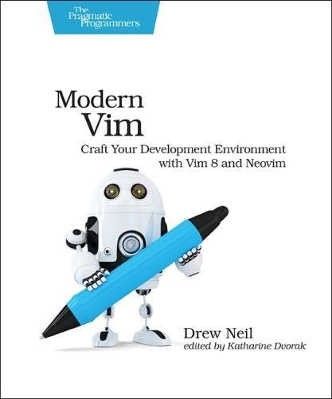
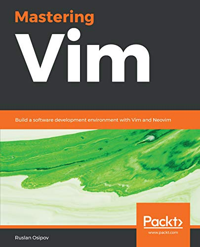

# Development Tools

This section covers all development tools required
for a Linux system programmer.

## Table of Content

### Editor

* [Practical Vim](#-practical-vim)
* [Modern Vim](#-modern-vim)
* [Mastering Vim](#-mastering-vim)

### Source Code Manager

* [Pro Git](#-pro-git)

### Building

* [Autotools Suite](#)
* [Professional CMake](#-professional-cmake)
* [CMake Cookbook](#-cmake-cookbook)

### Containerization

* [Docker Deep Dive](#)

### Uncategorized

* [Valgrind](https://valgrind.org/docs)
* [UML](#)
* [PlantUML](https://plantuml.com)
* [Doxygen](https://doxygen.nl)
* [GCC](#)
* [GDB](#)
* [LLVM](#)
* [LLDB](#)
* [sudo](#)
* [SELinux](#)
* [Auditd](#)
* [iptables](#)
* [snort](#)
* [Firewalld](#)

## ★★★★★ [Practical Vim](books/9781934356982.md)

## ★★★★★ [Modern Vim](books/9781680502626.md)

## ☆☆☆☆☆ [Mastering Vim](books/9781789341096.md)

## ☆☆☆☆☆ [Pro Git](books/9781484200773.md)

## ★★★★☆ [Professional CMake](books/9781925904208.md)

## ★★★★☆ [CMake Cookbook](books/9781788470711.md)

## ☆☆☆☆☆ [CMake Best Practices](books/9781803239729.md)

## ☆☆☆☆☆ [Modern CMake for C++](books/9781801070058.md)

## ★★★★☆ [Docker Deep Dive](books/9781521822807.md)

## ☆☆☆☆☆ [Autotools Suite](books/.md)

